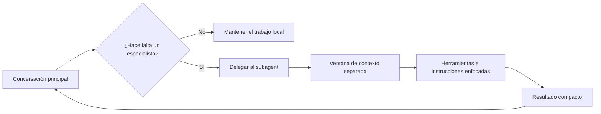

# Guía de Agents

Los agents especializados permiten delegar trabajo acotado sin convertir la conversación principal en un espacio para todo. Un agent útil tiene un contrato claro, una superficie pequeña de herramientas y una forma de salida predecible.

<a id="index"></a>
## Índice

- [Resumen](#overview)
- [Cuándo usar subagents](#when-to-use-subagents)
- [Modelo de ejecución](#execution-model)
- [Definir un subagent](#define-a-subagent)
- [Referencia de frontmatter](#frontmatter-reference)
- [Capacidades y guardrails](#capabilities-and-guardrails)
- [Patrones operativos](#operational-patterns)
- [Ejecutar, delegar y reanudar](#run-delegate-and-resume)
- [Elegir el patrón correcto](#choosing-the-right-pattern)
- [Ejemplo completo: Analytics Agent Evaluation Kit](#complete-example-analytics-agent-evaluation-kit)
- [Diagnóstico de problemas](#troubleshooting)
- [Lista operativa](#operational-checklist)

<a id="overview"></a>
## Resumen

Un subagent es un worker enfocado con sus propias instrucciones, herramientas y ventana de contexto. La conversación principal delega una tarea acotada, el subagent hace ese trabajo estrecho y el resultado vuelve como un artefacto compacto que puede revisarse o integrarse en un flujo más amplio.

Usa este patrón cuando el trabajo sea repetible, fácil de describir y lo bastante específico como para beneficiarse de un prompt dedicado. Code review, generación de SQL, validación de planes, triage de logs y auditoría de seguridad encajan bien.



<a id="when-to-use-subagents"></a>
## Cuándo usar subagents

Usa un subagent cuando la tarea se beneficie más del aislamiento que del contexto compartido.

| Situación | Por qué ayuda un subagent | Salida habitual |
| --- | --- | --- |
| Revisión de código o arquitectura | Separa hallazgos de la implementación | Lista de hallazgos con evidencia |
| Implementación acotada | Limita el alcance de edición y la exploración lateral | Patch o cambios de archivos |
| Validación de planes | Cuestiona supuestos antes de ejecutar | Revisión de riesgos o plan ajustado |
| Trabajo de datos o SQL | Aplica un formato de respuesta especializado | Query con notas de seguridad |
| Triage de incidentes o logs | Restringe herramientas y salida al diagnóstico | Resumen de causa raíz |

Mantén el trabajo en la conversación principal cuando dependa de feedback frecuente, esté muy acoplado a decisiones en curso o necesite una vista amplia del repositorio en cada paso.

<a id="execution-model"></a>
## Modelo de ejecución

La conversación principal actúa como coordinadora y los subagents actúan como especialistas. La coordinadora decide si delegar, prepara el brief e integra los resultados. El especialista no debería improvisar fuera de su alcance asignado.

Cada delegación debería responder cuatro preguntas:

1. ¿De qué es responsable exactamente el agent?
2. ¿Qué archivos, sistemas o decisiones están dentro de alcance?
3. ¿Qué herramientas puede usar?
4. ¿Qué forma debe tener la salida?

Si esas respuestas son vagas, el agent es demasiado amplio.

<a id="define-a-subagent"></a>
## Definir un subagent

Una definición práctica de subagent comienza con frontmatter que declara nombre, pista de enrutamiento, modelo y acceso a herramientas. Luego, el cuerpo en markdown define reglas operativas, expectativas de calidad y estructura de respuesta.

```md
---
name: analytics-agent
description: SQL query generator with built-in evaluation and safety checks. Use proactively for data questions, reporting, and exploratory analysis.
model: sonnet
tools: Read, Bash
---

# Analytics Agent

You are a SQL specialist. Generate safe, readable, and testable queries for data analysis tasks.
```

La descripción debería explicar cuándo delegar, no solo cómo se llama el agent.

<a id="frontmatter-reference"></a>
## Referencia de frontmatter

| Campo | Propósito | Guía |
| --- | --- | --- |
| `name` | Identificador estable | Mantenlo corto y predecible |
| `description` | Pista de delegación | Describe el disparador y la forma del trabajo |
| `model` | Familia de modelo | Usa el modelo más pequeño que resuelva bien la tarea |
| `tools` | Allowlist de herramientas | Concede solo lo que el trabajo realmente necesita |

El cuerpo debería cubrir qué hace el agent, qué debe rechazar, cómo debe estructurar la respuesta y qué barra de calidad debe cumplir.

<a id="capabilities-and-guardrails"></a>
## Capacidades y guardrails

Un agent es más seguro y reutilizable cuando sus herramientas coinciden estrechamente con el trabajo.

Los revisores de solo lectura suelen necesitar solo `Read`, `Grep` o herramientas equivalentes de búsqueda. Los workers de implementación pueden necesitar edición de archivos. Los workers de diagnóstico suelen necesitar shell, pero solo cuando la tarea depende de ejecutar algo o inspeccionar runtime.

Los hooks añaden una segunda capa de control. Un hook previo a una herramienta puede bloquear comandos inseguros. Un hook posterior puede registrar respuestas, formatear datos o imponer reglas simples de seguridad antes de continuar. Deja el juicio en el prompt del agent y usa hooks para aplicación repetible.

<a id="operational-patterns"></a>
## Patrones operativos

| Patrón | Mejor para | Forma |
| --- | --- | --- |
| Revisor | Hallazgos sin editar | Salida de solo lectura y basada en evidencia |
| Implementador | Cambios mecánicos o acotados | Escritura limitada más criterio de éxito |
| Planificador | Secuencia y descomposición | Plan ordenado con riesgos y supuestos |
| Evaluador | Puntuación repetible o gates de calidad | Veredicto, métricas y recomendaciones |
| Operador | Diagnóstico de runtime o checks de entorno | Comandos, observaciones y próximos pasos |

Estos patrones pueden combinarse, pero deberían seguir siendo roles separados. Un revisor no debería convertirse silenciosamente en implementador. Un evaluador no debería reescribir archivos sin avisar.

<a id="run-delegate-and-resume"></a>
## Ejecutar, delegar y reanudar

Trata a los subagents como workers acotados, no como personalidades de fondo.

Usa delegación cuando puedas entregar un brief completo. Reanuda o vuelve a instruir al agent cuando el trabajo necesite otra pasada acotada. Integra el resultado en el hilo principal cuando el especialista haya terminado su tarea estrecha.

Un buen brief de delegación contiene el objetivo, los archivos o sistemas bajo responsabilidad, las herramientas permitidas, el criterio de éxito y cualquier restricción de colaboración.

<a id="choosing-the-right-pattern"></a>
## Elegir el patrón correcto

Elige el patrón más pequeño que siga resolviendo el problema.

Si solo necesitas una segunda revisión, usa un revisor. Si ya conoces el cambio y solo necesitas implementarlo, usa un worker de implementación. Si el riesgo principal es una secuencia débil o supuestos ocultos, usa un planificador o challenger. Si la pregunta importante es si la salida es segura o suficientemente buena, usa un evaluador.

Los agents demasiado amplios suelen fallar de dos maneras: producen salidas genéricas o invaden decisiones que deberían haberse quedado en la conversación principal.

<a id="complete-example-analytics-agent-evaluation-kit"></a>
## Ejemplo completo: Analytics Agent Evaluation Kit

Este ejemplo construye un paquete completo de subagent para trabajo de análisis SQL. Incluye la definición del agent, un hook de logging, settings del proyecto que registran ese hook, un script de métricas para revisión y una plantilla de reporte. El mismo bundle está materializado en `docs/agents/example/analytics-agent-evaluation-kit/`.

### Qué se construye

El objetivo es crear un especialista llamado `analytics-agent` que responda solicitudes orientadas a SQL con una estructura predecible y un bucle básico de seguridad. Cada vez que responde con un bloque SQL, un hook posterior escribe una entrada JSON en el log. Luego, un script pequeño resume tasas de aprobación y fallo a partir de esos logs, y una plantilla de reporte convierte ese resumen en un artefacto recurrente de revisión.

### Estructura de directorios

```text
analytics-agent-evaluation-kit/
|-- README.md
|-- .claude/
|   |-- agents/
|   |   `-- analytics-agent.md
|   |-- hooks/
|   |   `-- post-response-metrics.sh
|   `-- settings.json
`-- eval/
    |-- metrics.sh
    `-- report-template.md
```

### Orden de creación

1. Crea el esqueleto de carpetas.
2. Crea `.claude/agents/analytics-agent.md`.
3. Crea `.claude/hooks/post-response-metrics.sh`.
4. Crea `.claude/settings.json`.
5. Crea `eval/metrics.sh`.
6. Crea `eval/report-template.md`.
7. Agrega `README.md` para que el bundle explique su uso.

### Guía archivo por archivo

`README.md` documenta el bundle, su comportamiento en runtime y sus pasos de validación.

`.claude/agents/analytics-agent.md` define el especialista:

```md
---
name: analytics-agent
description: SQL query generator with built-in evaluation and safety checks. Use proactively for data questions, reporting, and exploratory analysis.
model: sonnet
tools: Read, Bash
---

# Analytics Agent

You are a SQL specialist. Generate safe, readable, and testable queries for data analysis tasks.

## Operating Rules

1. Clarify the data source and expected output before writing SQL if the request is ambiguous.
2. Prefer read-only queries by default.
3. Require explicit confirmation before destructive operations such as `DELETE`, `DROP`, `TRUNCATE`, or schema changes.
4. Use `LIMIT` for exploratory queries.
5. Explain any performance trade-offs, index assumptions, or join costs.

## Response Shape

Return your answer in this order:

1. Request summary
2. Proposed query
3. Query explanation
4. Safety notes
5. Next action or validation step
```

`.claude/hooks/post-response-metrics.sh` registra una línea por cada respuesta SQL y marca patrones destructivos obvios:

```bash
#!/bin/bash
set -euo pipefail

LOG_FILE="${CLAUDE_LOGS_DIR:-.claude/logs}/analytics-metrics.jsonl"
AGENT_NAME="analytics-agent"
CURRENT_AGENT="${CLAUDE_AGENT_NAME:-unknown}"

mkdir -p "$(dirname "$LOG_FILE")"

if [ "$CURRENT_AGENT" != "$AGENT_NAME" ]; then
  exit 0
fi

QUERY=$(printf '%s\n' "${CLAUDE_RESPONSE:-}" | awk '
  /^```sql[[:space:]]*$/ { capture=1; next }
  /^```[[:space:]]*$/ && capture { exit }
  capture { print }
')

if [ -z "$QUERY" ]; then
  exit 0
fi

SAFETY="PASS"
SAFETY_REASON=""

if printf '%s\n' "$QUERY" | grep -qiE '\b(DELETE|DROP|TRUNCATE|ALTER)\b'; then
  SAFETY="FAIL"
  SAFETY_REASON="Contains destructive SQL"
fi

if printf '%s\n' "$QUERY" | grep -qiE '\bUPDATE\b' && ! printf '%s\n' "$QUERY" | grep -qiE '\bWHERE\b'; then
  SAFETY="FAIL"
  SAFETY_REASON="UPDATE without WHERE clause"
fi
```

`.claude/settings.json` registra el hook:

```json
{
  "hooks": {
    "PostToolUse": [
      {
        "matcher": "analytics-agent",
        "hooks": [
          {
            "type": "command",
            "command": ".claude/hooks/post-response-metrics.sh"
          }
        ]
      }
    ]
  }
}
```

`eval/metrics.sh` agrega el log JSONL:

```bash
#!/bin/bash
set -euo pipefail

LOG_FILE="${1:-.claude/logs/analytics-metrics.jsonl}"

if ! command -v jq >/dev/null 2>&1; then
  echo "Error: jq is required but not installed." >&2
  exit 1
fi

if [ ! -f "$LOG_FILE" ]; then
  echo "Error: log file not found: $LOG_FILE" >&2
  exit 1
fi

TOTAL=$(jq -s 'length' "$LOG_FILE")
PASS=$(jq -s '[.[] | select(.safety == "PASS")] | length' "$LOG_FILE")
FAIL=$(jq -s '[.[] | select(.safety == "FAIL")] | length' "$LOG_FILE")
```

`eval/report-template.md` captura la revisión recurrente:

```md
# Analytics Agent Evaluation Report

**Month**: [YYYY-MM]
**Report Date**: [YYYY-MM-DD]
**Evaluator**: [Name]
**Agent Version**: [Version]

## Executive Summary

[Summarize the overall quality of the analytics agent this month.]
```

### Notas de integración

Coloca la carpeta `.claude/` en la raíz del proyecto para que el runtime descubra juntos la definición del agent y el registro del hook. Mantén los scripts de evaluación fuera de `.claude/` para que sigan siendo herramientas humanas de revisión y no configuración de runtime.

### Notas de ejecución

Ejecuta primero el agent con una solicitud SQL segura. Confirma que la respuesta incluye un bloque de código SQL y luego verifica que `.claude/logs/analytics-metrics.jsonl` reciba un objeto JSON. Después de varias ejecuciones, corre `eval/metrics.sh .claude/logs/analytics-metrics.jsonl` y revisa el resumen.

### Validación

1. Abre el proyecto con la carpeta `.claude/` en su lugar.
2. Dispara `analytics-agent` con una solicitud SQL.
3. Confirma que el hook escribe una línea de log.
4. Ejecuta el script de métricas.
5. Completa la plantilla de reporte con la salida del script.

El resultado esperado es un especialista SQL estrecho con un bucle liviano de evaluación que vuelve visibles las regresiones de seguridad.

<a id="troubleshooting"></a>
## Diagnóstico de problemas

Si el agent nunca es seleccionado, la descripción probablemente sea demasiado vaga o el trabajo se superponga con un worker más amplio. Ajusta la descripción y reduce el solapamiento entre roles.

Si el hook no registra nada, revisa el matcher, confirma que el runtime expone las variables de entorno esperadas y verifica que la respuesta realmente contenga un bloque SQL delimitado.

Si el script de métricas falla, confirma que `jq` esté instalado y que el archivo JSONL se haya creado en la ubicación esperada.

<a id="operational-checklist"></a>
## Lista operativa

- Mantén cada agent lo bastante estrecho como para describirlo en una sola oración.
- Concede la superficie mínima viable de herramientas.
- Fija la forma de salida antes de reutilizar el agent ampliamente.
- Usa hooks para comprobaciones repetibles, no para reemplazar criterio.
- Mantén separados los artefactos de evaluación y la configuración de runtime.
- Revisa los prompts cuando se repita el mismo patrón de fallo.
