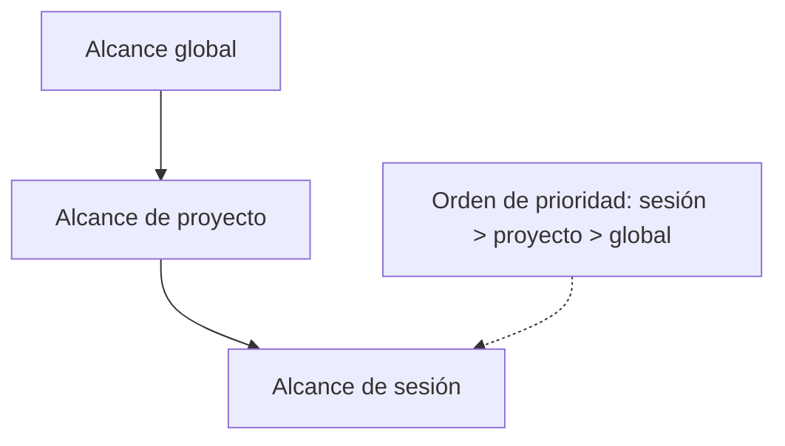

# Ingeniería de Contexto

La ingeniería de contexto es la disciplina de decidir qué debe saber Claude antes de empezar a trabajar, dónde debe vivir ese conocimiento y cómo debe mantenerse con el tiempo. El objetivo práctico no es sumar instrucciones. El objetivo es entregar la información correcta en el alcance correcto, con suficiente estructura para que el modelo la aplique de forma confiable.

<a id="index"></a>
## Índice

- [Modelo de Contexto](#context-model)
- [Jerarquía de Configuración](#configuration-hierarchy)
- [Arquitectura Modular](#modular-architecture)
- [Armado de Equipo](#team-assembly)
- [Ciclo de Vida Y Mantenimiento](#lifecycle-and-maintenance)
- [Medición de Calidad](#quality-measurement)
- [Técnicas de Reducción](#reduction-techniques)
- [Ejemplo Completo](#complete-example)

<a id="context-model"></a>
## Modelo de Contexto

Claude no conserva memoria entre sesiones a menos que se externalice deliberadamente. Por eso, la ingeniería de contexto consiste en diseñar un sistema duradero alrededor de tres alcances:

| Alcance | Qué contiene | Duración típica | Cuándo usarlo |
|---|---|---|---|
| Global | Identidad, preferencias universales, restricciones no específicas del proyecto | Atraviesa todos los proyectos | Reglas que deben aplicar siempre |
| Proyecto | Arquitectura, stack, convenciones del equipo, restricciones propias del proyecto | Atraviesa el proyecto | Información que debe sobrevivir entre sesiones |
| Sesión | Instrucciones puntuales, excepciones temporales, restricciones de una tarea | Solo la conversación actual | Instrucciones que no deben volverse permanentes |

La idea útil es esta:



La propiedad importante es la especificidad. Una instrucción de sesión debe poder anular una regla de proyecto, y una regla de proyecto debe poder anular un valor global. Si el sistema no tiene modelo de anulación, cada excepción temporal termina convertida en edición permanente, y la configuración deriva hacia el ruido.

La otra propiedad importante es el presupuesto. Un contexto siempre activo demasiado grande desplaza contenido de la tarea. La señal práctica de que el presupuesto está mal no es un umbral exacto de tokens, sino la degradación de la adherencia, las explicaciones duplicadas y el aumento sostenido de correcciones después de cada respuesta.

<a id="configuration-hierarchy"></a>
## Jerarquía de Configuración

La pregunta central para cada regla es su ubicación. Si la regla es demasiado global, consume contexto en todas las tareas. Si es demasiado local, Claude puede no verla cuando hace falta. La jerarquía de abajo es la estrategia de colocación por defecto:

| Pregunta | Dónde ubicarla |
|---|---|
| ¿Aplica a todos los proyectos y a todas las tareas? | Configuración global |
| ¿Aplica a un proyecto, pero no a otros? | Configuración de proyecto |
| ¿Aplica solo a un subsistema o directorio? | Módulo con alcance por ruta |
| ¿Aplica solo a la conversación actual? | Instrucción de sesión |

Los módulos por ruta son la técnica de mayor impacto para reducir ruido. Mantienen el archivo raíz pequeño, pero conservan cobertura total para reglas específicas de un subsistema. El patrón es simple: conservar las reglas compartidas en la raíz y cargar orientación adicional solo cuando el trabajo toca una ruta concreta.

La diferencia entre capas importa porque la misma regla puede ser correcta en una capa y dañina en otra. Por ejemplo, una restricción de seguridad que aplica en todas partes pertenece a la capa global. Una convención de migraciones de base de datos pertenece a la capa de proyecto. Una regla sobre un subárbol `src/api/` pertenece a un módulo por ruta. Una restricción temporal para una refactorización puntual pertenece a la capa de sesión.

<a id="modular-architecture"></a>
## Arquitectura Modular

La configuración monolítica es el modo de falla más común. Un único archivo largo es fácil de arrancar y difícil de mantener. Acumula duplicados, patrones obsoletos y reglas que solo importan a un subsistema. Con el tiempo, el resultado no es solo un archivo más grande. Es uno menos confiable.

La respuesta es modularizar:

| Artefacto | Propósito | Cuándo se carga |
|---|---|---|
| Configuración raíz | Reglas compartidas del proyecto e importaciones | Siempre |
| Módulo por ruta | Reglas para un subsistema | Cuando el trabajo toca esa ruta |
| Skill | Procedimiento o flujo repetible | A demanda |
| Instrucción de sesión | Restricción puntual de una tarea | Solo en la conversación actual |

Las reglas y los skills no son lo mismo. Una regla es una restricción permanente. Un skill es un procedimiento o flujo de trabajo. Si necesitas que Claude recuerde cómo hacer algo de forma repetida, pero no quieres cargar ese procedimiento todo el tiempo, un skill es mejor opción. Si necesitas que Claude evite un patrón malo en todo momento, la regla pertenece a la configuración.

El objetivo práctico del archivo raíz es que sea pequeño y estable. Debe contener reglas compartidas, no un manual de políticas completo. Las reglas detalladas pertenecen a módulos que corresponden al subsistema adecuado.

<a id="team-assembly"></a>
## Armado de Equipo

A escala de equipo, la ingeniería de contexto se convierte en un problema de ensamblado de configuración. Distintos desarrolladores trabajan con stacks, preferencias y responsabilidades diferentes. No conviene mantener manualmente un archivo de contexto distinto para cada desarrollador y cada proyecto. Conviene un conjunto compartido de módulos más perfiles por desarrollador.

El modelo de ensamblado tiene tres partes:

| Parte | Responsabilidad |
|---|---|
| Módulos compartidos | Reglas del proyecto que varias personas reutilizan |
| Perfil del desarrollador | Selecciona qué módulos aplican a una persona |
| Overrides | Agrega un número pequeño de reglas personales cuando realmente hacen falta |

Esta estructura da una base estable y una capa explícita de personalización. También hace visible el drift. Cuando cambia una regla compartida, los perfiles que dependen de ella pueden regenerarse y validarse. Cuando un desarrollador cambia de rol, cambia el perfil, no toda la base de reglas.

En la práctica, el flujo de armado es:

1. Elegir un perfil para la persona y el rol.
2. Seleccionar los módulos compartidos que corresponden al proyecto.
3. Agregar solo los overrides personales que sean genuinamente personales.
4. Generar el archivo final de contexto del proyecto.
5. Validar el resultado con checks de presupuesto y canaries.

El punto del flujo es la repetibilidad. Un archivo generado es más fácil de auditar que uno editado a mano, porque las entradas están explícitas.

<a id="lifecycle-and-maintenance"></a>
## Ciclo de Vida Y Mantenimiento

El contexto mejora cuando se trata como infraestructura viva.

El feed de conocimiento es el proceso de capturar lo que una sesión enseñó y convertirlo en una regla durable, o bien decidir explícitamente que esa regla no debe ser permanente. Esto evita repetir la misma corrección en cada sesión posterior.

Los retrospectivos de sesión son la versión liviana de la misma práctica. Al final de una sesión significativa, preguntá qué patrones aparecieron, qué hubo que corregir y qué debería documentarse. La salida debe ser breve y accionable. Si una regla es demasiado genérica como para copiarse al contexto, probablemente no vale la pena conservarla.

En proyectos de larga vida, el mantenimiento también debe incluir auditorías periódicas. Las reglas obsoletas, duplicadas o que ya no coinciden con el stack son formas de deuda de instrucciones. Cuanto más tiempo quedan en el archivo, más reducen la utilidad del resto del contexto.

<a id="quality-measurement"></a>
## Medición de Calidad

La calidad del contexto debe medirse con señales concretas, no solo con intuición.

| Señal | Qué indica |
|---|---|
| Conteo de reglas | Si la configuración se está acercando a saturación de atención |
| Tamaño del archivo | Si el archivo raíz sigue siendo lo bastante compacto para leer y mantener |
| Resultados de canaries | Si Claude sigue respetando las convenciones importantes |
| Checks de drift | Si el contexto generado aún coincide con el conjunto actual de módulos |
| Historial de revisión | Si más de una persona está manteniendo el archivo |

Un baseline útil es mantener la configuración raíz lo bastante pequeña como para auditarla en una sola revisión. Si el archivo crece, la primera pregunta no debería ser "como agrego más instrucciones". La primera pregunta debería ser "qué puedo sacar, deduplicar o mover a un artefacto bajo demanda".

<a id="reduction-techniques"></a>
## Técnicas de Reducción

Las mejoras de mayor impacto suelen venir por sustracción.

| Técnica | Efecto | Cuándo usarla |
|---|---|---|
| Módulos por ruta | Carga reglas del subsistema solo cuando son relevantes | Cuando un archivo quiere cubrir demasiado |
| Restricciones negativas | Nombra directamente el patrón malo | Cuando Claude sigue recurriendo al default incorrecto |
| Compresión | Convierte prosa larga en reglas precisas | Cuando las reglas son más largas de lo necesario |
| Deduplicación | Elimina duplicados semánticos | Cuando la misma restricción aparece más de una vez |
| Archivado | Conserva conocimiento retirado sin cargarlo | Cuando una regla vieja todavía vale como referencia |
| Prioridad 80/20 | Pone primero las reglas de mayor valor | Cuando las reglas importantes quedaron enterradas |

El principio principal es simple: mantener pequeña la superficie siempre activa, mantener específicas las reglas y mantener modulares los procedimientos.

<a id="complete-example"></a>
## Ejemplo Completo

El paquete de ejemplo en `docs/context/example/` muestra un toolkit completo de ingeniería de contexto que puede inspeccionarse, copiarse y adaptarse. Está organizado como un sistema pequeño y autocontenido para construir y validar una configuración de contexto específica de proyecto.

### Qué Construye El Ejemplo

El toolkit construye un flujo con estos resultados:

| Resultado | Significado |
|---|---|
| Configuración basada en perfiles | Distintos desarrolladores pueden generar diferentes archivos de contexto desde una base compartida |
| Paso de armado repetible | El archivo final se genera a partir de entradas explícitas, no a mano |
| Bucle de validación | Checks de presupuesto, canaries y drift detectan regresiones temprano |
| Bucle de feedback | Los aprendizajes de sesión vuelven como reglas durables |

### Árbol De Directorios Del Ejemplo

```text
docs/context/example/
  README.md
  README.es.md
  context-engineering/
    README.md
    README.es.md
    profile-template.yaml
    skeleton-template.md
    skeleton-template.es.md
    assembler.ts
    eval-questions.yaml
    canary-check.sh
    ci-drift-check.yml
    context-budget-calculator.sh
    rules/
      knowledge-feeding.md
      knowledge-feeding.es.md
      update-loop-retro.md
      update-loop-retro.es.md
```

El bundle también incluye companions en español para los archivos markdown orientados a humanos, para que el ejemplo sea navegable en ambos idiomas.

### Responsabilidad De Cada Archivo

| Archivo | Rol |
|---|---|
| `README.md` | Visión general del bundle y flujo recomendado |
| `profile-template.yaml` | Estructura para seleccionar módulos y overrides por desarrollador |
| `skeleton-template.md` | Estructura inicial para un archivo de contexto de proyecto |
| `assembler.ts` | Genera el archivo final a partir del perfil y los módulos |
| `eval-questions.yaml` | Checklist de autoauditoría para revisión manual |
| `canary-check.sh` | Validación estructural de archivos faltantes, tamaño y conflictos obvios |
| `ci-drift-check.yml` | Detección semanal de drift en automatización |
| `context-budget-calculator.sh` | Estima el costo de contexto siempre activo |
| `rules/knowledge-feeding.md` | Convierte aprendizajes post-sesión en reglas durables |
| `rules/update-loop-retro.md` | Prompt de retrospectiva al cierre de sesión |

### Orden De Creación

1. Crear el README del bundle para dejar claro el propósito del toolkit.
2. Definir la plantilla de perfil para que las entradas de armado sean explícitas.
3. Redactar la plantilla skeleton para arrancar un proyecto desde una forma conocida.
4. Agregar el assembler para que los perfiles produzcan un archivo de contexto final.
5. Agregar la checklist de evaluación y el calculador de presupuesto.
6. Agregar el canary y el check de drift en CI para detectar regresiones.
7. Agregar las reglas de knowledge feed y retrospectiva para que el sistema mejore con el uso.

### Flujo De Ejecución

1. Empezar desde la plantilla de perfil y completar un perfil real.
2. Ajustar la skeleton template para que coincida con el proyecto objetivo.
3. Ejecutar el assembler para generar el archivo de contexto.
4. Revisar el presupuesto antes de sumar más reglas.
5. Ejecutar canaries para confirmar que el contexto sigue respetando las convenciones esperadas.
6. Programar el check de drift en CI.
7. Después de sesiones significativas, incorporar los aprendizajes a las reglas.

### Resultado Esperado

El resultado es un sistema de contexto mantenible, con una separación clara entre reglas estables, procedimientos reutilizables y excepciones específicas de sesión. La raíz del proyecto permanece pequeña. El conocimiento especializado queda organizado. El equipo puede auditar cambios sin tener que reconstruir un monolito opaco.

### Por Qué Importa Este Ejemplo

Este bundle es útil porque muestra el ciclo operativo completo, no solo las piezas individuales. El punto no es la sintaxis de un archivo. El punto es el sistema:

- definir las reglas,
- ensamblar la salida,
- validar el resultado,
- y devolver el aprendizaje al sistema.
