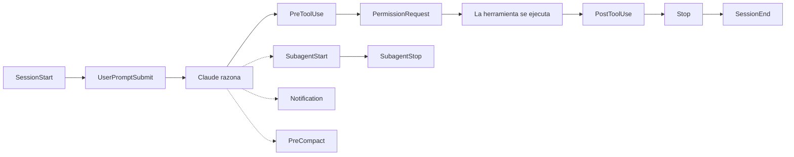

# Hooks de Claude Code

Los hooks de Claude Code son acciones deterministas de shell, prompt, agente o HTTP que se ejecutan en puntos concretos del ciclo de vida. Sirven para imponer políticas, enriquecer contexto, validar trabajo y automatizar tareas repetitivas sin depender de que el modelo “recuerde” hacerlo.

Los hooks son más valiosos cuando el comportamiento deseado es específico y repetible. Si la regla puede expresarse con claridad y verificarse mecánicamente, un hook suele ser la herramienta correcta. Si la decisión requiere juicio más amplio, conviene usar un hook basado en prompt o en agente en lugar de meter ese juicio dentro de un script de shell.

## Indice

1. [Modelo mental](#hooks-modelo-mental)
2. [Cuando usar hooks](#hooks-cuando-usar)
3. [Alcance de configuracion](#hooks-alcance)
4. [Contrato de ejecucion](#hooks-contrato)
5. [Tipos de hook](#hooks-tipos)
6. [Referencia de eventos](#hooks-eventos)
7. [Modelo de seguridad](#hooks-seguridad)
8. [Patrones operativos](#hooks-patrones)
9. [Ejemplo end-to-end implementable](#hooks-ejemplo)
10. [Guia practica](#hooks-guia-practica)
11. [Troubleshooting](#hooks-troubleshooting)
12. [Baseline recomendado](#hooks-baseline)

<a id="hooks-modelo-mental"></a>
## Modelo Mental



La división mental útil es simple:

`SessionStart` y `SessionEnd` delimitan la sesión.

`UserPromptSubmit` cambia lo que Claude ve antes de razonar.

`PreToolUse` y `PermissionRequest` controlan si una acción puede ocurrir.

`PostToolUse` y `Stop` reaccionan cuando el trabajo ya está en marcha.

`Notification`, `PreCompact` y los eventos de subagentes son hooks auxiliares que mantienen la sesión usable y observable.

<a id="hooks-cuando-usar"></a>
## Cuándo Usar Hooks

| Necesidad | Forma de hook recomendada |
| --- | --- |
| Bloquear comandos de shell o escrituras peligrosas | Hook de comando en `PreToolUse` |
| Agregar contexto a un prompt del usuario | Hook de comando en `UserPromptSubmit` |
| Decidir con criterio de lenguaje natural | `type: "prompt"` |
| Inspeccionar el estado real del repositorio antes de decidir | `type: "agent"` |
| Enviar alertas o métricas a otro servicio | `type: "http"` |
| Ejecutar formateadores o validadores después de editar | Hook de comando en `PostToolUse` |

<a id="hooks-alcance"></a>
## Alcance de Configuración

Los hooks pueden definirse en varios lugares. El alcance importa porque determina quién ve el comportamiento y qué tan fácil es reutilizarlo.

| Ubicación | Alcance | Uso típico |
| --- | --- | --- |
| `~/.claude/settings.json` | Todos los proyectos en la máquina | Automatización y guardrails personales |
| `.claude/settings.json` | Un solo proyecto | Política compartida del repositorio |
| `.claude/settings.local.json` | Un solo proyecto, no versionado | Overrides locales |
| Manifiesto de un plugin | Plugin habilitado | Distribución reutilizable |
| Frontmatter de skill o agente | Skill o agente activo | Comportamiento acotado al componente |

Los hooks a nivel proyecto son preferibles cuando el comportamiento forma parte del contrato del repositorio. Los hooks a nivel usuario son mejores para flujos personales, notificaciones y enforcement local.

<a id="hooks-contrato"></a>
## Contrato de Ejecución

Cada hook recibe datos del evento por `stdin`. Los hooks de comando leen JSON desde `stdin`, realizan su trabajo y comunican el resultado mediante `stdout`, `stderr` y el código de salida.

El contrato por defecto es:

`exit 0`
: permite que la acción continúe.

`exit 2`
: bloquea o deniega la acción en los eventos que soportan bloqueo, y expone el motivo a Claude o al usuario según el evento.

Otros códigos distintos de cero
: suelen indicar un error sin la semántica fuerte de bloqueo de `exit 2`.

En `UserPromptSubmit`, `SessionStart` y `Setup`, el texto escrito en `stdout` se añade como contexto adicional. En otros eventos, el JSON estructurado suele ser la mejor interfaz porque permite que Claude Code interprete la respuesta con precisión.

### Matchers

Los matchers reducen el alcance de un hook. Son sensibles a mayúsculas y normalmente matchean el nombre de la herramienta, la transición de sesión o la razón específica del evento.

- `Write`
- `Edit|Write`
- `Bash`
- `compact`
- `clear`
- `startup`

Cuando se omite el matcher, el hook aplica a cada ocurrencia de ese evento.

<a id="hooks-tipos"></a>
## Tipos de Hook Soportados

### Hooks de Comando

Los hooks de comando son la opción por defecto. Ejecutan un script local, son fáciles de versionar y son la mejor opción cuando la regla es determinista.

### Hooks Basados en Prompt

Estos hooks envían el payload del evento y tu prompt a un modelo rápido y esperan una decisión JSON como `{ "ok": true }` o `{ "ok": false, "reason": "..." }`. Son útiles para `Stop` y `SubagentStop` cuando el contexto importa más que la sintaxis pura.

### Hooks Basados en Agente

Los hooks de agente lanzan un subagente con acceso a herramientas. Úsalos cuando la decisión requiera leer archivos, ejecutar tests o inspeccionar el código real.

### Hooks HTTP

Los hooks HTTP hacen `POST` de los datos del evento a un servicio remoto. Son apropiados cuando la lógica del hook se centraliza en un servicio o se comparte entre varios equipos.

<a id="hooks-eventos"></a>
## Referencia de Eventos

| Evento | Cuándo se dispara | Uso típico | Bloqueo |
| --- | --- | --- | --- |
| `UserPromptSubmit` | Inmediatamente después de que el usuario envía un prompt | Validación, inyección de contexto, logging | Puede bloquear el prompt |
| `PreToolUse` | Antes de ejecutar una herramienta | Control de permisos, detección de secretos, reescritura de entradas | Puede bloquear la herramienta |
| `PermissionRequest` | Cuando aparece un diálogo de permisos | Allowlist o enforcement de políticas | Puede permitir o denegar |
| `PostToolUse` | Después de que una herramienta se ejecuta correctamente | Formateo, validación, auditoría | Puede agregar feedback |
| `PostToolUseFailure` | Después de un fallo de herramienta | Logging de fallos y señales de recuperación | Informativo |
| `Notification` | Cuando Claude necesita atención | Alertas de escritorio o audio | Informativo |
| `Stop` | Cuando Claude termina de responder | Chequeos finales, compuertas de continuación | Puede bloquear el stop |
| `SubagentStop` | Cuando un subagente termina | Verificación y cleanup | Puede bloquear el stop |
| `PreCompact` | Antes de la compactación | Guardar estado o preservar contexto | Normalmente informativo |
| `Setup` | Durante init o mantenimiento | Bootstrap de contexto y entorno | Puede agregar contexto |
| `SessionStart` | Cuando una sesión comienza o se reanuda | Cargar contexto, baseline, auditoría de arranque | Puede agregar contexto |
| `SessionEnd` | Cuando la sesión termina | Resúmenes, cleanup, logging | Informativo |

<a id="hooks-seguridad"></a>
## Modelo de Seguridad

Los hooks se ejecutan con tus credenciales actuales y pueden acceder al mismo entorno que la sesión de Claude Code. Eso los hace potentes y peligrosos.

Trata el código de los hooks como código de producción:

- Revisa cada comando antes de registrarlo.
- Usa rutas absolutas o `$CLAUDE_PROJECT_DIR`.
- Cita las variables de shell.
- Mantén los matchers estrechos.
- Usa timeouts cortos para lógica no crítica.
- Prefiere comportamiento `fail-open` para hooks de observabilidad y `fail-closed` para guardrails.

El riesgo principal son los efectos secundarios ocultos. Un hook puede leer archivos, escribir archivos, llamar servicios externos o exfiltrar datos. No registres código que no hayas inspeccionado.

<a id="hooks-patrones"></a>
## Patrones Operativos

### Guardrails

Usa `PreToolUse` para reglas que deben cumplirse antes de ejecutar la acción. Los casos más comunes son detección de secretos, protección de archivos, chequeos de sandbox y bloqueo de comandos inseguros.

### Automatización Post-Edición

Usa `PostToolUse` después de `Edit` o `Write` para formatear código, correr un validador rápido o capturar logs de auditoría. Esto mantiene el repositorio limpio sin depender de la memoria del modelo.

### Ingreso de Prompts

Usa `UserPromptSubmit` para agregar contexto del proyecto, rechazar solicitudes peligrosas o normalizar la intención del usuario antes de que el modelo empiece a razonar.

### Higiene de Sesión

Usa `SessionStart`, `SessionEnd`, `PreCompact` y `Setup` para preservar contexto, registrar baselines y producir resúmenes que sobrevivan sesiones largas.

<a id="hooks-ejemplo"></a>
## Ejemplo Completo de Extremo a Extremo

Este ejemplo construye un guardrail funcional para `UserPromptSubmit` dentro de un repositorio real. El objetivo es bloquear prompts que parezcan contener secretos y, si el prompt es valido, inyectar contexto operativo del proyecto antes de que Claude empiece a razonar.

### Lo que vas a crear

Debes crear exactamente estos dos archivos dentro de la raiz del repositorio:

```text
my-repo/
|-- .claude/
|   |-- settings.json
|   `-- hooks/
|       `-- prompt-gate.sh
`-- ...
```

Antes de empezar, asegurate de que `jq` este disponible en la maquina y de que el repositorio sea un checkout git normal para poder leer la rama activa.

### Archivo 1: `.claude/settings.json`

Este archivo registra el hook. Va en la carpeta `.claude/` del repositorio porque forma parte de la politica compartida del proyecto.

```json
{
  "hooks": {
    "UserPromptSubmit": [
      {
        "hooks": [
          {
            "type": "command",
            "command": "\"$CLAUDE_PROJECT_DIR\"/.claude/hooks/prompt-gate.sh"
          }
        ]
      }
    ]
  }
}
```

Que hace:

1. Escucha cada `UserPromptSubmit`.
2. Ejecuta un script local antes de que Claude procese el prompt.
3. Permite que el script bloquee el prompt con `exit 2` o inyecte contexto por `stdout`.

### Archivo 2: `.claude/hooks/prompt-gate.sh`

Este archivo contiene la logica real. Debe ubicarse exactamente en `.claude/hooks/prompt-gate.sh`.

```bash
#!/usr/bin/env bash
set -euo pipefail

input=$(cat)
prompt=$(echo "$input" | jq -r '.prompt // empty')

if echo "$prompt" | grep -qiE '(password|secret|token)\\s*[:=]'; then
  echo "Blocked: remove secrets from the prompt" >&2
  exit 2
fi

project_name=$(basename "${CLAUDE_PROJECT_DIR:-$(pwd)}")
branch=$(git rev-parse --abbrev-ref HEAD 2>/dev/null || echo "unknown")

printf 'Project: %s\nBranch: %s\n---\n' "$project_name" "$branch"
exit 0
```

Que hace cada bloque:

1. Lee el payload JSON del evento desde `stdin`.
2. Extrae el campo `prompt`.
3. Busca patrones simples de secretos como `password=`, `secret:` o `token=`.
4. Si encuentra algo sensible, escribe el motivo en `stderr` y devuelve `exit 2`.
5. Si el prompt es valido, imprime el nombre del proyecto y la rama actual para que Claude los reciba como contexto adicional.

### Paso operativo: permisos del script

Despues de crear el script, dale permiso de ejecucion:

```bash
chmod +x .claude/hooks/prompt-gate.sh
```

### Como probarlo

Prueba un prompt bloqueado:

```text
Necesito revisar esto: token=abc123
```

Resultado esperado:

1. Claude Code no procesa el prompt.
2. El usuario ve el mensaje `Blocked: remove secrets from the prompt`.

Prueba un prompt valido:

```text
Revisa el flujo de login y dime si la validacion de errores esta bien implementada.
```

Resultado esperado:

1. Claude Code procesa el prompt normalmente.
2. El modelo recibe contexto adicional parecido a:

```text
Project: my-repo
Branch: feature/login-audit
---
```

### Por que este ejemplo esta completo

No solo muestra la idea. Define la ubicacion exacta de cada archivo, el contenido de cada uno, el paso de instalacion que falta para que el script funcione y la forma de verificar el comportamiento bloqueado y permitido.

<a id="hooks-guia-practica"></a>
## Guía Práctica

Empieza con un solo resultado por hook. Si un hook intenta loguear, bloquear, formatear, resumir y notificar a la vez, se vuelve difícil de razonar y de testear.

Usa hooks de shell deterministas para reglas deterministas. Usa hooks de prompt cuando la regla sea semántica. Usa hooks de agente cuando necesites el estado real del repositorio. Usa hooks HTTP solo cuando la responsabilidad pertenezca fuera de la máquina local.

<a id="hooks-troubleshooting"></a>
## Troubleshooting

| Síntoma | Causa probable | Solución |
| --- | --- | --- |
| El hook nunca se dispara | Evento o matcher incorrecto | Verifica el tipo de evento y la cadena del matcher |
| El hook bloquea todo | Falta una ruta por defecto que permita | Haz explícita la rama exitosa |
| Falla el parseo del JSON | Hay salida extra de shell antes del JSON | Elimina `echo` o `printf` sobrantes |
| No se encuentra el script | Ruta relativa o falta el bit ejecutable | Usa rutas absolutas y `chmod +x` |
| Un hook de prompt se siente lento | Hace demasiado trabajo para un prompt hook | Mueve la lógica a un hook de comando o agente |

<a id="hooks-baseline"></a>
## Baseline Recomendado

- Usa `PreToolUse` para controles de seguridad.
- Usa `PostToolUse` para formateo y validación liviana.
- Usa `UserPromptSubmit` para normalizar prompts e inyectar contexto.
- Usa `SessionStart` y `SessionEnd` para flujos con estado.
- Mantén cada hook enfocado en una sola decisión.
- Prefiere fallos observables antes que cambios silenciosos de comportamiento.
