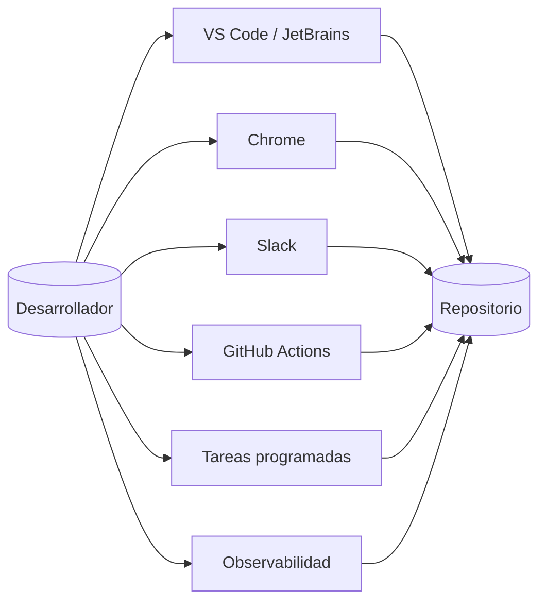

# Integraciones

Claude Code encaja en un flujo de trabajo a través de cinco superficies principales: editor, navegador, colaboración, automatización y observabilidad. La decisión importante no es qué integración existe, sino dónde debe ocurrir el trabajo y qué límite de confianza cruza.

<a id="table-of-contents"></a>
## Índice

1. [Mapa de superficies de integración](#integration-surface-map)
2. [Cómo elegir una integración](#how-to-choose-an-integration)
3. [Integraciones interactivas](#interactive-integrations)
4. [Integraciones de colaboración](#collaboration-integrations)
5. [Integraciones de automatización](#automation-integrations)
6. [Observabilidad y herramientas](#observability-and-tooling)
7. [Seguridad y límites de confianza](#security-and-trust-boundaries)
8. [Ejemplo end-to-end principal](#primary-end-to-end-example)
9. [Lista de validación](#validation-checklist)

<a id="integration-surface-map"></a>
## Mapa de superficies de integración



Las superficies difieren en un punto clave: algunas son interactivas y con estado, mientras que otras son dirigidas por eventos y repetibles. Las integraciones con IDE y navegador funcionan mejor cuando una persona guía el trabajo en tiempo real. GitHub Actions y las tareas programadas funcionan mejor cuando la misma operación debe ejecutarse de forma repetible y con poca ambigüedad. Slack queda en el medio: es una capa de coordinación que puede derivar una solicitud hacia una sesión concreta de ejecución.

<a id="how-to-choose-an-integration"></a>
## Cómo elegir una integración

Si la tarea requiere feedback visual, inspección del DOM o una sesión del navegador ya autenticada, usa Chrome. Si la tarea vive dentro del editor y depende del contexto de archivos, usa VS Code o JetBrains. Si la tarea empieza como conversación, usa Slack. Si la tarea debe ejecutarse en cada pull request o issue, usa GitHub Actions. Si la tarea debe repetirse en un intervalo, usa tareas programadas. Si la única pregunta es qué hizo Claude y cuánto costó, usa herramientas de observabilidad.

| Necesidad | Mejor opción | Por qué |
|---|---|---|
| Inspeccionar una app web en ejecución | Chrome | Claude puede ver la consola, el DOM y el comportamiento de formularios en un navegador real |
| Permanecer dentro del editor | VS Code o JetBrains | El contexto queda cerca del código y los diffs se ven en el mismo lugar |
| Retomar trabajo desde chat | Slack | La solicitud puede arrancar donde ya existe la discusión |
| Automatizar reviews o triage | GitHub Actions | Se ejecuta de forma previsible sobre eventos del repositorio con permisos repetibles |
| Repetir un prompt en un cronograma | Tareas programadas | Útil para polling, recordatorios y loops de sesión |
| Estimar costo y uso | Observabilidad | Los logs locales y las sesiones muestran lo ocurrido después |
| Extender el ecosistema | Herramientas de terceros | Útiles cuando se necesitan dashboards, TUIs o reducción de salida |

<a id="interactive-integrations"></a>
## Integraciones interactivas

### Chrome

Usa Chrome cuando Claude necesite probar una app web como lo haría una persona. La integración del navegador funciona muy bien para validación de UI, depuración de consola, llenado de formularios, sitios autenticados y extracción de datos. Funciona mejor cuando la tarea se describe en términos de qué abrir, qué clicar y qué verificar.

La limitación principal es la confianza. Claude comparte la sesión activa del navegador, por lo que puede aprovechar el estado ya autenticado. Trátalo como una comodidad solo en entornos confiables. Si una página de login, un CAPTCHA o un modal bloquea la interacción, detén el flujo y resuélvelo manualmente en lugar de forzar la sesión.

### VS Code

VS Code es la integración de editor más cómoda porque el panel de Claude vive junto al código. Soporta diffs en línea, @-mentions, revisión de planes, derivación al terminal y automatización de navegador desde el editor. Úsalo para trabajo cotidiano de implementación donde el árbol de archivos, el diff y la conversación deben permanecer juntos.

Esta integración funciona mejor cuando el proyecto ya tiene convenciones claras. Claude debería poder leer la selección actual, inspeccionar los archivos referenciados y hacer un cambio pequeño y revisable. Si necesitas un cambio mayor, usa modo plan o un prompt que limite el alcance antes de ejecutar.

### JetBrains IDEs

El soporte de JetBrains es similar en espíritu al de VS Code, pero el flujo gira alrededor del plugin del IDE y del terminal integrado. Es una buena opción para equipos estandarizados en IntelliJ, PyCharm, WebStorm o IDEs relacionados. Úsalo cuando quieras diffs de código, contexto de selección y diagnóstico compartido sin salir del IDE.

El detalle operativo principal es que la detección del IDE depende de un proceso de Claude iniciado desde la raíz del proyecto o conectado mediante el terminal del IDE. Si el IDE no se detecta, verifica que el plugin esté habilitado y que la ruta del terminal coincida con el workspace esperado.

<a id="collaboration-integrations"></a>
## Integraciones de colaboración

### Slack

Slack es una superficie de coordinación, no un reemplazo del editor. Es útil cuando una discusión ya contiene el contexto de un bug, una feature o una investigación. Mencionar `@Claude` puede derivar una solicitud a una sesión de código en la web, permitiendo que el equipo siga trabajando mientras Claude se ocupa de la implementación.

El límite importante es la confianza. Claude puede consumir el contexto del hilo, lo que también le permite heredar suposiciones ajenas a la tarea. Usa Slack en canales donde tanto los participantes como la solicitud sean confiables, y haz explícito el trabajo para que la ruta de ejecución sea obvia.

### Cuándo conviene Slack

Slack es la mejor entrada cuando una solicitud nace en una conversación de equipo y debe convertirse en una tarea de implementación sin copiar contexto a otro lado. Es especialmente útil para bugs reportados por soporte, seguimientos después de planificación y coordinación asincrónica entre husos horarios.

<a id="automation-integrations"></a>
## Integraciones de automatización

### GitHub Actions

GitHub Actions es el lugar correcto para automatización repetible del repositorio: code review, security review, issue triage y workflows personalizados que se ejecutan sobre eventos de PR o issues. La integración funciona mejor cuando el prompt vive en un archivo Markdown separado y el workflow se mantiene mínimo y explícito.

Para workflows de revisión de PR, el mejor patrón es:

1. Colocar los criterios de revisión en un archivo de prompt separado.
2. Ejecutar el workflow solo sobre eventos de PR significativos.
3. Restringir las herramientas a inspección de solo lectura y a la publicación de la revisión.
4. Publicar hallazgos solo después de verificarlos contra el diff.

Para triage de issues, el patrón es ligeramente distinto:

1. Reunir el título y el cuerpo del issue.
2. Pedir a Claude JSON estricto.
3. Validar el JSON antes de publicar labels o comentarios.
4. Mantener los permisos acotados para que el workflow pueda triagear, no modificar código.

### Tareas programadas

Las tareas programadas son de alcance de sesión. Son útiles para recordatorios, polling y prompts repetidos mientras una sesión de Claude Code sigue abierta. No son una plataforma de automatización duradera. Si el terminal se cierra o la sesión termina, las tareas desaparecen.

Úsalas cuando el trabajo pertenezca a la sesión interactiva actual. Usa GitHub Actions u otro scheduler duradero cuando la tarea deba sobrevivir reinicios.

<a id="observability-and-tooling"></a>
## Observabilidad y herramientas

La observabilidad responde dos preguntas: qué hizo Claude y cuánto costó. Los logs de sesión locales y la telemetría basada en hooks pueden mostrar lecturas de archivos, ejecución de comandos, patrones de uso de herramientas y gasto aproximado de tokens. Eso los vuelve útiles para depurar flujos, encontrar lecturas repetidas y detectar cuándo falta contexto.

Las herramientas de terceros cubren vacíos que las integraciones nativas no resuelven. Algunas se enfocan en costo e historial de sesiones, otras en reducción de salida y otras en dashboards de equipo o coordinación multi-agente. Trátalas como extensiones del flujo, no como fuente de verdad. Si una herramienta necesita acceso a logs locales, evalúa si debe quedarse local o exportar datos hacia afuera.

| Categoría | Uso típico | Precaución |
|---|---|---|
| Trackers de costo | Estimar gasto desde logs de sesión | Suele ser heurístico, no equivalente a facturación |
| Browsers de sesiones | Inspeccionar o reanudar trabajo previo | El historial local puede contener contexto sensible |
| Reductores de salida | Reducir ruido de comandos antes de que Claude lo vea | Puede ocultar detalle si se aplica demasiado |
| UIs multi-agente | Coordinar varias sesiones de Claude a la vez | Útil solo cuando la concurrencia es una necesidad real |
| Generadores de configuración | Crear configuraciones y hooks iniciales | Revisar los valores por defecto antes de adoptarlos |

<a id="security-and-trust-boundaries"></a>
## Seguridad y límites de confianza

Cada integración amplía la cantidad de estado que Claude puede ver o influir. Las integraciones con navegador comparten sesiones autenticadas. Las integraciones con IDE pueden tocar archivos de configuración que el propio IDE ejecuta. Slack puede importar contexto de conversación que contenga supuestos ajenos. GitHub Actions puede actuar sobre secretos del repositorio. La observabilidad puede exponer prompts, comandos y nombres de archivo sensibles si los logs se conservan sin cuidado.

Usa un enfoque por capas:

1. Minimiza permisos primero.
2. Mantén límites revisables entre prompt, workflow y secretos.
3. Prefiere aprobación humana para ediciones que afecten ejecución o control de acceso.
4. Trata los logs como datos sensibles salvo prueba en contrario.
5. Usa herramientas externas solo después de revisar qué leen, almacenan o transmiten.

<a id="primary-end-to-end-example"></a>
## Ejemplo end-to-end principal

El ejemplo de integración más completo es un pack de automatización de repositorio construido sobre GitHub Actions. Combina un prompt de revisión, un workflow de revisión de PR, un workflow de revisión de seguridad y un workflow de triage de issues. Juntos cubren el ciclo común de una base de código: revisar cambios entrantes, inspeccionar diffs sensibles a seguridad y clasificar issues nuevos.

### Objetivo

El objetivo es crear una pequeña suite de automatización que pueda copiarse en un repositorio y usarse de inmediato. La suite debe:

1. Revisar pull requests con hallazgos verificados.
2. Ejecutar una revisión de seguridad enfocada en cada PR.
3. Clasificar issues nuevos con labels y un comentario breve.
4. Mantener separados el prompt y los workflows para poder cambiar criterios sin reescribir la automatización.

### Árbol del ejemplo

```text
github-actions-review-kit/
|-- .github/
|   |-- prompts/
|   |   `-- code-review.md
|   `-- workflows/
|       |-- claude-code-review.yml
|       |-- claude-security-review.yml
|       `-- claude-issue-triage.yml
```

### Definición archivo por archivo

| Ruta | Propósito | Contenido clave |
|---|---|---|
| `.github/prompts/code-review.md` | Política de revisión | Protocolo anti-alucinación, criterios de review y formato de salida |
| `.github/workflows/claude-code-review.yml` | Automatización de review de PR | Reglas de trigger, herramientas de solo lectura, referencia al prompt externo y publicación de la revisión |
| `.github/workflows/claude-security-review.yml` | Review orientada a seguridad | Trigger sobre PR, prompt restringido a seguridad, solo hallazgos verificados |
| `.github/workflows/claude-issue-triage.yml` | Triage de issues | Extraer texto del issue, pedir JSON estricto, publicar labels y comentario de resumen |

### Orden de creación

1. Crea primero el archivo de prompt. Define el estándar de revisión y mantiene estable el workflow.
2. Crea después el workflow de review de PR. Es el camino principal de automatización.
3. Añade el workflow de seguridad. Reutiliza la misma identidad del repositorio y el mismo patrón de permisos.
4. Añade el workflow de triage de issues. Usa el mismo repositorio pero una forma de ejecución distinta.
5. Agrega secretos del repositorio en la interfaz de GitHub: `CLAUDE_CODE_OAUTH_TOKEN` o `ANTHROPIC_API_KEY`, según el camino que uses.

### Qué debe contener cada archivo

`code-review.md` debe definir un protocolo estricto de revisión. Debe exigir verificación antes de cada hallazgo, prohibir líneas inventadas y clasificar los hallazgos por severidad. También debe especificar qué hacer cuando no se encuentra ningún problema para que la revisión cierre de forma limpia.

`claude-code-review.yml` debe ejecutarse sobre pull request abiertos, sincronizados y listos para revisión, además de un trigger opcional por comentario `/claude-review`. Su trabajo es invocar a Claude con acceso de solo lectura, cargar el prompt externo y publicar una revisión estructurada.

`claude-security-review.yml` debe ser más estrecho. Debe centrarse en autenticación, autorización, inyección, manejo de secretos, defaults inseguros y exposición de datos. El workflow no debe derivar en feedback genérico de estilo.

`claude-issue-triage.yml` debe ser determinista. Debe reunir el título y el cuerpo del issue, pedir a Claude JSON estricto, validar la forma y luego escribir el resultado como labels y un comentario.

### Resultado esperado

Después de instalarlo, los pull requests deben recibir feedback estructurado sin prompting manual, los diffs sensibles a seguridad deben ser revisados en cada PR y los issues nuevos deben categorizarse con suficiente confianza como para que un mantenedor pueda actuar rápido. La automatización debe ser lo bastante acotada como para que una persona pueda corregirla cuando cambien la base de código o la política del repositorio.

### Verificación

1. Abre un PR en borrador y confirma que el workflow de review no se dispara.
2. Marca el PR como listo y confirma que aparece el comentario de revisión.
3. Sube un cambio que toque código sensible a seguridad y confirma que corre la revisión de seguridad.
4. Abre un issue nuevo y confirma que el triage produce una sugerencia de labels y un comentario breve.
5. Verifica que los workflows fallen de forma segura cuando faltan secretos, en vez de publicar una salida parcial.

<a id="validation-checklist"></a>
## Lista de validación

Antes de publicar la documentación de integraciones o copiar el ejemplo en un repositorio, verifica lo siguiente:

1. El guide tiene un índice enlazado que funciona en lectores Markdown.
2. La sección de ejemplo explica el árbol de archivos, el contenido, el orden de creación y el resultado esperado.
3. El pack de automatización de repositorio puede crearse sin leer material externo.
4. Los permisos quedan en modo lectura cuando es posible y acotados cuando se necesita escritura.
5. Los secretos se guardan en la configuración del repositorio, no hardcodeados en YAML ni en archivos de prompt.
6. La documentación se entiende si la lee en aislamiento un desarrollador senior.
