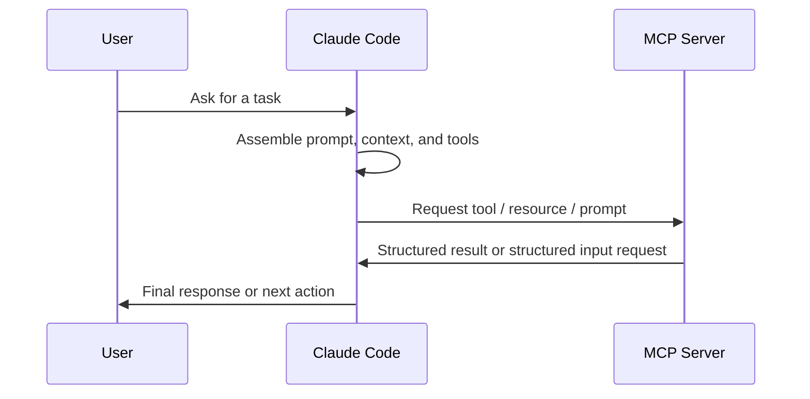

# MCP in Claude Code

Model Context Protocol (MCP) is the extension layer that lets Claude Code use external tools, data sources, and workflows without hard-coding integrations into the client. In practice, Claude Code acts as the MCP client, and MCP servers expose capabilities that Claude can discover and use during a session.

The useful mental model is simple: Claude Code assembles a session prompt, loads the available tool surface, and then decides when to call tools, read resources, or ask for structured input. MCP is what makes that external capability layer composable.

## Core Model

MCP has four concepts that matter operationally.

| Concept | What it provides | How Claude Code uses it |
|---|---|---|
| Tools | Executable actions such as querying a database, browsing a page, or creating a ticket | Claude invokes tools when the task needs an external side effect or fresh data |
| Resources | Readable objects such as issues, docs, schemas, or reports | You reference them with `@` mentions and they are injected into the conversation |
| Prompts | Reusable command-like workflows exposed by a server | They appear as slash commands such as `/mcp__server__prompt` |
| Elicitation | Structured mid-task input from the server | Claude Code surfaces a form or URL flow and returns the response to the server |

At runtime, Claude Code does not treat MCP as a separate UI. It folds MCP capabilities into the same session loop that handles normal reasoning and file operations.



## How Claude Code Uses MCP

Claude Code discovers available MCP capabilities at session start and then loads them on demand as the conversation requires them. This matters for two reasons: it keeps the context window manageable, and it allows large MCP ecosystems to stay usable without preloading every tool description.

When MCP tools become numerous, Claude Code can use tool search instead of loading every definition up front. Tool search is the right default for large deployments because it reduces context pressure while keeping the tool set discoverable.

### Tools, Resources, and Prompts

Tools are for actions. Resources are for reading. Prompts are for prepackaged workflows. That distinction is important because it determines whether Claude should act, inspect, or invoke a canned task.

- Use a tool when the server needs to do work on your behalf.
- Use a resource when the server already has the content you want to reason about.
- Use a prompt when the server provides a standard operational workflow that should be exposed as a command.

Resource references behave like file mentions. Prompt names are normalized into commands. That lets MCP servers feel native inside Claude Code rather than bolted on.

### Elicitation

Some MCP servers need information they cannot infer themselves. Claude Code handles that by opening a structured prompt or browser flow, collecting the response, and continuing the task. This is most common for authentication, approvals, and user-specific setup values.

## Configuration Model

Claude Code supports three primary transport styles plus plugin-provided servers.

| Transport | Best for | Notes |
|---|---|---|
| HTTP | Remote production services | Recommended default for cloud-hosted servers |
| SSE | Legacy remote services | Supported, but deprecated when HTTP is available |
| stdio | Local processes and custom scripts | Ideal for private tools and machine-local automation |
| Plugin-provided | Bundled tools shipped with a plugin | Activates automatically with the plugin lifecycle |

The key rule for command-line configuration is order. Transport flags, scope flags, headers, and environment flags must come before the server name, and `--` separates the server name from the command passed to a stdio server.

```bash
claude mcp add --transport stdio --env KEY=value my-server -- node server.js
```

### Scopes and Policy

MCP configuration is commonly organized into local, project, and user scopes. A project-scoped server is the right choice for team-shared tools. A user-scoped server is the right choice for a personal tool you want across projects. A local-scoped server is the narrowest private option.

For managed environments, `managed-mcp.json` can take exclusive control over the allowed MCP surface. That is the correct choice when policy matters more than user flexibility. When you do allow user-managed servers, use allowlists and denylists to constrain the permitted surface.

| Control mode | Behavior |
|---|---|
| Normal scopes | Users can configure servers within their allowed scope |
| Managed control | Administrators define a fixed server set |
| Allowlist | Only matching servers are permitted |
| Denylist | Matching servers are blocked everywhere |

If the same server name exists in multiple places, inspect the effective configuration with `claude mcp get <name>` rather than assuming the intended source won.

### Environment Expansion

`.mcp.json` supports environment variable expansion so a team can share one config while keeping machine-specific values and secrets external.

Supported patterns include `${VAR}` and `${VAR:-default}`. Expansion can be used in server commands, arguments, environment blocks, URLs, and HTTP headers.

## Authentication and Server Lifecycle

Remote HTTP servers commonly use OAuth 2.0. Claude Code can launch the browser-based login flow, store tokens securely, and refresh them automatically. When a server requires a fixed redirect URI, use `--callback-port` so the callback matches the server registration.

If the server uses pre-configured OAuth credentials, provide the client ID and secret through the MCP command or JSON config. For servers that expose a nonstandard metadata endpoint, `authServerMetadataUrl` lets you point Claude Code at a working OAuth metadata document instead of relying on the default discovery path.

Claude Code also supports:

- `claude mcp list`, `get`, and `remove` for lifecycle management
- `/mcp` for viewing and authenticating servers inside the session
- `list_changed` notifications so servers can refresh tools without reconnecting

## Tool Search and Context Management

Tool search is the mechanism that keeps large MCP setups usable. Instead of preloading every tool description, Claude Code can defer tool loading and search for the relevant capability when needed.

| Setting | Effect |
|---|---|
| `ENABLE_TOOL_SEARCH=true` | Force tool search on |
| `ENABLE_TOOL_SEARCH=auto` | Enable it when the MCP footprint crosses the configured threshold |
| `ENABLE_TOOL_SEARCH=auto:N` | Use a custom threshold percentage |
| `ENABLE_TOOL_SEARCH=false` | Preload all tools upfront |

When `ANTHROPIC_BASE_URL` points to a non-first-party host, tool search is disabled by default because many proxies do not forward the required `tool_reference` blocks. If your proxy supports them, enable it explicitly.

Claude Code also warns when MCP outputs become too large. The practical limits are:

- Default warning threshold: 10,000 tokens
- Default maximum: 25,000 tokens
- Override: `MAX_MCP_OUTPUT_TOKENS`

For native Windows, local stdio servers that launch `npx` need the `cmd /c` wrapper so the process starts correctly.

## Security and Governance

Treat every third-party MCP server as code with privileges. The server can read local files, call APIs, and inject instructions into context through descriptions and tool metadata. That means trust boundaries matter.

The main risks are:

- Prompt injection embedded in tool descriptions or server instructions
- Overbroad credentials or environment variables
- Unreviewed remote servers that fetch untrusted content
- Excessive output that floods the conversation context

The right baseline is to install only vetted servers, store secrets outside config files when possible, and prefer the narrowest scope that still solves the problem. For managed deployments, combine exclusive control with policy filtering when you need organization-wide standards.

## Using Claude Code as an MCP Server

Claude Code can expose its own tools to another MCP client.

```bash
claude mcp serve
```

That is useful when you want Claude Code to become the automation backend for another desktop client or orchestrator. The host client remains responsible for the user-confirmation model around tool calls.

## Ecosystem and Server Selection

The MCP ecosystem is easiest to navigate if you split it into official and community servers.

| Type | Characteristics | Use when |
|---|---|---|
| Official | Maintained by the platform owner, stable behavior, best documentation | You want the safest default and the broadest compatibility |
| Community | Maintained by third parties, can be production-ready, quality varies | You need a specialized integration not covered by official servers |

For community servers, a good production bar is:

| Criterion | Practical threshold |
|---|---|
| Maintenance | Recent releases and active issue handling |
| Documentation | Setup, examples, and troubleshooting are complete |
| Tests | CI or automated verification exists |
| Use case | It fills a real gap instead of duplicating an official server |
| License | OSS and auditable enough for your environment |

### Representative Server Categories

| Category | Representative servers | Best fit |
|---|---|---|
| Version control | Git MCP | Local commits, diffs, branch operations, log analysis |
| Browser automation | Playwright MCP, Browserbase MCP, Chrome DevTools MCP | E2E testing, cloud automation, runtime debugging |
| Infrastructure | Kubernetes MCP, Vercel MCP | Cluster operations, deployment workflows |
| Security | Semgrep MCP | SAST, secrets scanning, secure coding gates |
| Code search | Grepai MCP | Semantic search and call graph exploration |
| Documentation | Context7 MCP | Fresh library docs and API examples |
| Project management | Linear MCP | Issue tracking and delivery coordination |
| Orchestration | MCP-Compose | Managing many servers with a single config |

Prefer the simplest server that fits the problem. For example, use Playwright for browser automation tests, Chrome DevTools for debugging, and Browserbase when you need cloud execution or stealth features.

## Recommended Production Stack

For most teams, the smallest useful stack is:

1. Playwright MCP for browser verification
2. Semgrep MCP for security review
3. Context7 MCP for accurate library usage
4. Git MCP for local version-control automation

Add Linear if you need delivery tracking, Kubernetes or Vercel if you own deployment workflows, and MCP-Compose if you manage a large server fleet.

## End-to-End Example

The example below shows a realistic workflow that uses multiple MCP servers in one session.

1. Add the servers:

```bash
claude mcp add --transport stdio playwright -- npx -y @microsoft/playwright-mcp
claude mcp add semgrep -- uvx semgrep-mcp
claude mcp add context7 -- npx -y @upstash/context7-mcp --api-key "$CONTEXT7_API_KEY"
claude mcp add linear -- npx -y mcp-linear --api-key "$LINEAR_API_KEY"
```

2. Ask Claude Code to implement and validate the change:

```text
Use Context7 to confirm the current SDK pattern for the feature, implement the change in the codebase, verify the flow in Playwright, scan the final patch with Semgrep, and create a Linear issue if anything still needs follow-up.
```

3. Expected tool flow:

- Claude queries Context7 for the up-to-date API pattern.
- Claude edits the code with the repository tools.
- Claude opens the app in Playwright and validates the user journey.
- Claude runs Semgrep to catch obvious security regressions.
- Claude creates or updates a Linear ticket if there is unresolved work.

4. Result:

- The implementation is based on current documentation.
- The user flow is verified in a browser.
- The security scan is part of the same loop.
- Follow-up work is tracked in the issue system instead of being left in chat.

## Operational Checklist

Before putting an MCP server into production, verify the following:

- The server is officially maintained or has a recent release cadence.
- The transport matches the trust model: HTTP for remote services, stdio for local helpers.
- Secrets are stored in environment variables or a secure credential store.
- Tool descriptions and prompts were reviewed for injection risk.
- The server output is bounded or paginated.
- The chosen scope is no broader than necessary.
- The team knows how to authenticate, refresh, and revoke access.

If these conditions are not met, the server is not production-ready even if it installs successfully.
