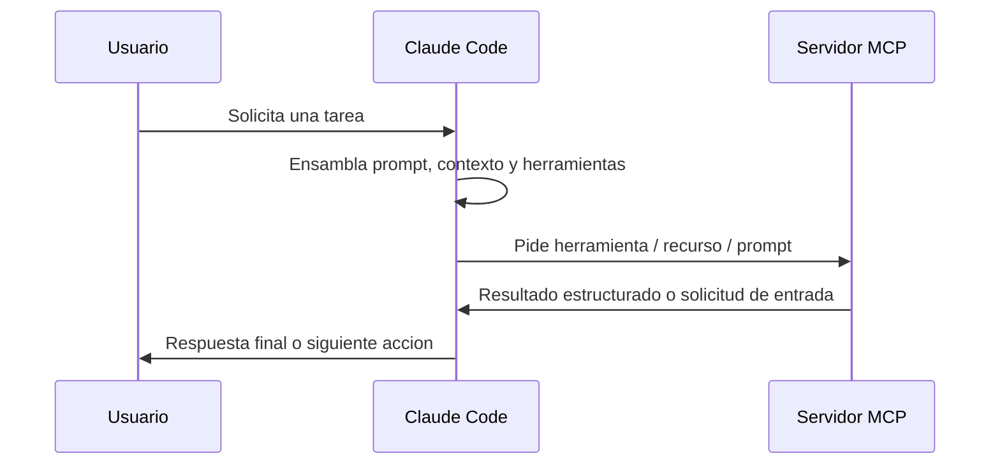

# MCP en Claude Code

Model Context Protocol (MCP) es la capa de extension que permite que Claude Code use herramientas externas, fuentes de datos y flujos de trabajo sin codificar integraciones especificas en el cliente. En la practica, Claude Code actua como cliente MCP, y los servidores MCP exponen capacidades que Claude puede descubrir y usar durante una sesion.

El modelo mental util es simple: Claude Code ensambla un prompt de sesion, carga el conjunto de herramientas disponible y luego decide cuando llamar herramientas, leer recursos o pedir entrada estructurada. MCP es lo que hace que esa capa de capacidad externa sea componible.

## Indice

1. [Modelo basico](#mcps-modelo-basico)
2. [Como usa Claude Code MCP](#mcps-como-usa)
3. [Modelo de configuracion](#mcps-configuracion)
4. [Autenticacion y ciclo de vida](#mcps-autenticacion)
5. [Busqueda de herramientas](#mcps-busqueda)
6. [Seguridad y gobernanza](#mcps-seguridad)
7. [Claude Code como servidor MCP](#mcps-claude-servidor)
8. [Ecosistema y seleccion](#mcps-ecosistema)
9. [Stack recomendado](#mcps-stack)
10. [Ejemplo end-to-end implementable](#mcps-ejemplo)
11. [Lista de verificacion operativa](#mcps-lista-verificacion)

<a id="mcps-modelo-basico"></a>
## Modelo Basico

MCP tiene cuatro conceptos que importan en operacion.

| Concepto | Que aporta | Como lo usa Claude Code |
|---|---|---|
| Herramientas | Acciones ejecutables como consultar una base de datos, navegar una pagina o crear un ticket | Claude invoca herramientas cuando la tarea necesita un efecto externo o datos frescos |
| Recursos | Objetos legibles como issues, docs, schemas o reportes | Se referencian con `@` y se inyectan en la conversacion |
| Prompts | Flujos reutilizables expuestos como comandos | Aparecen como comandos slash, por ejemplo `/mcp__server__prompt` |
| Elicitacion | Entrada estructurada a mitad de tarea solicitada por el servidor | Claude Code muestra un formulario o un flujo por URL y devuelve la respuesta al servidor |

En tiempo de ejecucion, Claude Code no trata MCP como una interfaz aparte. Integra las capacidades MCP en el mismo ciclo de sesion que maneja el razonamiento normal y las operaciones sobre archivos.



<a id="mcps-como-usa"></a>
## Como Usa Claude Code MCP

Claude Code descubre las capacidades MCP disponibles al inicio de la sesion y luego las carga bajo demanda segun la conversacion lo requiera. Esto importa por dos razones: mantiene el contexto manejable y permite que ecosistemas MCP grandes sigan siendo utilizables sin pre-cargar todas las descripciones de herramientas.

Cuando hay muchas herramientas MCP, Claude Code puede usar busqueda de herramientas en lugar de cargar todas las definiciones de una vez. La busqueda de herramientas es la opcion correcta para despliegues grandes porque reduce la presion sobre el contexto sin perder descubribilidad.

### Herramientas, Recursos y Prompts

Las herramientas son para acciones. Los recursos son para lectura. Los prompts son para flujos de trabajo empaquetados. Esa distincion importa porque define si Claude debe actuar, inspeccionar o invocar una tarea predefinida.

- Usa una herramienta cuando el servidor necesita hacer trabajo por ti.
- Usa un recurso cuando el servidor ya tiene el contenido que quieres analizar.
- Usa un prompt cuando el servidor ofrece un flujo operativo estandar que debe exponerse como comando.

Las referencias a recursos se comportan como menciones de archivos. Los nombres de prompts se normalizan a comandos. Eso hace que los servidores MCP se sientan nativos dentro de Claude Code y no como algo agregado despues.

### Elicitacion

Algunos servidores MCP necesitan informacion que no pueden inferir por si mismos. Claude Code maneja eso abriendo un prompt estructurado o un flujo por navegador, recogiendo la respuesta y continuando la tarea. Esto es comun para autenticacion, aprobaciones y valores especificos del usuario.

<a id="mcps-configuracion"></a>
## Modelo de Configuracion

Claude Code soporta tres estilos principales de transporte mas servidores provistos por plugins.

| Transporte | Mejor para | Notas |
|---|---|---|
| HTTP | Servicios remotos de produccion | Opcion recomendada para servidores alojados en la nube |
| SSE | Servicios remotos heredados | Sigue soportado, pero esta deprecado cuando HTTP esta disponible |
| stdio | Procesos locales y scripts personalizados | Ideal para herramientas privadas y automatizacion local |
| Provisto por plugin | Herramientas empaquetadas junto con un plugin | Se activa automaticamente con el ciclo de vida del plugin |

La regla clave para la configuracion por linea de comandos es el orden. Los flags de transporte, scope, headers y variables de entorno deben ir antes del nombre del servidor, y `--` separa el nombre del servidor del comando que se pasa a un servidor stdio.

```bash
claude mcp add --transport stdio --env KEY=value my-server -- node server.js
```

### Scopes y Politica

La configuracion MCP suele organizarse en scopes local, project y user. Un servidor con scope de proyecto es la mejor opcion para herramientas compartidas por el equipo. Un servidor con scope de usuario es la mejor opcion para una herramienta personal que quieres usar en todos los proyectos. Un servidor con scope local es la opcion privada mas restringida.

En entornos administrados, `managed-mcp.json` puede tomar control exclusivo de la superficie MCP permitida. Esa es la opcion correcta cuando la politica importa mas que la flexibilidad del usuario. Cuando si permites servidores administrados por usuarios, usa listas permitidas y listas denegadas para acotar la superficie.

| Modo de control | Comportamiento |
|---|---|
| Scopes normales | Los usuarios pueden configurar servidores dentro del scope permitido |
| Control administrado | Los administradores definen un conjunto fijo de servidores |
| Lista permitida | Solo se permiten servidores que coincidan |
| Lista denegada | Los servidores coincidentes se bloquean en todos los scopes |

Si el mismo nombre de servidor existe en varios lugares, verifica la configuracion efectiva con `claude mcp get <name>` en lugar de asumir que gano la fuente prevista.

### Expansion de Variables de Entorno

`.mcp.json` soporta expansion de variables de entorno para que un equipo pueda compartir una sola configuracion manteniendo fuera del archivo los valores especificos de cada maquina y los secretos.

Los patrones soportados incluyen `${VAR}` y `${VAR:-default}`. La expansion puede usarse en comandos del servidor, argumentos, bloques de entorno, URLs y headers HTTP.

<a id="mcps-autenticacion"></a>
## Autenticacion y Ciclo de Vida del Servidor

Los servidores HTTP remotos suelen usar OAuth 2.0. Claude Code puede abrir el flujo de login en el navegador, guardar tokens de forma segura y renovarlos automaticamente. Cuando un servidor requiere una URI de redireccion fija, usa `--callback-port` para que el callback coincida con el registro del servidor.

Si el servidor usa credenciales OAuth preconfiguradas, proporciona el client ID y el secret mediante el comando MCP o la configuracion JSON. Para servidores que exponen un endpoint de metadata no estandar, `authServerMetadataUrl` permite apuntar a un documento de metadata OAuth que funcione en lugar de depender de la ruta de discovery por defecto.

Claude Code tambien soporta:

- `claude mcp list`, `get` y `remove` para gestion del ciclo de vida
- `/mcp` para ver y autenticar servidores dentro de la sesion
- notificaciones `list_changed` para que los servidores refresquen herramientas sin reconectar

<a id="mcps-busqueda"></a>
## Busqueda de Herramientas y Gestion de Contexto

La busqueda de herramientas es el mecanismo que hace usable un despliegue MCP grande. En lugar de pre-cargar todas las descripciones de herramientas, Claude Code puede diferir la carga y buscar la capacidad relevante cuando haga falta.

| Ajuste | Efecto |
|---|---|
| `ENABLE_TOOL_SEARCH=true` | Fuerza la busqueda de herramientas |
| `ENABLE_TOOL_SEARCH=auto` | La activa cuando la huella MCP cruza el umbral configurado |
| `ENABLE_TOOL_SEARCH=auto:N` | Usa un porcentaje de umbral personalizado |
| `ENABLE_TOOL_SEARCH=false` | Pre-carga todas las herramientas |

Cuando `ANTHROPIC_BASE_URL` apunta a un host que no es first-party, la busqueda de herramientas se desactiva por defecto porque muchos proxies no reenvian los bloques `tool_reference`. Si tu proxy si los soporta, activala explicitamente.

Claude Code tambien avisa cuando las salidas MCP se vuelven demasiado grandes. Los limites practicos son:

- Umbral de alerta por defecto: 10,000 tokens
- Maximo por defecto: 25,000 tokens
- Override: `MAX_MCP_OUTPUT_TOKENS`

En Windows nativo, los servidores stdio locales que arrancan `npx` necesitan el wrapper `cmd /c` para que el proceso se inicie correctamente.

<a id="mcps-seguridad"></a>
## Seguridad y Gobernanza

Trata cada servidor MCP de terceros como codigo con privilegios. El servidor puede leer archivos locales, llamar APIs e inyectar instrucciones en el contexto a traves de descripciones y metadata de herramientas. Por eso los limites de confianza importan.

Los riesgos principales son:

- Prompt injection embebida en descripciones de herramientas o instrucciones del servidor
- Credenciales o variables de entorno demasiado amplias
- Servidores remotos no revisados que consumen contenido no confiable
- Salidas excesivas que inundan el contexto de la conversacion

La base correcta es instalar solo servidores verificados, guardar secretos fuera de los archivos de configuracion cuando sea posible y preferir el scope mas restringido que resuelva el problema. Para despliegues administrados, combina control exclusivo con filtrado por politica cuando necesites estandarizacion a nivel organizacional.

<a id="mcps-claude-servidor"></a>
## Usar Claude Code como Servidor MCP

Claude Code puede exponer sus propias herramientas a otro cliente MCP.

```bash
claude mcp serve
```

Eso es util cuando quieres que Claude Code sea el backend de automatizacion para otro cliente de escritorio u orquestador. El cliente anfitrion sigue siendo responsable del modelo de confirmacion de usuario para las llamadas a herramientas.

<a id="mcps-ecosistema"></a>
## Ecosistema y Seleccion de Servidores

La forma mas simple de navegar el ecosistema MCP es separarlo en servidores oficiales y comunitarios.

| Tipo | Caracteristicas | Cuando usarlo |
|---|---|---|
| Oficial | Mantenido por el autor de la plataforma, comportamiento estable, mejor documentacion | Quieres el valor por defecto mas seguro y la compatibilidad mas amplia |
| Comunitario | Mantenido por terceros, puede estar listo para produccion, la calidad varia | Necesitas una integracion especializada no cubierta por un servidor oficial |

Para servidores comunitarios, un umbral razonable de produccion es:

| Criterio | Umbral practico |
|---|---|
| Mantenimiento | Releases recientes y gestion activa de issues |
| Documentacion | Setup, ejemplos y troubleshooting completos |
| Tests | Existe CI o verificacion automatizada |
| Caso de uso | Resuelve una necesidad real y no duplica un servidor oficial |
| Licencia | OSS y suficientemente auditable para tu entorno |

### Categorias Representativas de Servidores

| Categoria | Servidores representativos | Mejor ajuste |
|---|---|---|
| Control de versiones | Git MCP | Commits locales, diffs, ramas, analisis de logs |
| Automatizacion de navegador | Playwright MCP, Browserbase MCP, Chrome DevTools MCP | E2E testing, automatizacion cloud, debug en runtime |
| Infraestructura | Kubernetes MCP, Vercel MCP | Operaciones de cluster, flujos de despliegue |
| Seguridad | Semgrep MCP | SAST, escaneo de secretos, gates de codigo seguro |
| Busqueda de codigo | Grepai MCP | Busqueda semantica y exploracion de grafos de llamadas |
| Documentacion | Context7 MCP | Documentacion actualizada de librerias y ejemplos de API |
| Gestion de proyectos | Linear MCP | Seguimiento de issues y coordinacion de entrega |
| Orquestacion | MCP-Compose | Gestion de muchos servidores con una sola configuracion |

Prefiere el servidor mas simple que encaje con el problema. Por ejemplo, usa Playwright para pruebas de navegacion, Chrome DevTools para debug y Browserbase cuando necesites ejecucion en la nube o funciones de stealth.

<a id="mcps-stack"></a>
## Stack Recomendado para Produccion

Para la mayoria de los equipos, el stack minimo util es:

1. Playwright MCP para verificacion en navegador
2. Semgrep MCP para revision de seguridad
3. Context7 MCP para uso correcto de librerias
4. Git MCP para automatizacion local de control de versiones

Agrega Linear si necesitas seguimiento de entrega, Kubernetes o Vercel si controlas flujos de despliegue, y MCP-Compose si administras un fleet grande de servidores.

<a id="mcps-ejemplo"></a>
## Ejemplo End-to-End

Este ejemplo arma una configuracion MCP de proyecto con cuatro archivos concretos. La idea es que un repositorio pueda arrancar con documentacion fresca, validacion en navegador y escaneo de seguridad sin depender de configuraciones manuales dispersas.

### Lo que vas a crear

```text
my-repo/
|-- .mcp.json
|-- .env.example
|-- .gitignore
`-- scripts/
    `-- verify-mcp-env.sh
```

### Archivo 1: `.mcp.json`

Este es el archivo principal. Debe vivir en la raiz del repositorio para que el equipo comparta la misma capa MCP.

```json
{
  "mcpServers": {
    "context7": {
      "command": "npx",
      "args": ["-y", "@upstash/context7-mcp"],
      "env": {
        "CONTEXT7_API_KEY": "${CONTEXT7_API_KEY}"
      }
    },
    "playwright": {
      "command": "npx",
      "args": ["-y", "@microsoft/playwright-mcp"]
    },
    "semgrep": {
      "command": "uvx",
      "args": ["semgrep-mcp"]
    }
  }
}
```

Que aporta cada servidor:

1. `context7` para documentacion actualizada.
2. `playwright` para validar flujos reales en navegador.
3. `semgrep` para detectar problemas de seguridad en el patch final.

### Archivo 2: `.env.example`

Este archivo documenta que variables deben existir sin commitear secretos reales.

```bash
CONTEXT7_API_KEY=replace-me
```

Su objetivo es operatividad, no seguridad absoluta. Los secretos reales deben vivir en `.env.local`, en variables del sistema o en un secret manager.

### Archivo 3: `.gitignore`

Este archivo evita que los valores reales terminen en git.

```gitignore
.env.local
.env
```

Si ya tienes un `.gitignore`, agrega estas lineas en lugar de reemplazarlo.

### Archivo 4: `scripts/verify-mcp-env.sh`

Este script valida el entorno antes de arrancar Claude Code.

```bash
#!/usr/bin/env bash
set -euo pipefail

required_vars=("CONTEXT7_API_KEY")

for var_name in "${required_vars[@]}"; do
  if [ -z "${!var_name:-}" ]; then
    echo "Missing required environment variable: ${var_name}" >&2
    exit 1
  fi
done

echo "MCP environment looks ready."
```

Hazlo ejecutable:

```bash
chmod +x scripts/verify-mcp-env.sh
```

### Orden de implementacion

1. Crear `.mcp.json`.
2. Crear `.env.example`.
3. Actualizar `.gitignore`.
4. Crear `scripts/verify-mcp-env.sh`.
5. Exportar `CONTEXT7_API_KEY` en tu entorno local.
6. Ejecutar `bash scripts/verify-mcp-env.sh`.

### Como usarlo en una sesion real

Pide a Claude Code algo que requiera las tres capacidades:

```text
Usa Context7 para confirmar el patron actual del SDK, implementa el cambio en el codigo, verifica el flujo en Playwright y pasa Semgrep sobre el patch final.
```

Resultado esperado:

1. Claude usa Context7 para obtener la referencia actual.
2. Claude cambia el codigo con herramientas del repositorio.
3. Claude valida el flujo en Playwright.
4. Claude ejecuta Semgrep antes de cerrar el trabajo.

### Por que este ejemplo esta completo

No se limita a listar comandos de instalacion. Define el archivo compartido de MCP, el archivo de ejemplo para secretos, la proteccion minima en git y el script de verificacion previa para que el setup sea repetible en cualquier repositorio.

<a id="mcps-lista-verificacion"></a>
## Lista de Verificacion Operativa

Antes de poner un servidor MCP en produccion, verifica lo siguiente:

- El servidor esta mantenido oficialmente o tiene una cadencia reciente de releases.
- El transporte coincide con el modelo de confianza: HTTP para servicios remotos, stdio para helpers locales.
- Los secretos se guardan en variables de entorno o en un almacen de credenciales seguro.
- Las descripciones de herramientas y prompts fueron revisadas por riesgo de inyeccion.
- La salida del servidor esta acotada o paginada.
- El scope elegido no es mas amplio de lo necesario.
- El equipo sabe como autenticar, renovar y revocar acceso.

Si estas condiciones no se cumplen, el servidor no esta listo para produccion aunque instale correctamente.
