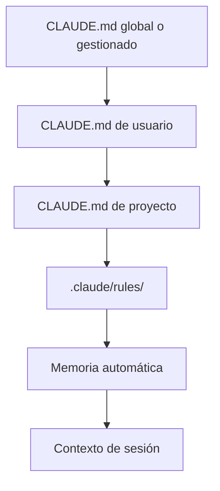

# Memoria e Instrucciones Persistentes

Claude Code conserva conocimiento entre sesiones mediante dos mecanismos: instrucciones explícitas en archivos `CLAUDE.md` y memoria automática, donde Claude registra hechos aprendidos sobre un proyecto. Usa `CLAUDE.md` para reglas estables y revisables. Usa memoria automática para observaciones duraderas que Claude deba reutilizar sin convertirlas en política a mano.

<a id="index"></a>
## Índice
- [Resumen](#overview)
- [Modelo de memoria](#memory-model)
- [Cómo elegir la capa correcta](#choosing-the-right-layer)
- [Archivos `CLAUDE.md`](#claude-md-files)
- [`.claude/rules/`](#claude-rules)
- [Memoria automática](#auto-memory)
- [Orden de carga y precedencia](#load-order-and-precedence)
- [Diagnóstico de problemas](#troubleshooting)
- [Ejemplo extremo a extremo](#end-to-end-example)
- [Lista operativa](#operational-checklist)

<a id="overview"></a>
## Resumen

Cada sesión comienza con un contexto conversacional nuevo. La persistencia no vive en el chat, sino en archivos del sistema de archivos. Eso te da dos canales estables para conocimiento de larga duración:

- archivos `CLAUDE.md` para instrucciones que deben estar presentes siempre que Claude trabaje en un alcance concreto
- memoria automática para aprendizajes que Claude registra mientras ayuda, como comandos de build, patrones de depuración y convenciones locales

Un buen diseño de memoria reduce sorpresas. Cuanto más específica sea una instrucción, más cerca debe vivir del código que gobierna. Cuanto más transitorio sea un hecho, más sentido tiene dejarlo en memoria automática en lugar de meterlo en un archivo de instrucciones editado a mano.

<a id="memory-model"></a>
## Modelo de Memoria

| Capa | Alcance | Quién la escribe | Uso ideal | Persistencia | Cuándo se carga |
| --- | --- | --- | --- | --- | --- |
| `CLAUDE.md` gestionado | Toda la organización | Plataforma o IT | Cumplimiento, seguridad, estándares globales | Persistente | Siempre para la máquina o la organización |
| `CLAUDE.md` de usuario | Todos tus proyectos | Tú | Preferencias personales y herramientas | Persistente | Siempre para tus sesiones |
| `CLAUDE.md` de proyecto | Un repositorio | El equipo | Arquitectura, build y pruebas | Persistente | Cuando Claude trabaja en ese repo |
| Archivos en `.claude/rules/` | Rutas o subsistemas concretos | El equipo | Reglas que solo aplican a parte del árbol | Persistente | Cuando se leen archivos coincidentes |
| Memoria automática | Un almacén de memoria por proyecto | Claude | Aprendizajes, comandos, patrones, preferencias | Persistente entre sesiones | `MEMORY.md` al inicio, archivos temáticos bajo demanda |
| Contexto de sesión | Una conversación | Usuario y Claude | Instrucciones puntuales y decisiones transitorias | Temporal | Solo la sesión actual |

<a id="memory-hierarchy-diagram"></a>


<a id="choosing-the-right-layer"></a>
## Cómo Elegir la Capa Correcta

Coloca la información lo más abajo posible en la jerarquía sin hacerla difícil de encontrar.

| Si la información... | Va en... | Motivo |
| --- | --- | --- |
| Aplica a todos los proyectos | `CLAUDE.md` de usuario o gestionado | Debe estar disponible en todas partes |
| Aplica a un repositorio concreto | `CLAUDE.md` del proyecto | El equipo debe poder revisarla |
| Solo aplica a una carpeta o tipo de archivo | `.claude/rules/` | Debe cargarse solo cuando corresponda |
| Es un patrón que Claude aprendió trabajando | Memoria automática | Es duradero, pero no una política estricta |
| Solo importa en la sesión actual | Conversación | No conviene persistir ruido |

El fallo más común es sobrecargar el archivo de instrucciones superior. Si una regla solo importa para un subconjunto de archivos, escópala. Si un hecho solo importa después de que Claude lo aprenda, deja que lo guarde en memoria automática. Si la nota es temporal, mantenla en la sesión.

<a id="claude-md-files"></a>
## Archivos `CLAUDE.md`

`CLAUDE.md` es el mecanismo principal para instrucciones estables. Úsalo para comandos de build, convenciones, arquitectura del repositorio, reglas de nomenclatura y flujos de trabajo repetibles.

La documentación de proyecto puede vivir en `./CLAUDE.md` o en `./.claude/CLAUDE.md`. Usa la ubicación que mejor encaje con la estructura del repositorio. Los archivos más específicos sobrescriben a los más amplios, así que un archivo a nivel de proyecto puede refinar un archivo de usuario, y un archivo de subdirectorio puede refinar uno de proyecto.

Escribe `CLAUDE.md` como un manual operativo breve:

- mantén el archivo lo bastante corto como para leerlo rápido
- prefiere instrucciones concretas frente a consejos genéricos
- agrupa reglas relacionadas bajo encabezados claros
- evita duplicar la misma regla en varios sitios
- separa temas grandes en archivos importados o reglas con alcance por ruta

`CLAUDE.md` puede importar otros archivos con la sintaxis `@ruta/al/archivo`. Úsalo cuando quieras un punto de entrada único que agrupe instrucciones relacionadas sin convertir el archivo principal en un bloque inmanejable.

```text
Resumen del proyecto: @README.md
Comandos de build y test: @docs/build.md
Flujo específico del repositorio: @.claude/project.md
```

<a id="claude-rules"></a>
## `.claude/rules/`

Usa `.claude/rules/` cuando una instrucción deba aplicarse solo a un subconjunto de archivos, directorios o flujos de trabajo. Las reglas se descubren de forma recursiva y cada archivo puede acotarse con frontmatter YAML.

```markdown
---
paths:
  - "src/api/**/*.ts"
  - "src/api/**/*.tsx"
---

# Reglas de API

- Valida entradas antes de la lógica de negocio.
- Mantén los handlers pequeños y explícitos.
- Devuelve formas de error estables.
```

Las reglas con alcance por ruta son útiles para contratos de API, convenciones específicas de framework, reglas de migración y requisitos de testing de un subsistema.

<a id="auto-memory"></a>
## Memoria Automática

La memoria automática es el almacén de recuerdos aprendidos por Claude. Sirve para hechos duraderos pero no normativos: comandos locales de build, hábitos de pruebas, atajos de depuración, rarezas específicas del repositorio y preferencias que Claude descubre mientras ayuda.

El almacén de memoria se organiza alrededor de un `MEMORY.md` central y archivos temáticos opcionales. `MEMORY.md` debe actuar como índice, no como volcado de todas las notas.

```text
~/.claude/projects/<project>/memory/
├── MEMORY.md
├── debugging.md
├── conventions.md
└── preferences.md
```

Trata `MEMORY.md` como un mapa:

- resume qué se guarda
- apunta a archivos temáticos para el detalle
- mantén pequeña la carga inicial
- mueve las explicaciones largas a archivos temáticos

La memoria automática es ideal para información que Claude puede reutilizar con seguridad en sesiones futuras sin reinterpretarla como una política. No sustituye a las instrucciones explícitas. Si una regla importa porque el equipo espera un comportamiento consistente, ponla en `CLAUDE.md` o en `.claude/rules/`.

<a id="load-order-and-precedence"></a>
## Orden de Carga y Precedencia

Cuando aplican varias capas, gana el alcance más estrecho que sea relevante.

1. Las instrucciones de sesión sobrescriben todo lo demás para la conversación actual.
2. Las reglas específicas por ruta sobrescriben la guía más amplia del proyecto para los archivos coincidentes.
3. `CLAUDE.md` del proyecto sobrescribe los valores por defecto de usuario para ese repositorio.
4. `CLAUDE.md` de usuario sobrescribe los valores globales o gestionados solo donde la política lo permita.
5. La memoria automática complementa la pila con hechos aprendidos, pero no debe tratarse como una capa de política dura.

La consecuencia operativa importante es que no conviene depender de memoria amplia cuando un archivo más estrecho puede expresar la misma regla con más precisión. Los archivos pequeños y específicos son más auditables y más fáciles de aplicar de forma consistente.

<a id="troubleshooting"></a>
## Diagnóstico de Problemas

Si Claude parece ignorar una instrucción, revisa lo siguiente en este orden:

- confirma que el archivo relevante está realmente en un alcance cargado
- busca instrucciones en conflicto en una capa más amplia o más estrecha
- vuelve la instrucción más concreta
- separa reglas no relacionadas en archivos distintos
- verifica que la nota pertenezca a memoria persistente y no a un mensaje puntual de sesión

Si la memoria automática se vuelve ruidosa:

- mantén `MEMORY.md` conciso
- mueve el detalle a archivos temáticos
- elimina notas obsoletas que ya no describen el flujo actual
- prioriza patrones duraderos frente a observaciones incidentales

Si una sesión se siente fragmentada después de `compact`, recuerda que el historial conversacional no es la capa de persistencia. La capa persistente es el sistema de archivos: `CLAUDE.md`, `.claude/rules/` y la memoria automática.

<a id="end-to-end-example"></a>
## Ejemplo Extremo a Extremo

Este ejemplo muestra un repositorio pequeño que usa juntos los tres mecanismos de persistencia:

- un `CLAUDE.md` raíz para la guía estable del repositorio
- reglas `.claude/rules/` con alcance por ruta para subsistemas
- una captura local de memoria automática para hechos aprendidos del proyecto

El ejemplo se divide en dos partes en disco:

- `project/` contiene los archivos del repositorio que Claude lee mientras trabaja
- `memory/` contiene una captura materializada del directorio de memoria automática que Claude usaría para ese proyecto

### Qué se construye

El proyecto es un servicio TypeScript llamado `memory-demo`. El equipo quiere que Claude:

- use `pnpm`
- valide entradas de API
- mantenga obligatorias las pruebas para cambios de comportamiento
- recuerde hechos recurrentes de build y depuración entre sesiones

### Estructura de directorios

```text
memory-demo/
├── project/
│   ├── CLAUDE.md
│   └── .claude/
│       ├── project.md
│       └── rules/
│           ├── api.md
│           ├── testing.md
│           └── deployment.md
└── memory/
    └── .claude/
        └── projects/
            └── memory-demo/
                └── memory/
                    ├── MEMORY.md
                    ├── debugging.md
                    └── preferences.md
```

### Contenido de los archivos

#### `project/CLAUDE.md`

```md
# Instrucciones de Memory Demo

@.claude/project.md

## Reglas operativas

- Usa `pnpm` para la gestión de paquetes.
- Ejecuta el conjunto de tests más específico antes de una validación amplia.
- Mantén breve la guía de todo el repositorio.
```

#### `project/.claude/project.md`

```md
# Convenciones del proyecto

- Este repositorio es un servicio TypeScript.
- Los cambios en el flujo de pagos requieren una prueba de regresión.
- Si un comportamiento cambia de forma duradera, registra el hecho en la memoria automática después de validarlo.
```

#### `project/.claude/rules/api.md`

```md
---
paths:
  - "src/api/**/*.ts"
---

# Reglas de API

- Valida las entradas antes de llamar a la lógica de negocio.
- Mantén los handlers pequeños y explícitos.
- Devuelve formas de error estables.
```

#### `project/.claude/rules/testing.md`

```md
---
paths:
  - "src/**/*.{ts,tsx}"
  - "tests/**/*.test.ts"
---

# Reglas de testing

- Añade o actualiza una prueba de regresión cuando cambie el comportamiento.
- Prefiere la prueba más pequeña que demuestre el caso.
- Ejecuta `pnpm test` antes de cerrar un cambio.
```

#### `project/.claude/rules/deployment.md`

```md
---
paths:
  - "deploy/**/*"
  - "infra/**/*"
---

# Reglas de despliegue

- Revisa el orden de despliegue antes de integrar cambios de infraestructura.
- Mantén las instrucciones de despliegue alineadas con el proceso de release actual.
- Actualiza los runbooks cuando cambie la forma de desplegar.
```

#### `memory/.claude/projects/memory-demo/memory/MEMORY.md`

```md
# MEMORY

## Temas almacenados

- debugging.md: modos de fallo recurrentes y cómo verificarlos
- preferences.md: preferencias locales de flujo de trabajo y comandos

## Hechos estables

- Usa `pnpm build` para builds de producción.
- Usa `pnpm test` para validación.
- La deriva del contrato de API es el riesgo de regresión más común.
```

#### `memory/.claude/projects/memory-demo/memory/debugging.md`

```md
# Notas de depuración

- Si la respuesta de API deriva, compara el validador de entrada con la forma de salida del handler.
- Si los tests pasan localmente pero fallan en CI, revisa secretos y valores por defecto específicos del entorno.
- Si un cambio toca la lógica de reintentos de pago, verifica explícitamente el comportamiento idempotente.
```

#### `memory/.claude/projects/memory-demo/memory/preferences.md`

```md
# Preferencias

- Prefiere `pnpm` frente a `npm`.
- Empieza con tests dirigidos antes de ejecutar toda la suite.
- Mantén las notas cortas y operativas.
```

### Orden de creación

1. Crea el `CLAUDE.md` a nivel de repositorio.
2. Añade el archivo de convenciones importado.
3. Añade reglas por ruta para API, testing y despliegue.
4. Crea la captura de memoria automática con `MEMORY.md` como índice.
5. Añade archivos temáticos de memoria para hechos recurrentes y patrones de depuración.

### Notas de integración

- `CLAUDE.md` proporciona la base siempre activa.
- `.claude/rules/` estrecha el comportamiento a las rutas coincidentes.
- La memoria automática captura hechos que Claude debe reutilizar después sin convertirlos en política permanente.

### Notas de ejecución

En una sesión real, Claude cargaría `CLAUDE.md` al inicio, tomaría las reglas que coinciden cuando lea archivos en esas rutas y leería archivos temáticos de memoria solo cuando los necesite. El resultado es un conjunto pequeño de instrucciones siempre activas más conocimiento persistente del proyecto que no infla el archivo principal.

### Validación

- Abre `/memory` y confirma que las instrucciones de nivel de proyecto están visibles.
- Confirma que las reglas por ruta solo aparecen cuando se leen archivos coincidentes.
- Verifica que `MEMORY.md` siga siendo un índice conciso y no un segundo volcado de instrucciones.
- Confirma que el proyecto puede reanudarse en una nueva sesión sin perder las notas duraderas.

### Resultado esperado

El proyecto sigue siendo fácil de guiar, las reglas permanecen auditables y los hechos aprendidos sobreviven entre sesiones sin inflar el archivo principal de instrucciones.

<a id="operational-checklist"></a>
## Lista Operativa

- Mantén instrucciones duraderas en `CLAUDE.md`.
- Mantén instrucciones específicas de archivo en `.claude/rules/`.
- Mantén hechos aprendidos en memoria automática.
- Mantén `MEMORY.md` corto.
- Prefiere reglas explícitas y verificables frente a orientación vaga.
- Revisa instrucciones en conflicto antes de que se acumulen.
