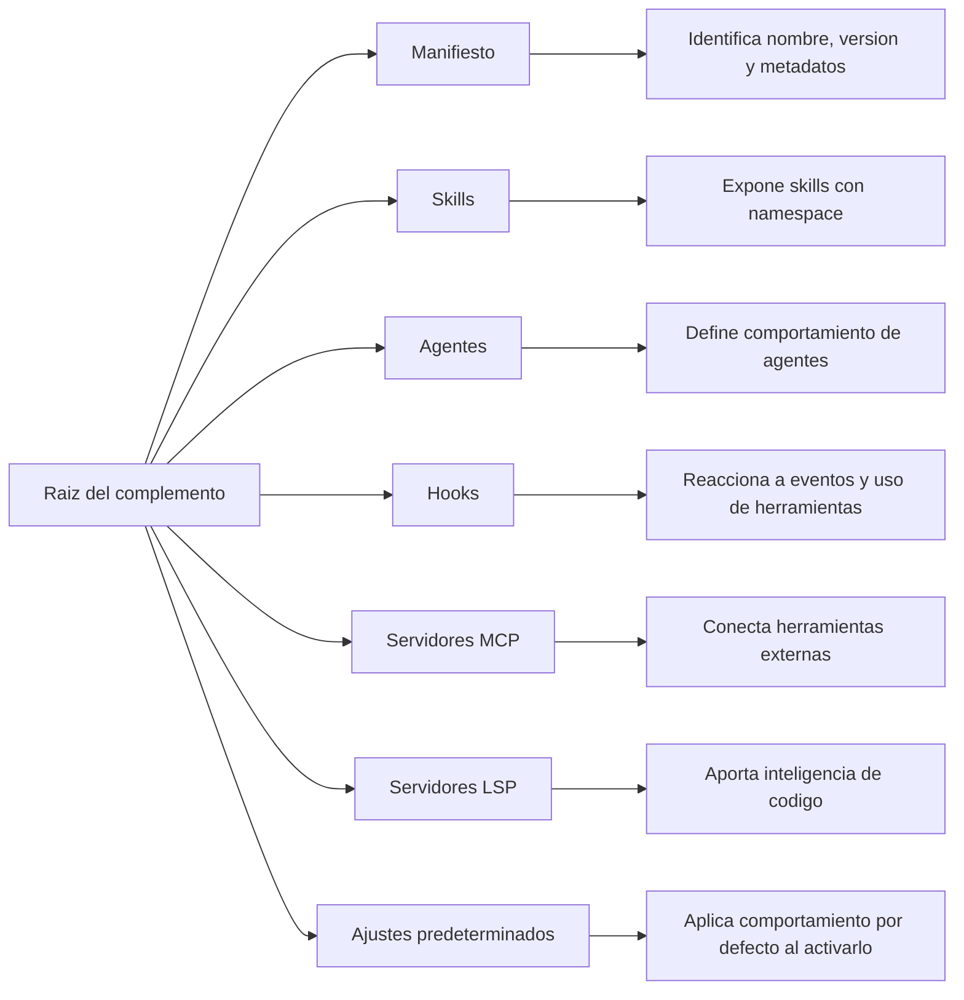

# Complementos de Claude Code

Los complementos de Claude Code empaquetan funcionalidad reutilizable en una unidad que se puede compartir. Un complemento puede incluir metadatos de identidad, skills, agentes, hooks, configuración de servidores MCP, configuración de LSP y ajustes predeterminados. El resultado es una extensión repetible que se puede instalar localmente, compartir con un equipo o publicar mediante un marketplace.

Los complementos son la abstracción adecuada cuando se necesita el mismo comportamiento en varios proyectos o para varios usuarios. Para experimentos rápidos o personalizaciones puntuales de un proyecto, la configuración independiente suele ser más simple. Cuando algo se va a reutilizar, versionar, distribuir o gobernar, un complemento es un límite mucho más durable.

## Indice

1. [Cuando usar un complemento](#plugins-cuando-usar)
2. [Modelo mental](#plugins-modelo-mental)
3. [Anatomia](#plugins-anatomia)
4. [Manifiesto y metadatos](#plugins-manifiesto)
5. [Componentes principales](#plugins-componentes)
6. [Flujo de desarrollo](#plugins-flujo)
7. [Ejemplo end-to-end implementable](#plugins-ejemplo)
8. [Pruebas y depuracion](#plugins-pruebas)
9. [Distribucion](#plugins-distribucion)
10. [Seguridad](#plugins-seguridad)
11. [Migracion](#plugins-migracion)
12. [Lista operativa](#plugins-lista-operativa)

<a id="plugins-cuando-usar"></a>
## Cuándo Usar Un Complemento

| Caso de uso | Preferir configuración independiente | Preferir complemento |
| --- | --- | --- |
| Flujo personal en un solo repositorio | Sí | No |
| Flujo compartido por un equipo | No | Sí |
| Skill o hook reutilizable | No | Sí |
| Experimentación temprana | Sí | Quizás después |
| Distribución por marketplace | No | Sí |
| Capacidades con namespace para evitar colisiones | No | Sí |

Conviene empezar con configuración independiente cuando la prioridad es iterar rápido. Pasa a un complemento cuando el comportamiento deja de ser exclusivo del repositorio original o cuando necesitas versiones y comandos con namespace.

<a id="plugins-modelo-mental"></a>
## Modelo Mental Del Complemento

En alto nivel, un complemento es un directorio raíz que contiene un manifiesto y directorios opcionales para componentes. Claude Code lee el manifiesto, carga los componentes disponibles y los expone a través del administrador de complementos y de comandos con namespace.



La restriccion de diseño mas importante es la ubicacion. Los directorios de componentes deben vivir en la raiz del complemento. El directorio `.claude-plugin/` debe contener el manifiesto y nada mas.

<a id="plugins-anatomia"></a>
## Anatomia Del Complemento

| Componente | Ubicacion | Responsabilidad |
| --- | --- | --- |
| Manifiesto | `.claude-plugin/plugin.json` | Define identidad, version y metadatos |
| Skills | `skills/` | Agrega instrucciones reutilizables que Claude puede invocar |
| Agentes | `agents/` | Agrega definiciones de agentes personalizados |
| Hooks | `hooks/` | Ejecuta automatizacion guiada por eventos |
| Configuracion MCP | `.mcp.json` | Declara servidores de herramientas externas |
| Configuracion LSP | `.lsp.json` | Agrega inteligencia de codigo basada en language servers |
| Ajustes predeterminados | `settings.json` | Aplica comportamiento por defecto al habilitar el complemento |

Un complemento limpio mantiene legible el nivel raiz. Si empieza a crecer mucho, organiza por responsabilidad en lugar de mezclar todo en una sola carpeta.

<a id="plugins-manifiesto"></a>
## Manifiesto Y Metadatos

El manifiesto describe el complemento para Claude Code y para los usuarios que lo ven en el administrador de complementos. El modelo esperado de versionado es semantic versioning.

| Campo | Propósito |
| --- | --- |
| `name` | Identidad del complemento y prefijo del namespace |
| `description` | Resumen legible que se muestra en la UI |
| `version` | Version de release, normalmente semantic versioning |
| `author` | Metadato de autoría |
| `homepage` | Home page opcional del proyecto |
| `repository` | Repositorio fuente opcional |
| `license` | Metadato opcional de licencia |

Trata `name` como parte del contrato publico. Determina como se invocan los skills con namespace, asi que cambiarlo mas adelante tambien cambia el prefijo que escriben los usuarios.

<a id="plugins-componentes"></a>
## Componentes Principales

### Skills

Los skills son el bloque mas comun de un complemento. Encapsulan instrucciones repetibles para una tarea bien definida, como revisiones de codigo, redaccion de release notes o limpieza de documentacion de API. En un complemento, los skills usan namespace, por lo que la invocacion incluye el nombre del complemento.

Usa skills cuando el comportamiento sea procedimental, basado en texto o mejor expresado como un conjunto reutilizable de instrucciones. Funcionan bien para tareas donde la consistencia importa mas que la improvisacion de una sola ejecucion.

### Agentes

Los agentes son utiles cuando un complemento necesita un estilo operativo propio, un system prompt personalizado o restricciones de herramientas. Son mas expresivos que un skill cuando el comportamiento debe parecer un rol dedicado y no solo un fragmento reutilizable de prompt.

### Hooks

Los hooks son automatizacion guiada por eventos. Son apropiados para validacion, cumplimiento de politicas, formateo, notificaciones o higiene del repositorio. El lugar correcto para un hook es un evento que debe ejecutarse porque algo ocurrio, no porque un usuario invoco manualmente una skill.

### Servidores MCP

La configuracion MCP le da al complemento acceso a servicios externos mediante el Model Context Protocol. Es la herramienta correcta para integraciones controladas con sistemas de terceros, APIs internas o automatizacion local que debe comportarse como una herramienta de primera clase.

### Servidores LSP

La configuracion LSP agrega inteligencia de lenguaje, como diagnosticos, busqueda de simbolos y navegacion. Usala cuando Claude necesite mas conciencia del codigo para un lenguaje que no esta cubierto por la configuracion base.

### Ajustes Predeterminados

Los ajustes predeterminados permiten que un complemento cambie el comportamiento de Claude Code cuando el complemento esta habilitado. Mantiene estos ajustes acotados. Deben establecer un valor por defecto razonable, no codificar toda una politica de proyecto.

<a id="plugins-flujo"></a>
## Flujo De Desarrollo

1. Crear la raiz del complemento y el manifiesto.
2. Agregar un componente por vez.
3. Validar localmente con `claude --plugin-dir`.
4. Recargar los complementos activos con `/reload-plugins`.
5. Probar el complemento desde el administrador y con comandos directos.

Esta secuencia mantiene corto el ciclo de feedback. Primero valida el componente mas simple y despues incorpora hooks, integracion MCP o ajustes solo cuando lo basico funciona.

<a id="plugins-ejemplo"></a>
## Ejemplo Completo De Extremo A Extremo

Este ejemplo crea un plugin operativo con cuatro archivos reales. El plugin agrega una skill namespaced de code review, un hook de formateo post-edicion y un servidor MCP para analisis de seguridad.

### Lo que vas a crear

```text
team-review-kit/
|-- .claude-plugin/
|   `-- plugin.json
|-- skills/
|   `-- code-review/
|       `-- SKILL.md
|-- hooks/
|   `-- hooks.json
`-- .mcp.json
```

### Archivo 1: `.claude-plugin/plugin.json`

Este es el manifiesto. Debe existir exactamente en `.claude-plugin/plugin.json`.

```json
{
  "name": "team-review-kit",
  "description": "Shared review workflow for engineering teams",
  "version": "1.0.0",
  "author": {
    "name": "Platform Engineering"
  }
}
```

Que define:

1. El nombre publico del plugin.
2. El namespace de invocacion.
3. La version que vas a distribuir.

### Archivo 2: `skills/code-review/SKILL.md`

Este archivo implementa la capacidad principal del plugin. Debe ubicarse en `skills/code-review/SKILL.md`.

```markdown
---
description: Review the current change set for correctness, security, and maintainability
allowed-tools: Read, Grep, Glob, Bash(git diff:*), Bash(git status:*), Bash(git log:*)
---

# Code Review Skill

Review the current change set as a senior engineer.

Always inspect:
- behavioral correctness
- edge cases
- security and data handling
- test coverage
- maintainability and clarity

When you find a problem, explain why it matters, estimate the risk, and suggest the smallest safe fix.
```

Que aporta:

1. Un trigger claro para revisiones.
2. Un scope de herramientas acotado.
3. Un contrato de salida orientado a findings.

### Archivo 3: `hooks/hooks.json`

Este archivo registra un hook propio del plugin. Debe crearse en `hooks/hooks.json`.

```json
{
  "hooks": {
    "PostToolUse": [
      {
        "matcher": "Write|Edit",
        "hooks": [
          {
            "type": "command",
            "command": "npm run lint:fix"
          }
        ]
      }
    ]
  }
}
```

Que hace:

1. Escucha escrituras y ediciones.
2. Lanza un formateo automatico.
3. Mantiene el repositorio consistente despues de cambios de Claude.

### Archivo 4: `.mcp.json`

Este archivo agrega una integracion opcional para revisar hallazgos de seguridad con Semgrep. Debe vivir en la raiz del plugin.

```json
{
  "mcpServers": {
    "semgrep": {
      "command": "uvx",
      "args": ["semgrep-mcp"]
    }
  }
}
```

Que aporta:

1. Un servidor MCP dedicado a analisis de seguridad.
2. Una extension reusable dentro del mismo paquete.
3. Una forma de convertir el plugin en algo mas que prompts y hooks.

### Orden de creacion recomendado

1. Crear la carpeta `team-review-kit/`.
2. Crear `.claude-plugin/plugin.json`.
3. Crear `skills/code-review/SKILL.md`.
4. Crear `hooks/hooks.json`.
5. Crear `.mcp.json`.

Ese orden facilita validar el plugin por capas: identidad primero, capacidad principal despues, automatizacion y servicios al final.

### Como probarlo localmente

Carga el plugin:

```bash
claude --plugin-dir ./team-review-kit
```

Recarga despues de cualquier cambio:

```text
/reload-plugins
```

Ejecuta la skill:

```text
/team-review-kit:code-review
```

Edita un archivo JavaScript o TypeScript para verificar el hook:

```text
Corrige este archivo y luego vuelve a formatearlo.
```

Resultado esperado:

1. La skill aparece con namespace propio.
2. El hook corre despues de `Write` o `Edit`.
3. El servidor MCP queda disponible para el plugin si `uvx` y `semgrep-mcp` estan instalados.

### Por que este ejemplo es completo

No se limita a mostrar una estructura. Te dice que archivos crear, donde van, que responsabilidad tiene cada uno, en que orden conviene armarlos y como verificar que el plugin funciona de punta a punta.

<a id="plugins-pruebas"></a>
## Pruebas Y Depuracion

Empieza con carga local. Es la forma mas rapida de obtener feedback y evita publicar un complemento roto. Si algo no aparece en el administrador de complementos, revisa primero tres cosas: la ubicacion del manifiesto, la estructura de directorios en la raiz y si recargaste los complementos despues de editar.

Los fallos mas comunes suelen ser estructurales y no conceptuales. La mayoria de los problemas aparece por poner directorios dentro de `.claude-plugin/`, por olvidar la recarga o por asumir que una actualizacion ya esta activa antes de que Claude Code vuelva a leerla.

<a id="plugins-distribucion"></a>
## Distribucion Y Comparticion

Cuando el complemento ya esta listo para compartirse, agrega un README, mantiene el numero de version en movimiento y distribuyelo mediante un marketplace si quieres una ruta de instalacion estable. Para uso en equipo, conviene una configuracion de marketplace a nivel de repositorio para que todos reciban el mismo conjunto de extensiones aprobadas.

El versionado importa porque un complemento es un artefacto de cadena de suministro de software. Trata las releases como snapshots inmutables, no como carpetas informales que se conservan por costumbre.

<a id="plugins-seguridad"></a>
## Consideraciones De Seguridad

Los complementos son potentes y deben tratarse como codigo confiable. Pueden ejecutar comandos, cargar definiciones de herramientas externas e influir en el comportamiento de Claude Code. Instala solo complementos de fuentes confiables y revisa la implementacion antes de habilitarla en un entorno sensible.

El limite de confianza es mas amplio que el manifiesto. Hooks, servidores MCP e integraciones LSP expanden la superficie efectiva de confianza. Si un complemento necesita acceso a sistemas o datos privados, valida los permisos exactos y la ruta de ejecucion antes de desplegarlo.

<a id="plugins-migracion"></a>
## Migracion Desde Configuracion Independiente

Si ya mantienes skills o hooks en una configuracion independiente, conviertelos en un complemento cuando necesites portabilidad.

| Configuracion independiente | Equivalente en complemento |
| --- | --- |
| Personalizacion local de proyecto | Paquete reutilizable con namespace |
| Archivos en `.claude/` | Archivos en la raiz del complemento |
| Hooks definidos en settings | `hooks/hooks.json` |
| Skills sin namespace | Invocaciones con namespace |
| Comparticion manual por copia | Instalacion via marketplace o plugin directo |

La migracion es simple: crea la raiz del complemento, mueve los componentes relevantes, prueba con `--plugin-dir` y recien despues publica o comparte.

<a id="plugins-lista-operativa"></a>
## Lista Operativa

Antes de publicar un complemento, verifica que tenga un manifiesto claro, una estructura de raiz predecible, al menos un componente probado, una version documentada y una historia de confianza coherente con su audiencia.

Si el complemento es para un equipo, tambien verifica el scope de instalacion, el comportamiento de actualizacion y la estrategia de rollback. Esos detalles importan tanto como la implementacion.
