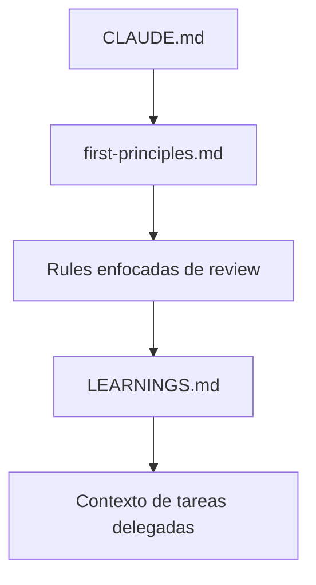

# Guía de Rules

Las rules son las restricciones duraderas y los lentes de review que mantienen alineado a Claude Code cuando una sesión se alarga o una tarea se vuelve compleja. Importan porque el contexto conversacional decae, pero las rules del repositorio pueden recargarse de forma predecible. Un buen sistema de rules le da a Claude límites estables, umbrales medibles de calidad y criterios repetibles de revisión.

<a id="index"></a>
## Índice

- [Por qué existen las rules](#why-rules-exist)
- [Capas de rules](#rule-layers)
- [Cómo escribir rules efectivas](#how-to-write-effective-rules)
- [Propagación y learnings de sesión](#propagation-and-session-learnings)
- [Ejemplo completo: Review Guardrails Kit](#complete-example-review-guardrails-kit)
- [Validación y mantenimiento](#validation-and-maintenance)
- [Lista operativa](#operational-checklist)

<a id="why-rules-exist"></a>
## Por qué existen las rules

Las rules resuelven tres problemas operativos al mismo tiempo.

Primero, resisten la deriva del contexto. Una restricción escrita en el repositorio sobrevive entre sesiones mucho mejor que una instrucción perdida antes en el chat. Segundo, vuelven revisables las expectativas. El equipo puede discutir un umbral o una invariante en un archivo mejor que en un transcript. Tercero, hacen más consistente el review. Cuando arquitectura, calidad de código, performance y testing están explicitados, Claude puede aplicarlos como una rúbrica estable en lugar de improvisarla cada vez.

<a id="rule-layers"></a>
## Capas de rules

La mayoría de los sistemas de rules funcionan mejor cuando separan restricciones universales de criterios de review específicos.

| Capa | Propósito | Ubicación típica |
| --- | --- | --- |
| Invariantes de sesión | Restricciones de seguridad, proceso y alcance que nunca deben romperse | `CLAUDE.md` o `.claude/rules/first-principles.md` |
| Rules de review enfocadas | Criterios de arquitectura, calidad, performance y testing | `.claude/rules/*.md` |
| Learnings de sesión | Restricciones nuevas descubiertas durante el trabajo que deberían inyectarse en tareas delegadas | `.claude/LEARNINGS.md` más wiring de hooks |

Esta estructura por capas mantiene cada archivo estrecho. Las invariantes de sesión definen lo que siempre debe cumplirse. Las rules enfocadas definen qué inspeccionar en una dimensión concreta. Los learnings de sesión capturan descubrimientos específicos del repositorio sin reescribir continuamente todo el pack.



<a id="how-to-write-effective-rules"></a>
## Cómo escribir rules efectivas

Las buenas rules son lo bastante concretas como para aplicarse y lo bastante estrechas como para entenderse rápido.

Hay tres principios que más importan:

| Principio | Qué significa en la práctica |
| --- | --- |
| Restricciones duras en lugar de preferencias vagas | Expresar explícitamente lo que nunca debe romperse |
| Umbrales en lugar de adjetivos | Preferir límites medibles a palabras como "bueno" o "razonable" |
| Lentes de review en lugar de recordatorios genéricos | Dar a cada archivo una tarea enfocada |

Un archivo útil de first principles suele incluir cuatro secciones:

- hard constraints
- quality thresholds
- workflow invariants
- anti-patterns to detect

Las rules enfocadas, en cambio, deberían responder una sola pregunta de forma correcta. Una rule de arquitectura no debería convertirse en manifiesto de testing. Una rule de performance no debería mutar silenciosamente en checklist de despliegue.

<a id="propagation-and-session-learnings"></a>
## Propagación y learnings de sesión

Algunas restricciones son lo bastante estables como para vivir siempre en las rules. Otras se descubren durante el trabajo y solo necesitan persistir el tiempo suficiente como para influir en tareas delegadas dentro del mismo repositorio.

Ahí ayuda el patrón `LEARNINGS.md`. El archivo actúa como una libreta viva de observaciones duraderas del flujo actual: un subsistema frágil, un riesgo de migración, una rareza del entorno o una nueva restricción descubierta durante debugging. Conectar ese archivo al arranque de tareas delegadas mantiene alineados a los workers especializados con el contexto operativo más reciente.

La clave es no convertir `LEARNINGS.md` en un segundo `CLAUDE.md`. Debe seguir siendo corto, operativo y fácil de podar.

<a id="complete-example-review-guardrails-kit"></a>
## Ejemplo completo: Review Guardrails Kit

Este ejemplo construye un pack de rules orientado a review para un repositorio que quiere que Claude permanezca dentro de límites fuertes de seguridad mientras aplica criterios especializados de arquitectura, calidad de código, performance y tests.

El mismo artefacto está materializado en `docs/rules/example/review-guardrails-kit/`.

### Qué se construye

El kit combina tres cosas:

- un `CLAUDE.md` raíz que importa el pack duradero de rules
- archivos de rules enfocadas bajo `.claude/rules/`
- un `LEARNINGS.md` más el registro del hook para que las tareas delegadas hereden restricciones operativas frescas

### Estructura de directorios

```text
review-guardrails-kit/
|-- README.md
|-- README.es.md
|-- CLAUDE.md
`-- .claude/
    |-- LEARNINGS.md
    |-- settings.json
    `-- rules/
        |-- first-principles.md
        |-- architecture-review.md
        |-- code-quality-review.md
        |-- performance-review.md
        `-- test-review.md
```

### Orden de creación

1. Crea `.claude/rules/`.
2. Agrega `first-principles.md` para que el repositorio arranque con límites duros.
3. Agrega los archivos de review enfocados.
4. Agrega `CLAUDE.md` en la raíz para importar el pack.
5. Agrega `.claude/LEARNINGS.md`.
6. Registra el hook de propagación en `.claude/settings.json`.
7. Agrega `README.md` para explicar cómo copiar el bundle.

### Guía archivo por archivo

`README.md` explica los destinos:

```md
# Review Guardrails Kit

Copy `CLAUDE.md` into the target repository root.
Copy `.claude/rules/`, `.claude/LEARNINGS.md`, and `.claude/settings.json` into the repository-level `.claude/`.

Use this kit when you want Claude to apply consistent review criteria and keep delegated tasks aligned with newly discovered constraints.
```

`CLAUDE.md` importa el pack:

```md
# Repository Contract

@.claude/rules/first-principles.md
@.claude/rules/architecture-review.md
@.claude/rules/code-quality-review.md
@.claude/rules/performance-review.md
@.claude/rules/test-review.md
```

`.claude/LEARNINGS.md` captura observaciones frescas pero duraderas:

```md
# Learnings

- Payments code should be treated as high-risk and reviewed for regressions before merge.
- Changes that touch environment loading need explicit validation in CI and local development.
- Database-related changes should call out query shape and migration impact.
```

`.claude/settings.json` propaga learnings a tareas delegadas:

```json
{
  "hooks": {
    "PreToolUse": [
      {
        "matcher": "Task",
        "hooks": [
          {
            "type": "command",
            "command": "cat .claude/LEARNINGS.md 2>/dev/null || true"
          }
        ]
      }
    ]
  }
}
```

`.claude/rules/first-principles.md` define invariantes de todo el repositorio:

```md
# First Principles

## Hard Constraints

- Never delete production data without explicit confirmation.
- Never add secrets to version-controlled files.
- Never modify files outside the current task scope without calling it out.

## Quality Thresholds

- Every bug fix requires a regression test.
- New public behavior needs explicit validation.
- No silent error handling.

## Workflow Invariants

- Read before editing.
- Re-test after significant change.
- Stop and report when the current task conflicts with the repository contract.
```

`.claude/rules/architecture-review.md` acota el review a límites de sistema:

```md
# Architecture Review

- Check whether responsibilities are split across clear component boundaries.
- Look for circular dependencies and mixed concerns.
- Verify that data ownership and source of truth are explicit.
- Identify likely failure points under higher load.
```

`.claude/rules/code-quality-review.md` captura criterios de mantenibilidad:

```md
# Code Quality Review

- Flag duplicated logic aggressively.
- Look for silent failures and weak error handling.
- Check whether module structure and naming stay consistent.
- Call out over-engineering and under-engineering separately.
```

`.claude/rules/performance-review.md` se enfoca en riesgo de hot paths:

```md
# Performance Review

- Check for N+1 query patterns.
- Verify that data is fetched at the right granularity.
- Look for unnecessary work in hot paths.
- Ask whether caching is applied at the right layer.
```

`.claude/rules/test-review.md` define expectativas de testing:

```md
# Test Review

- Look for missing coverage around public behavior and critical paths.
- Prefer behavior assertions over implementation assertions.
- Check boundary cases and failure modes explicitly.
- Verify that tests remain independent and non-flaky.
```

### Notas de integración

- Mantén los archivos de rules enfocados lo bastante pequeños como para leerlos de una pasada.
- Agrega nuevos archivos solo cuando la dimensión de review sea realmente distinta.
- Poda `LEARNINGS.md` a medida que las rarezas del repositorio dejan de ser relevantes.
- Usa el patrón de hooks solo para notas cortas y duraderas que las tareas delegadas necesiten de verdad.

### Notas de ejecución

Después de copiar el kit a un repositorio:

1. Inicia Claude Code dentro del repositorio.
2. Abre la guía raíz para confirmar que `CLAUDE.md` carga el pack.
3. Agrega una nota breve a `.claude/LEARNINGS.md`.
4. Delega una tarea acotada y confirma que el worker recibe esa nota.
5. Ejecuta una solicitud orientada a review y revisa que los hallazgos respeten las dimensiones definidas por las rules.

### Resultado esperado

Claude aplica un contrato estable de repositorio, revisa con lentes explícitos y mantiene alineado el trabajo delegado con los learnings vivos del repositorio en lugar de depender de memoria conversacional que deriva.

<a id="validation-and-maintenance"></a>
## Validación y mantenimiento

Valida el pack en este orden:

1. Confirma que `CLAUDE.md` importa los archivos previstos.
2. Revisa que los archivos de rules no se dupliquen entre sí en exceso.
3. Verifica que `LEARNINGS.md` siga siendo corto y operativo.
4. Confirma que el wiring del hook apunta al archivo correcto.
5. Revisa si los umbrales y las invariantes siguen alineados con los estándares del equipo.

El fallo más común es la inflación de rules: demasiados archivos, demasiado solapamiento y demasiada prosa. Si una rule deja de ser escaneable, divídela. Si dos archivos dicen lo mismo, fusiónalos.

<a id="operational-checklist"></a>
## Lista operativa

- Pon las reglas que nunca deben romperse en la capa más duradera.
- Prefiere umbrales medibles a adjetivos vagos.
- Dale a cada archivo de rules enfocadas una sola tarea.
- Mantén `LEARNINGS.md` lo bastante corto como para inyectarlo con seguridad.
- Revisa el pack cuando cambie el workflow o el perfil de riesgo del equipo.
- Trata las rules como interfaces del repositorio, no como notas descartables.
