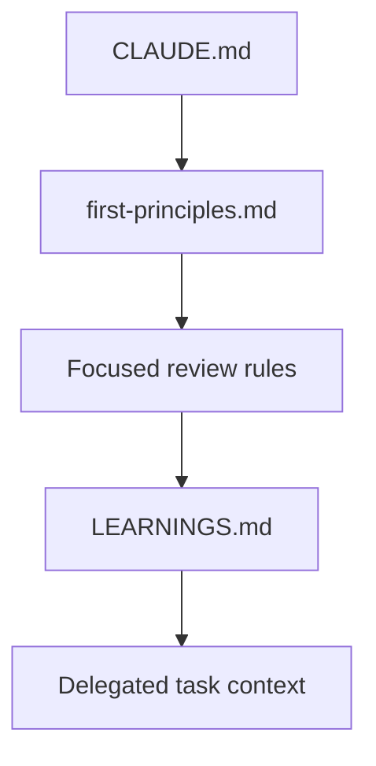

# Rules Guide

Rules are the durable constraints and review lenses that keep Claude Code aligned when a session grows long or a task becomes complex. They matter because chat context decays, but repository rules can be reloaded predictably. A strong rule system gives Claude stable boundaries, measurable quality thresholds, and repeatable review criteria.

<a id="index"></a>
## Index

- [Why Rules Exist](#why-rules-exist)
- [Rule Layers](#rule-layers)
- [How to Write Effective Rules](#how-to-write-effective-rules)
- [Propagation and Session Learnings](#propagation-and-session-learnings)
- [Complete Example: Review Guardrails Kit](#complete-example-review-guardrails-kit)
- [Validation and Maintenance](#validation-and-maintenance)
- [Operational Checklist](#operational-checklist)

<a id="why-rules-exist"></a>
## Why Rules Exist

Rules solve three operational problems at once.

First, they resist context drift. A constraint written down in the repository survives across sessions better than an instruction buried earlier in the chat. Second, they make expectations reviewable. Teams can debate a threshold or invariant in a file far more effectively than in a transcript. Third, they make review more consistent. When architecture, code quality, performance, and test expectations are explicit, Claude can apply them as a stable rubric instead of improvising one each time.

<a id="rule-layers"></a>
## Rule Layers

Most rule systems work best when they separate universal constraints from task-specific review criteria.

| Layer | Purpose | Typical location |
| --- | --- | --- |
| Session invariants | Never-break safety, process, and scope constraints | `CLAUDE.md` or `.claude/rules/first-principles.md` |
| Focused review rules | Architecture, code quality, performance, and testing criteria | `.claude/rules/*.md` |
| Session learnings | Fresh constraints discovered during work that should be injected into delegated tasks | `.claude/LEARNINGS.md` plus hook wiring |

This layered structure keeps each file narrow. Session invariants define what must always hold. Focused review rules define what to inspect in a given dimension. Session learnings capture project-specific discoveries without rewriting the rule pack constantly.



<a id="how-to-write-effective-rules"></a>
## How to Write Effective Rules

Good rules are concrete enough to enforce and narrow enough to understand quickly.

Three principles matter most:

| Principle | What it means in practice |
| --- | --- |
| Hard constraints over vague preference | State never-break rules explicitly |
| Thresholds over adjectives | Prefer measurable limits to words such as "good" or "reasonable" |
| Review lenses over generic reminders | Give each rule file a focused job |

A useful first-principles file usually includes four sections:

- hard constraints
- quality thresholds
- workflow invariants
- anti-patterns to detect

Focused rule files should then answer one question well. An architecture rule should not become a testing manifesto. A performance rule should not silently become a deployment checklist.

<a id="propagation-and-session-learnings"></a>
## Propagation and Session Learnings

Some constraints are stable enough to live in rules forever. Others are discovered during work and only need to persist long enough to influence delegated tasks in the same repository.

That is where a `LEARNINGS.md` pattern helps. The file acts as a rolling scratchpad for durable observations from the current stream of work: a fragile subsystem, a migration hazard, an environment quirk, or a new constraint discovered during debugging. Hooking that file into delegated task startup keeps specialist workers aligned with the latest repository-specific context.

The key is not to turn `LEARNINGS.md` into a second `CLAUDE.md`. Keep it short, operational, and easy to prune.

<a id="complete-example-review-guardrails-kit"></a>
## Complete Example: Review Guardrails Kit

This example builds a review-oriented rule pack for a repository that wants Claude to stay inside strong safety boundaries while applying specialized review criteria for architecture, code quality, performance, and tests.

The same artifact is materialized under `docs/rules/example/review-guardrails-kit/`.

### What is being built

The kit combines three things:

- a root `CLAUDE.md` that imports the durable rule pack
- focused rule files under `.claude/rules/`
- a `LEARNINGS.md` file plus hook registration so delegated tasks inherit fresh operational constraints

### Directory structure

```text
review-guardrails-kit/
|-- README.md
|-- README.es.md
|-- CLAUDE.md
`-- .claude/
    |-- LEARNINGS.md
    |-- settings.json
    `-- rules/
        |-- first-principles.md
        |-- architecture-review.md
        |-- code-quality-review.md
        |-- performance-review.md
        `-- test-review.md
```

### Creation order

1. Create `.claude/rules/`.
2. Add `first-principles.md` so the repository starts with hard boundaries.
3. Add the focused review rule files.
4. Add root `CLAUDE.md` to import the rule pack.
5. Add `.claude/LEARNINGS.md`.
6. Register the propagation hook in `.claude/settings.json`.
7. Add `README.md` to explain how the bundle should be copied.

### File-by-file guide

`README.md` explains the copy targets:

```md
# Review Guardrails Kit

Copy `CLAUDE.md` into the target repository root.
Copy `.claude/rules/`, `.claude/LEARNINGS.md`, and `.claude/settings.json` into the repository-level `.claude/`.

Use this kit when you want Claude to apply consistent review criteria and keep delegated tasks aligned with newly discovered constraints.
```

`CLAUDE.md` imports the rule pack:

```md
# Repository Contract

@.claude/rules/first-principles.md
@.claude/rules/architecture-review.md
@.claude/rules/code-quality-review.md
@.claude/rules/performance-review.md
@.claude/rules/test-review.md
```

`.claude/LEARNINGS.md` captures fresh but durable observations:

```md
# Learnings

- Payments code should be treated as high-risk and reviewed for regressions before merge.
- Changes that touch environment loading need explicit validation in CI and local development.
- Database-related changes should call out query shape and migration impact.
```

`.claude/settings.json` propagates learnings into delegated tasks:

```json
{
  "hooks": {
    "PreToolUse": [
      {
        "matcher": "Task",
        "hooks": [
          {
            "type": "command",
            "command": "cat .claude/LEARNINGS.md 2>/dev/null || true"
          }
        ]
      }
    ]
  }
}
```

`.claude/rules/first-principles.md` defines repository-wide invariants:

```md
# First Principles

## Hard Constraints

- Never delete production data without explicit confirmation.
- Never add secrets to version-controlled files.
- Never modify files outside the current task scope without calling it out.

## Quality Thresholds

- Every bug fix requires a regression test.
- New public behavior needs explicit validation.
- No silent error handling.

## Workflow Invariants

- Read before editing.
- Re-test after significant change.
- Stop and report when the current task conflicts with the repository contract.
```

`.claude/rules/architecture-review.md` narrows review to system boundaries:

```md
# Architecture Review

- Check whether responsibilities are split across clear component boundaries.
- Look for circular dependencies and mixed concerns.
- Verify that data ownership and source of truth are explicit.
- Identify likely failure points under higher load.
```

`.claude/rules/code-quality-review.md` captures maintainability criteria:

```md
# Code Quality Review

- Flag duplicated logic aggressively.
- Look for silent failures and weak error handling.
- Check whether module structure and naming stay consistent.
- Call out over-engineering and under-engineering separately.
```

`.claude/rules/performance-review.md` focuses on hot-path risk:

```md
# Performance Review

- Check for N+1 query patterns.
- Verify that data is fetched at the right granularity.
- Look for unnecessary work in hot paths.
- Ask whether caching is applied at the right layer.
```

`.claude/rules/test-review.md` defines testing expectations:

```md
# Test Review

- Look for missing coverage around public behavior and critical paths.
- Prefer behavior assertions over implementation assertions.
- Check boundary cases and failure modes explicitly.
- Verify that tests remain independent and non-flaky.
```

### Integration notes

- Keep the focused rule files small enough to scan in one pass.
- Add new rule files only when the review dimension is clearly distinct.
- Prune `LEARNINGS.md` as repository quirks stop being relevant.
- Use the hook pattern only for short, durable notes that delegated tasks genuinely need.

### Execution notes

After copying the kit into a repository:

1. Start Claude Code in the repository.
2. Open the root guidance to confirm `CLAUDE.md` loads the rule pack.
3. Add one short note to `.claude/LEARNINGS.md`.
4. Delegate a bounded task and confirm the worker receives the learning note.
5. Run a review-oriented request and check that findings align with the rule dimensions.

### Expected outcome

Claude applies a stable repository contract, reviews code with explicit lenses, and keeps delegated work aligned with live repository learnings instead of relying on drifting chat memory.

<a id="validation-and-maintenance"></a>
## Validation and Maintenance

Validate the pack in this order:

1. Confirm `CLAUDE.md` imports the intended rule files.
2. Check that rule files do not duplicate each other excessively.
3. Verify `LEARNINGS.md` stays short and operational.
4. Confirm the hook wiring points at the right file.
5. Review whether thresholds and invariants still match the team's standards.

The most common failure mode is rule inflation: too many files, too much overlap, and too much prose. If a rule file stops being scannable, split it. If two files say the same thing, merge them.

<a id="operational-checklist"></a>
## Operational Checklist

- Put never-break rules in the most durable layer.
- Prefer measurable thresholds to vague adjectives.
- Give each focused rule file one job.
- Keep `LEARNINGS.md` short enough to inject safely.
- Review the rule pack whenever the team's workflow or risk profile changes.
- Treat rules as repository interfaces, not as disposable notes.
