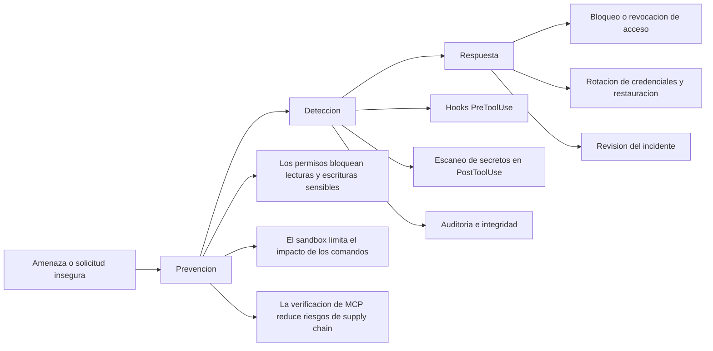

# Seguridad y endurecimiento de produccion para Claude Code

Esta guia define la postura de seguridad para usar Claude Code en proyectos reales. Esta escrita para desarrolladores senior que necesitan controles practicos, no politica abstracta. El modelo operativo es defensa en profundidad: los permisos reducen lo que Claude puede pedir, el sandbox limita lo que pueden hacer los comandos, los hooks detectan comportamiento riesgoso y la gobernanza mantiene esos controles consistentes en todo el equipo.

## Indice

1. [Modelo de seguridad](#security-modelo)
2. [Controles preventivos](#security-controles)
3. [Aislamiento de ejecucion](#security-aislamiento)
4. [Deteccion y monitoreo](#security-deteccion)
5. [Reglas de seguridad de produccion](#security-reglas)
6. [Gobernanza a escala de equipo](#security-gobernanza)
7. [Privacidad y retencion](#security-privacidad)
8. [Seguridad de Remote Control](#security-remote-control)
9. [Respuesta a incidentes](#security-incidentes)
10. [Checklist operativo](#security-checklist)
11. [Resumen de decision](#security-resumen)
12. [Companion de implementacion](#security-companion)

<a id="security-modelo"></a>
## Modelo de seguridad

Claude Code debe tratarse como un asistente con privilegios altos. Puede leer codigo, inspeccionar salidas, ejecutar comandos e interactuar con servidores MCP. Eso crea una superficie de ataque mayor que la de un plugin normal de IDE, asi que la respuesta correcta es control por capas y no una sola barrera.



El objetivo practico no es prevenir todo. Es hacer mas dificil el compromiso, volver visible el comportamiento sospechoso y reducir el radio de explosion si algo falla.

<a id="security-controles"></a>
## 1. Controles preventivos

### Permisos y limites para secretos

`permissions.deny` es la primera linea de defensa. Debe bloquear tanto el acceso directo a archivos como los atajos obvios por shell. Negar solo `Read(...)` no alcanza si Bash todavia puede imprimir o copiar el mismo contenido.

Usa reglas de denegacion para:

- Archivos de secretos como `.env`, claves, tokens y credenciales
- Directorios sensibles como `~/.ssh`, `~/.aws` y `~/.kube`
- Patrones de shell de alto riesgo como `cat .env`, `env` y `printenv`
- Archivos de infraestructura que no deben cambiar sin revision

```json
{
  "permissions": {
    "deny": [
      "Read(./.env*)",
      "Edit(./.env*)",
      "Write(./.env*)",
      "Read(./secrets/**)",
      "Read(./**/*.pem)",
      "Read(./**/*.key)",
      "Bash(cat .env*)",
      "Bash(printenv*)",
      "Bash(env)"
    ]
  }
}
```

Trata estas reglas como necesarias, pero no suficientes. Algunos mecanismos de indexacion o lectura en segundo plano pueden exponer contenido antes de que se aplique una regla a nivel de herramienta, por lo que los datos sensibles tambien deben vivir fuera del arbol del proyecto siempre que sea posible.

### Verificacion de MCP

Los servidores MCP amplian capacidad y superficie de ataque al mismo tiempo. La base segura es fijar versiones exactas, verificar integridad y usar credenciales lo mas acotadas posible.

Antes de aprobar uno, revisa:

| Control | Por que importa |
|---|---|
| Reputacion de la fuente | Reduce riesgo de supply chain |
| Fijacion de version exacta | Evita actualizaciones maliciosas silenciosas |
| Verificacion de hash | Detecta alteraciones en artefactos de publicacion |
| Revision de permisos | Evita acceso amplio al filesystem o a la red |
| Credenciales de solo lectura | Limita el dano si el servidor se compromete |

Prefiere servidores oficiales o validados por la comunidad para tareas de solo lectura, razonamiento local y persistencia local. Trata los MCP con filesystem libre, navegador completo o bases de datos de produccion como de alto riesgo salvo que su alcance este muy restringido.

### Skills y otras extensiones

Las skills de terceros y los paquetes similares tienen los mismos riesgos de supply chain que cualquier dependencia. Revisalos como codigo, no como documentacion.

Controles minimos:

- Inspeccionar la definicion antes de instalar
- Buscar acceso inesperado a Bash o ejecucion dinamica de codigo
- Fijar la version o el commit
- Auditar primero los scripts incluidos, porque suelen ser la parte mas riesgosa
- Escanear el paquete con una herramienta de seguridad antes de confiar en el

### Pre-scan del repositorio y superficie `.claude/`

Antes de abrir un repositorio desconocido, busca instrucciones ocultas y ganchos de ejecucion. Las zonas de mayor riesgo son los markdown, los manifiestos de paquete, los directorios de configuracion ocultos y las guias de contribucion. Busca comentarios HTML, entradas de scripts sospechosas, blobs base64 y comandos shell inesperados.

Un repositorio tambien puede incluir sus propios agentes, comandos, hooks y settings. Eso es util cuando confias en el repo, y peligroso cuando no. Revisa:

- Hooks con acceso a red, exfiltracion o salidas silenciosas
- Agentes que piden acceso amplio a Bash sin un proposito acotado
- Comandos que esconden instrucciones extra despues del prompt visible
- Settings que aflojan las reglas allow o desactivan protecciones

Si el repositorio es desconocido, inspecciona su contenido `.claude/` con el mismo criterio que aplicarias a workflows de CI o scripts de paquete.

<a id="security-aislamiento"></a>
## 2. Aislamiento de ejecucion

El sandbox es la segunda linea de defensa. Limita lo que Bash puede tocar incluso si el modelo es manipulado o un comando se comporta mal.

### Sandbox nativo

El sandbox nativo es la opcion liviana. Usa primitivas del sistema operativo para aislar la ejecucion de comandos.

| Plataforma | Mecanismo | Notas |
|---|---|---|
| macOS | Seatbelt | Integrado |
| Linux / WSL2 | bubblewrap + socat | Requiere instalacion |
| WSL1 | No soportado | Faltan features de kernel |
| Windows nativo | En plan | Usar WSL2 por ahora |

Usa sandbox nativo cuando quieras bajo overhead, codigo confiable y un flujo de desarrollo diario.

### Docker sandboxes

Los Docker sandboxes brindan un aislamiento mas fuerte. Ejecutan al agente dentro de una microVM con su propio filesystem y un daemon de Docker privado. Esta es la opcion correcta cuando el codigo no es confiable, cuando necesitas Docker dentro del entorno o cuando quieres una barrera mas fuerte que el aislamiento por proceso.

Propiedades clave:

- El workspace se sincroniza dentro del sandbox
- El daemon de Docker del host no queda expuesto
- El sandbox puede ejecutar con `--dangerously-skip-permissions` porque el propio sandbox se vuelve el limite de seguridad
- Las reglas de red siguen siendo importantes, porque el aislamiento no reemplaza el control de salida

### Sandboxes en la nube

Los sandboxes en la nube sirven para CI, flujos de trabajo de agentes via API y tareas altamente paralelas. Usalos cuando la tarea pertenece a infraestructura efimera y no a una workstation de desarrollo.

### Como elegir

| Situacion | Opcion recomendada |
|---|---|
| Desarrollo local confiable | Sandbox nativo |
| Codigo no confiable o dependencias desconocidas | Docker sandbox |
| CI, automatizacion o cargas multiagente | Sandbox en la nube |
| Necesitas Docker dentro del entorno | Docker sandbox |
| Necesitas overhead minimo | Sandbox nativo |

### Limites del sandbox

El sandbox es fuerte, pero no magico.

- Las allowlists amplias de dominios aun pueden permitir exfiltracion
- Los Unix sockets pueden romper supuestos si se permiten rutas demasiado amplias
- Escribir en directorios del PATH o en archivos de inicio del shell puede crear persistencia
- Los modos de compatibilidad con sandbox anidado son mas debiles y solo deben usarse cuando ya existe aislamiento extra

<a id="security-deteccion"></a>
## 3. Deteccion y monitoreo

### Hooks

Los hooks son la capa principal de deteccion en tiempo de ejecucion. Un stack practico es:

- `PreToolUse` para bloquear comandos peligrosos y detectar prompt injection
- `PostToolUse` para escaneo de secretos y registro de sesion
- `SessionStart` para checks de gobernanza e integridad de configuracion

Esto acerca los controles a la ejecucion en vez de depender de revision manual despues del hecho.

### Deteccion de prompt injection

El prompt injection suele esconderse en archivos que Claude lee automaticamente. Busca:

- Caracteres de ancho cero
- Caracteres de override RTL
- Secuencias ANSI
- Null bytes y tecnicas de truncado
- Comentarios HTML ocultos y blobs base64

La respuesta correcta es escanear el contenido, no confiar solo en la inspeccion visual.

### Escaneo de salidas

Todo comando que produce salida puede filtrar secretos. Agrega un scanner posterior para:

- Claves de API
- Tokens
- Cadenas de conexion
- Claves privadas
- Stack traces o rutas sensibles

Si un comando es sospechoso, falla en cerrado y pide revision.

### Chequeos de integridad

En proyectos con configuracion compartida, verifica que los MCP, los hooks y los archivos de gobernanza no hayan cambiado de forma inesperada. Los checks mas utiles son:

- Comparar hashes o diffs de la configuracion activa
- Verificar que los hooks instalados existan y sean ejecutables
- Comparar los MCP activos con un registro aprobado
- Alertar sobre cambios inesperados en archivos criticos de seguridad

<a id="security-reglas"></a>
## 4. Reglas de seguridad de produccion

Los equipos de produccion necesitan reglas mas estrictas que la guia normal de desarrollo. El punto no es prohibir el avance. Es evitar cambios que agregan riesgo operativo sin una decision explicita.

| Regla | Que protege |
|---|---|
| Estabilidad de puertos | Evita drift y roturas de despliegue |
| Seguridad de base de datos | Evita perdida destructiva de datos |
| Completitud de funcionalidades | Evita releases parciales o placeholders |
| Bloqueo de infraestructura | Evita cambios con impacto productivo accidental |
| Seguridad de dependencias | Evita riesgo innecesario de supply chain y mantenimiento |
| Seguimiento de patrones | Conserva la consistencia del codigo |

Aplicacion recomendada:

- Bloquear archivos criticos de infraestructura con reglas deny
- Exigir backup antes de trabajo destructivo en base de datos
- Bloquear nuevas instalaciones de paquetes salvo aprobacion explicita
- Usar las convenciones del proyecto como default, no como sugerencia
- No enviar implementaciones parciales como si fueran completas

### Paradoja de verificacion

No confies en que Claude verifique su propio trabajo. Usa controles independientes.

La validacion automatica deberia cubrir:

- Typecheck
- Lint
- Tests
- Escaneo de seguridad
- Validacion de build o bundle cuando aplique

La revision humana deberia enfocarse en arquitectura, edge cases y logica de negocio. No deberia ser el unico mecanismo de seguridad.

### Flujo de PR

Un flujo de revision sano es:

1. Ejecutar primero los checks automatizados
2. Revisar el diff buscando cambios sensibles de seguridad
3. Seguir el flujo de datos en auth, pagos y almacenamiento
4. Exigir aprobacion explicita para cambios que toquen riesgo de produccion

<a id="security-gobernanza"></a>
## 5. Gobernanza a escala de equipo

Los settings locales del desarrollador no alcanzan para entornos de equipo. La gobernanza tiene que vivir en configuracion versionada para que sea reproducible.

### Carta de uso

Una carta responde:

- Que clasificaciones de datos estan permitidas
- Que herramientas estan aprobadas
- Que casos de uso estan prohibidos
- Quien puede aprobar excepciones

La frontera mas importante es simple: los datos restringidos no deben entrar nunca en la ventana de contexto del modelo.

### Registro de MCP

Para entornos compartidos, manten un registro aprobado de servidores MCP con:

- Version
- Fuente
- Aprobador
- Fecha de expiracion
- Alcance de datos
- Justificacion

Revisalo periodicamente y trata los cambios de version como eventos de cambio, no como ruido rutinario.

### Niveles de guardrails

Usa tiers de politica en vez de una configuracion unica para todos.

| Tier | Uso previsto |
|---|---|
| Starter | Equipos pequenos, proyectos internos, bajo riesgo |
| Standard | Codigo cercano a produccion y sensibilidad moderada |
| Strict | Sistemas criticos y datos de clientes |
| Regulated | Salud, finanzas y otros entornos con compliance fuerte |

Cuanto mas alto el tier, mas conviene combinar reglas deny, hooks, logs de auditoria y gates de aprobacion explicitos.

### Auditoria y compliance

Los auditores suelen pedir evidencia de politica, enforcement, revision y manejo de incidentes. Conserva estos artefactos:

- La carta de uso
- El registro aprobado de MCP
- Logs de sesiones y tool calls
- Plantillas de PR con disclosure de AI
- Procedimientos de respuesta a incidentes

En entornos regulados, usa zero data retention donde exista, pero no asumas que cubre integraciones de terceros o metadatos administrativos.

<a id="security-privacidad"></a>
## 6. Privacidad y retencion

Claude Code envia prompts, contenido de archivos, salida de comandos y resultados de MCP a Anthropic para su procesamiento. Eso es comportamiento normal, asi que el control de privacidad consiste en reducir lo que entra en la ventana de contexto y elegir el nivel de retencion correcto.

### Resumen de retencion

| Modo | Retencion tipica |
|---|---|
| Consumer default | 5 anos |
| Consumer opt-out | 30 dias |
| Team / Enterprise / API | 30 dias |
| ZDR en Claude for Enterprise | Sin retencion server-side para la inferencia cubierta |

### Alcance de ZDR

ZDR aplica a la inferencia de Claude Code en Claude for Enterprise. No cubre automaticamente:

- Chat en la interfaz web
- Sesiones remotas
- Metadatos de analitica
- Datos administrativos de usuarios y asientos
- Servidores MCP de terceros o integraciones externas

Si una sesion queda marcada por uso indebido o existe un requerimiento legal, la retencion puede superar la ventana nominal de ZDR.

### Controles practicos de privacidad

- Bloquear archivos de secretos con reglas deny
- Usar credenciales de solo lectura para MCP de base de datos
- Evitar conectar Claude Code a bases de datos de produccion
- Desactivar telemetria y reportes de errores cuando corresponda
- Mantener material muy sensible fuera del arbol del proyecto

<a id="security-remote-control"></a>
## 7. Seguridad de Remote Control

Remote control permite operar una sesion local de Claude Code desde otro dispositivo. Esa comodidad tiene un costo de seguridad claro: la URL de la sesion funciona como un token de acceso en vivo.

Practicas recomendadas:

- Usarlo solo en una workstation dedicada
- Cerrar las sesiones cuando termines
- Nunca pegar la URL de sesion en chat, tickets o capturas
- Tratar las aprobaciones por comando como un guardrail, no como garantia
- Evitarlo en maquinas compartidas o con privilegios altos

Si tu organizacion tiene requisitos estrictos de residencia de datos o de workstation, trata Remote Control como cualquier otro plano de control que enruta trafico por la nube.

<a id="security-incidentes"></a>
## 8. Respuesta a incidentes

Si sospechas un compromiso, actua rapido y preserva evidencia.

1. Deshabilita el MCP o la extension sospechosa
2. Verifica la integridad de la configuracion y comparala con un estado conocido
3. Revisa tool calls recientes, logs de sesion y cambios en archivos
4. Rota las credenciales relacionadas de inmediato
5. Restaura desde backups si algun archivo critico fue alterado
6. Notifica al equipo o al responsable de compliance si datos regulados pudieron exponerse

Primero se contiene. Luego se recupera. Solo despues se analiza la causa raiz.

<a id="security-checklist"></a>
## 9. Checklist operativo

Usa esto como estandar minimo para proyectos sensibles:

- Bloquear archivos de secretos y rutas de credenciales
- Fijar cada MCP o extension de terceros
- Usar hooks para detectar prompt injection y escanear salidas
- Preferir ejecucion sandboxed para trabajo autonomo o no confiable
- Mantener reglas de produccion en configuracion compartida
- Conservar un registro aprobado de MCP para equipos
- Exigir backups antes de operaciones destructivas de base de datos
- Revisar diffs despues de cualquier ejecucion autonoma
- Rotar credenciales inmediatamente despues de una exposicion sospechada

<a id="security-resumen"></a>
## 10. Resumen de decision

| Si estas haciendo... | Usa... |
|---|---|
| Trabajo individual sobre codigo publico | Reglas deny + escaneo de salidas |
| Trabajo en equipo sobre codigo sensible | Reglas deny + hooks + verificacion de MCP |
| Refactors autonomos | Sandbox nativo o Docker, segun el nivel de confianza |
| Cambios de produccion | Reglas de produccion + backups + verificacion independiente |
| Despliegue a escala organizacional | Tiers de gobernanza + registro + auditoria |
| Datos regulados | ZDR donde exista, reglas deny estrictas, sin sorpresas de terceros |

La seguridad no es una sola funcion. Es un modelo operativo repetible. La mejor configuracion es la que el equipo realmente mantiene activada.

<a id="security-companion"></a>
## 11. Companion de implementacion

Si ademas de la guia conceptual quieres una receta implementable, usa `docs/security/security-in-action.md`. Ese documento aterriza la teoria en componentes concretos: hooks, plugin reusable, skill de revision y una integracion MCP recomendada para endurecer repositorios reales.
