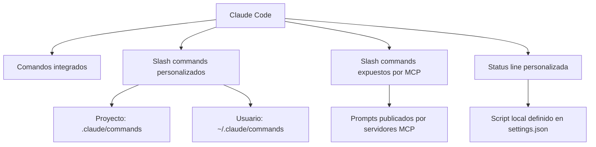
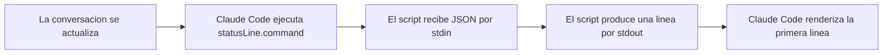

# Guia Completa de Slash Commands, MCP Commands y Status Lines

Esta guia explica, en un solo lugar, como funciona la personalizacion de comandos en Claude Code y como disenar comandos claros, seguros y reutilizables.

## Panorama general

Claude Code se puede extender por cuatro vias:



| Superficie | Para que sirve | Donde vive | Cuando conviene |
|---|---|---|---|
| Comandos integrados | Controlar la sesion y la herramienta | Claude Code | Configuracion, revision, memoria, estado |
| Slash commands personalizados | Encapsular flujos repetibles | `.claude/commands/` o `~/.claude/commands/` | Auditorias, planeacion, PRs, seguridad |
| MCP slash commands | Ejecutar prompts publicados por integraciones | Servidores MCP conectados | GitHub, Jira, sistemas externos |
| Status line | Mostrar contexto vivo en la interfaz | `.claude/settings.json` + script local | Modelo, branch, costo, contexto, directorio |

## 1. Comandos integrados

Los comandos integrados ya vienen con Claude Code. Conviene entenderlos por categoria:

| Categoria | Comandos | Uso principal |
|---|---|---|
| Sesion y contexto | `/help`, `/clear`, `/compact`, `/status`, `/cost`, `/bug` | Limpiar, inspeccionar y mantener la sesion |
| Proyecto y trabajo diario | `/init`, `/agents`, `/review`, `/pr_comments`, `/memory` | Inicializacion, agentes, revision y memoria |
| Configuracion | `/add-dir`, `/config`, `/permissions`, `/model`, `/mcp`, `/doctor` | Directorios, permisos, modelo, integraciones |
| Cuenta | `/login`, `/logout` | Cambiar o cerrar sesion |
| Interfaz | `/terminal-setup`, `/vim` | Ergonomia del terminal y modo de edicion |

En algunas instalaciones tambien puede existir un flujo guiado para la status line.

## 2. Slash commands personalizados

### Ubicacion

| Alcance | Ruta | Caracteristica |
|---|---|---|
| Proyecto | `.claude/commands/` | Se comparte con el repo y el equipo |
| Usuario | `~/.claude/commands/` | Se reutiliza en varios proyectos |

### Sintaxis basica

```text
/<nombre-del-comando> [argumentos]
```

El nombre del comando sale del nombre del archivo Markdown sin la extension `.md`.

Ejemplos:

- `.claude/commands/security-audit.md` -> `/security-audit`
- `.claude/commands/release-notes.md` -> `/release-notes`
- `~/.claude/commands/catchup.md` -> `/catchup`

### Organizacion recomendada

Puedes usar subcarpetas para ordenar archivos, pero conviene que el filename siga siendo claro por si solo. En la practica, lo mas robusto es:

- nombrar el archivo con un nombre suficientemente descriptivo
- usar subcarpetas solo para organizacion humana
- evitar depender de convenciones ambiguas en el nombre visible del comando

## 3. Anatomia de un command file

Un slash command bien hecho suele tener dos partes:

1. Frontmatter: metadatos y restricciones
2. Cuerpo del prompt: contexto, proceso, salida y guardrails

### Frontmatter soportado

| Campo | Para que sirve | Valor por defecto |
|---|---|---|
| `allowed-tools` | Restringe que herramientas puede usar el comando | Hereda la sesion actual |
| `argument-hint` | Muestra al usuario que argumentos espera el comando | Ninguno |
| `description` | Texto corto para autocompletado y ayuda | Primera linea del archivo |
| `model` | Fija un modelo especifico para ese comando | Hereda la sesion actual |

Ejemplo:

```markdown
---
allowed-tools: Read, Glob, Grep, Bash(git status:*), Bash(git diff:*)
argument-hint: [path] [--quick]
description: Inspecciona el estado del proyecto y devuelve riesgos concretos
model: claude-3-5-haiku-20241022
---
```

### Bloques recomendados dentro del prompt

| Bloque | Funcion |
|---|---|
| Titulo o apertura | Define el objetivo en una sola frase |
| `Context` | Reune datos antes de decidir |
| `Process` o `Instructions` | Ordena el flujo de trabajo |
| `Output Format` | Fija una salida consistente |
| `Guardrails` | Limita acciones peligrosas o ambiguas |
| `Usage` | Ensena invocaciones reales |

## 4. Capacidades dinamicas dentro del prompt

### 4.1 Argumentos con `$ARGUMENTS`

Sirve para inyectar texto dinamico desde la invocacion:

```markdown
Corrige el issue #$ARGUMENTS siguiendo las convenciones del proyecto.
```

Uso:

```text
/fix-issue 123
```

### 4.2 Referencias de archivos con `@`

Sirve para meter archivos o directorios en el contexto del comando:

```markdown
Revisa @src/auth/service.ts y compara con @src/auth/service.test.ts
```

Conviene usarlo cuando:

- quieres comparar implementacion y tests
- quieres contrastar codigo y documentacion
- necesitas traer a contexto un archivo clave sin escribir rutas a mano cada vez

### 4.3 Comandos inline con ``!`...` ``

Sirve para ejecutar un comando antes de que corra el prompt y meter la salida en contexto:

```markdown
- Estado git: !`git status --short`
- Diff actual: !`git diff --stat HEAD`
```

Esto exige dos cuidados:

- incluir `allowed-tools` con el alcance minimo necesario
- usarlo sobre todo para lectura, no para acciones destructivas

### 4.4 Thinking mode

Si el comando necesita razonamiento mas profundo, expresalo claramente en el prompt:

- "piensa por fases"
- "evalua trade-offs"
- "valida supuestos antes de concluir"
- "no avances si hay ambiguedades sin resolver"

## 5. Buenas practicas para `allowed-tools`

La calidad de un comando depende mucho de sus permisos.

### Reglas practicas

| Situacion | Recomendacion |
|---|---|
| Comando de lectura | Usa `Read`, `Glob`, `Grep` y `Bash(...)` muy acotado |
| Comando de escritura | Agrega solo las herramientas estrictamente necesarias |
| Comando con `git commit`, deploy o delete | Exige confirmacion explicita en el prompt |
| Comando de analisis | Mantenerlo analisis-only siempre que sea posible |

### Ejemplo correcto

```markdown
---
allowed-tools: Read, Glob, Grep, Bash(git status:*), Bash(git diff:*)
description: Resume cambios locales sin modificar archivos
---
```

### Ejemplo demasiado amplio

```markdown
---
allowed-tools: Bash(*), Write, Edit
description: Hace de todo
---
```

Ese segundo ejemplo es fragil, dificil de auditar y muy facil de usar mal.

## 6. MCP slash commands

Los servidores MCP pueden publicar prompts que aparecen como slash commands dentro de Claude Code.

### Formato

```text
/mcp__<server-name>__<prompt-name> [argumentos]
```

Ejemplos:

```text
/mcp__github__list_prs
/mcp__github__pr_review 456
/mcp__jira__create_issue "Bug en auth" high
```

### Como funcionan

| Propiedad | Explicacion |
|---|---|
| Descubrimiento | El comando aparece cuando el servidor MCP esta conectado y publica prompts |
| Argumentos | Los define el servidor MCP |
| Normalizacion | Los nombres suelen pasar a minusculas y underscores |
| Gestion | `/mcp` sirve para ver estado, auth, prompts y tools |

### Cuando usar MCP y cuando usar un custom command

| Caso | Mejor opcion |
|---|---|
| Workflow del repo o del equipo | Custom slash command |
| Flujo que vive en un sistema externo | MCP slash command |
| Necesitas versionar el prompt junto al codigo | Custom slash command |
| El comportamiento depende de un proveedor externo | MCP |

## 7. Status line personalizada

La status line no es un slash command, pero forma parte de la misma capa de personalizacion.

### Configuracion minima

```json
{
  "statusLine": {
    "type": "command",
    "command": "~/.claude/statusline.sh",
    "padding": 0
  }
}
```

### Flujo de ejecucion



### Reglas de funcionamiento

| Regla | Detalle |
|---|---|
| Frecuencia | Se actualiza como maximo cada 300 ms |
| Entrada | JSON por `stdin` |
| Salida | La primera linea de `stdout` se usa como status line |
| Estilo | Acepta colores ANSI |
| Diseno | Debe ser corta y legible de un vistazo |

### Campos importantes del JSON

| Grupo | Campos utiles |
|---|---|
| Modelo | `model.id`, `model.display_name` |
| Workspace | `cwd`, `workspace.current_dir`, `workspace.project_dir` |
| Costos | `cost.total_cost_usd`, `cost.total_duration_ms`, `cost.total_lines_added`, `cost.total_lines_removed` |
| Contexto | `context_window.used_percentage`, `remaining_percentage`, `context_window_size`, `current_usage.*` |
| Sesion | `session_id`, `transcript_path`, `hook_event_name` |
| Entorno | `version`, `output_style.name` |

### Ejemplo de script Bash

```bash
#!/usr/bin/env bash
set -euo pipefail

input=$(cat)
model=$(printf '%s' "$input" | jq -r '.model.display_name')
dir=$(printf '%s' "$input" | jq -r '.workspace.current_dir' | xargs basename)
used=$(printf '%s' "$input" | jq -r '.context_window.used_percentage // 0')

branch=""
if git rev-parse --git-dir >/dev/null 2>&1; then
  current_branch=$(git branch --show-current 2>/dev/null || true)
  if [ -n "$current_branch" ]; then
    branch=" | git:$current_branch"
  fi
fi

printf '[%s] %s%s | ctx:%s%%\n' "$model" "$dir" "$branch" "$used"
```

### Buenas practicas para la status line

- usar `jq` en Bash o un parser real en Python o Node
- evitar comandos caros en cada refresh
- no hacer network calls en el hot path
- cachear operaciones lentas si hace falta
- probar el script con JSON fake antes de configurarlo

## 8. Como disenar un buen slash command

### Patron recomendado


### Checklist de diseno

| Pregunta | Debe quedar resuelta |
|---|---|
| Que produce el comando | Un reporte, una propuesta, una accion, una explicacion |
| Que necesita para correr | Path, PR, branch, flags, ningun argumento |
| Que puede tocar | Solo lectura o tambien escritura |
| Como decide | Por fases, criterios, checks o score |
| Como devuelve resultados | Tabla, resumen, findings, plan de accion |
| Como evita errores | Confirmaciones, dry-run, validaciones previas |

### Estructura recomendada del prompt

```markdown
---
allowed-tools: ...
argument-hint: ...
description: ...
---

# Nombre del comando

Objetivo del comando en una o dos lineas.

## Context
- datos que se deben reunir

## Process
1. descubrir
2. analizar
3. validar
4. devolver

## Output Format
- resumen
- findings
- accion sugerida

## Guardrails
- que no debe hacer
- cuando debe pedir confirmacion

## Usage
/comando
/comando --modo
```

## 9. Ejemplo completo: como crear un comando de principio a fin

### Objetivo del ejemplo

Vamos a crear un comando llamado `/project-health-check` para inspeccionar el estado de un proyecto y devolver riesgos concretos sin modificar nada.

### Paso 1: elegir la ubicacion

Si el comando va a vivir dentro del repo:

```text
.claude/commands/project-health-check.md
```

Si va a ser personal:

```text
~/.claude/commands/project-health-check.md
```

### Paso 2: escribir el archivo completo

```markdown
---
allowed-tools: Read, Glob, Grep, Bash(git status:*), Bash(git diff:*), Bash(rg:*)
argument-hint: [path] [--quick] [--security]
description: Inspecciona el estado del proyecto y devuelve un plan de accion breve
---

# Project Health Check

Inspecciona el proyecto actual o la ruta indicada en `$ARGUMENTS`, detecta los riesgos mas importantes y devuelve prioridades claras sin modificar archivos.

## Context

- Estado git: !`git status --short`
- Resumen del diff: !`git diff --stat HEAD`
- Marcadores de stack: !`rg --files -g "package.json" -g "pyproject.toml" -g "Cargo.toml" -g "go.mod"`
- Posibles secretos: !`rg -n "(API_KEY|SECRET|TOKEN|PASSWORD)" -g "!node_modules" -g "!dist" .`

Revisa estos archivos cuando existan:
- @README.md
- @CLAUDE.md
- @package.json

## Process

1. Determina el stack y el alcance segun los archivos detectados y `$ARGUMENTS`.
2. Identifica los riesgos principales en higiene del repositorio, tests y seguridad.
3. Separa blockers de warnings.
4. Si el usuario pidio `--quick`, responde en version reducida.
5. Si no hay hallazgos fuertes, dilo explicitamente.

## Output Format

Devuelve exactamente estas secciones:

### Summary
- Scope
- Project type
- Overall status: healthy | warning | critical

### Blockers
- Item
- Why it matters
- Exact file or command reference when available

### Warnings
- Item
- Suggested follow-up

### Next Actions
1. Highest-value next step
2. Second follow-up
3. Optional deeper audit to run next

## Guardrails

- No modifiques archivos.
- Trata los matches heuristicas como hallazgos potenciales, no como vulnerabilidades confirmadas.
- Si falta argumento, usa el directorio actual.
- Si un comando inline falla, sigue con la mejor evidencia disponible.

## Usage

/project-health-check
/project-health-check src/api --security
/project-health-check --quick
```

### Paso 3: por que esta bien construido

| Parte | Por que existe |
|---|---|
| `allowed-tools` restringido | El comando solo necesita leer y observar |
| `argument-hint` | Ayuda a descubrir la forma correcta de uso |
| Apertura corta | Define el objetivo sin ruido |
| `Context` | Trae a la vista el estado real del proyecto |
| `Process` | Obliga a pensar por fases |
| `Output Format` | Hace que la salida sea estable y comparable |
| `Guardrails` | Evita sobrerreaccionar a falsos positivos y evita side effects |
| `Usage` | Ensena casos reales |

### Paso 4: como invocarlo

```text
/project-health-check
/project-health-check src/server
/project-health-check --quick
/project-health-check src/payments --security
```

### Paso 5: como evolucionarlo

Puedes convertir este comando en otras variantes:

- auditoria con score: agrega categorias y ponderaciones
- gate de release: agrega build, test y checks de deploy
- version educativa: cambia hallazgos por explicaciones
- version write-capable: agrega confirmaciones y tools de escritura muy acotados

## 10. Errores comunes al escribir commands

| Error | Problema | Solucion |
|---|---|---|
| Permisos demasiado amplios | El comando hace mas de lo necesario | Restringir `allowed-tools` |
| Objetivo ambiguo | La respuesta sale dispersa | Definir un resultado concreto |
| Sin formato de salida | Cada corrida devuelve algo distinto | Fijar secciones y tablas |
| Sin guardrails | Puede ejecutar cosas riesgosas | Agregar confirmaciones y limites |
| Sin ejemplos de uso | El comando es dificil de descubrir | Agregar 2 o 3 invocaciones reales |
| Sin fases | El razonamiento se vuelve inconsistente | Usar `Context`, `Process`, `Output Format` |

## 11. Checklist final

Antes de dar por terminado un slash command, verifica:

- el nombre del archivo coincide con el nombre del comando
- el objetivo se entiende en menos de 3 lineas
- los argumentos estan explicitados
- las tools estan restringidas
- la salida esta estructurada
- los casos peligrosos tienen guardrails
- hay al menos dos ejemplos de uso
- el comando puede correr con contexto parcial sin romperse
