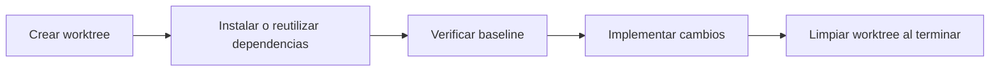
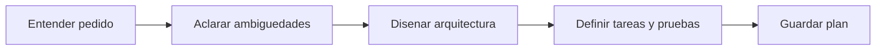

# Catalogo de ejemplos de comandos slash

Este archivo reune ejemplos completos, listos para copiar y adaptar. La idea es mostrar patrones fuertes y bien estructurados para los casos de uso mas utiles.

## Resumen ejecutivo

| Comando | Categoria | Efectos laterales | Mejor uso |
|---|---|---|---|
| `/audit-codebase` | Auditoria | No | Medir la salud tecnica del repo |
| `/catchup` | Contexto | No | Recuperar contexto despues de una pausa o de `/clear` |
| `/explain` | Aprendizaje | No | Explicar codigo, flujo o arquitectura |
| `/git-worktree` | Operacion | Si, controlado | Crear entornos aislados por branch |
| `/plan-start` | Planeacion | Si, escribe un plan | Disenar una implementacion antes de tocar codigo |
| `/review-pr` | Revision | No | Revisar una PR con hallazgos priorizados |
| `/ship` | Gate de release | No | Verificar readiness antes de deploy |
| `/security-audit` | Seguridad | No | Auditar repo y configuracion con score |

## Indice

1. [Audit Codebase](#1-audit-codebase)
2. [Catchup](#2-catchup)
3. [Explain](#3-explain)
4. [Git Worktree](#4-git-worktree)
5. [Plan Start](#5-plan-start)
6. [Review PR](#6-review-pr)
7. [Ship](#7-ship)
8. [Security Audit](#8-security-audit)
9. [Ideas rapidas para ampliar el catalogo](#9-ideas-rapidas-para-ampliar-el-catalogo)

## 1. Audit Codebase

### Que resuelve

Convierte una inspeccion amplia del repo en un score entendible, con hallazgos concretos y un plan de mejora por prioridad.

### Cuando usarlo

- al entrar a un proyecto nuevo
- antes de proponer una refactorizacion grande
- cuando quieres una foto tecnica y no solo impresiones sueltas

### Archivo del comando

```markdown
---
allowed-tools: Read, Glob, Grep, Bash(rg:*), Bash(find:*), Bash(git ls-files:*), Bash(npm audit:*), Bash(pnpm audit:*), Bash(pytest:*)
argument-hint: [path] [--quick] [--category=<name>]
description: Audita la salud tecnica del proyecto y devuelve score, hallazgos y plan de mejora
---

# Audit Codebase

Audita el proyecto actual o la ruta indicada en `$ARGUMENTS` y devuelve un score de salud tecnica con prioridades claras.

## Proceso

1. Detecta el stack y el alcance.
2. Evalua al menos estas categorias: secrets, security, tests, dependencies, structure.
3. Si el usuario pidio una categoria concreta, enfocate en esa categoria y reduce el resto.
4. Prioriza hallazgos con evidencia concreta.
5. No modifiques archivos.

## Formato de salida

### Resumen
- Alcance
- Stack
- Puntaje general: X/10

### Tarjeta de score
| Categoria | Score | Hallazgo clave |
|---|---|---|
| Secrets | X/10 | ... |
| Security | X/10 | ... |
| Tests | X/10 | ... |
| Dependencies | X/10 | ... |
| Structure | X/10 | ... |

### Hallazgos criticos
- item con archivo o comando asociado

### Acciones rapidas
1. accion de menos de 30 minutos
2. segunda accion
3. tercera accion

### Plan de progresion
1. Base
2. Solido
3. Excelente

## Salvaguardas

- Trata grep y patrones heuristicas como evidencia inicial, no como verdad absoluta.
- Si una herramienta externa no existe, continua con la mejor evidencia local disponible.
- Si no hay hallazgos fuertes, dilo explicitamente.

## Uso

/audit-codebase
/audit-codebase src/server
/audit-codebase --quick
/audit-codebase --category=tests
```

### Por que esta estructurado asi

| Decision | Motivo |
|---|---|
| Tarjeta de score fija | Permite comparar corridas distintas |
| Categorias estables | Evita auditorias improvisadas |
| Acciones rapidas | Convierte el analisis en accion |
| Salvaguardas contra falsos positivos | Muy importantes en auditorias por patrones |

### Como adaptarlo

- si tu equipo trabaja por dominios, cambia las categorias
- si quieres scoring mas duro, agrega umbrales por severidad
- si prefieres backlog, reemplaza `Plan de progresion` por `Backlog propuesto`

## 2. Catchup

### Que resuelve

Reconstruye el contexto reciente del proyecto a partir de git, cambios locales y marcadores de trabajo pendiente.

### Cuando usarlo

- despues de usar `/clear`
- cuando vuelves a un branch despues de varios dias
- cuando necesitas retomar rapido sin releer todo el historial

### Archivo del comando

```markdown
---
allowed-tools: Read, Glob, Grep, Bash(git log:*), Bash(git diff:*), Bash(git status:*), Bash(git branch:*), Bash(rg:*)
argument-hint: [tema] [--brief]
description: Recupera el contexto reciente del proyecto y propone el siguiente paso mas probable
---

# Catchup

Recupera el contexto de trabajo reciente usando git, cambios locales y marcadores de TODO.

## Proceso

1. Resume los ultimos commits relevantes.
2. Inspecciona cambios sin commitear y staged.
3. Busca TODO, FIXME, HACK y XXX en archivos tocados recientemente.
4. Si `$ARGUMENTS` contiene un tema, prioriza ese tema.
5. Si existe `--brief`, devuelve solo lo esencial.

## Formato de salida

### Contexto restaurado
- Branch
- Ultima actividad
- Alcance

### Trabajo reciente
1. commit o cambio relevante
2. commit o cambio relevante
3. commit o cambio relevante

### Cambios no commiteados
- archivo y resumen corto

### TODOs pendientes
- archivo:linea -> pendiente

### Siguientes pasos sugeridos
1. accion mas probable
2. alternativa valida

## Uso

/catchup
/catchup auth
/catchup --brief
```

### Por que esta estructurado asi

- empieza por evidencia objetiva en git
- luego pasa a cambios no commiteados
- termina proponiendo continuidad
- funciona bien tanto para ti como para otra persona que retoma el branch

### Como adaptarlo

- agrega lectura de `CLAUDE.md` o docs de sprint si tu equipo las usa
- agrega filtro por autor si el repo es muy activo
- convierte `Trabajo reciente` en tabla si quieres mas detalle

## 3. Explain

### Que resuelve

Explica codigo, conceptos o flujos con profundidad variable y sin quedarse en una descripcion superficial.

### Cuando usarlo

- para entender una funcion o modulo
- para documentar una decision tecnica
- para onboarding o pairing asincrono

### Archivo del comando

```markdown
---
allowed-tools: Read, Glob, Grep
argument-hint: [archivo|funcion|concepto] [--simple|--deep|--learn]
description: Explica codigo, arquitectura o conceptos con el nivel de profundidad adecuado
---

# Explain

Explica el objetivo indicado en `$ARGUMENTS`. Puede ser un archivo, una funcion, un flujo o un concepto.

## Proceso

1. Determina si el objetivo es archivo, funcion, flujo o concepto.
2. Ajusta la profundidad segun `--simple`, default o `--deep`.
3. Si existe `--learn`, agrega notas pedagogicas y contexto.
4. Explica primero el para que, despues el como, y por ultimo los trade-offs.

## Formato de salida

### Que hace
- objetivo y responsabilidad

### Como funciona
1. paso
2. paso
3. paso

### Decisiones clave
| Decision | Por que | Alternativa |
|---|---|---|
| ... | ... | ... |

### Ejemplo de uso
- ejemplo de uso correcto o de flujo

### Codigo relacionado
- archivo relacionado y por que importa

### Notas de aprendizaje
- solo si el usuario pidio `--learn`

## Uso

/explain src/auth/middleware.ts
/explain handleWebhook in payments.ts
/explain --deep authentication flow
/explain --learn repository pattern
```

### Por que esta estructurado asi

| Parte | Valor |
|---|---|
| Separa `Que hace` de `Como funciona` | Evita mezclar proposito con implementacion |
| Tabla de decisiones | Obliga a explicar por que algo existe |
| `--learn` | Sirve tanto para expertos como para gente nueva |

### Como adaptarlo

- agrega analogias si tu audiencia es junior
- agrega `Pruebas relacionadas` si quieres usarlo como comando de onboarding
- cambia `Ejemplo de uso` por `Recorrido secuencial` si el foco es un flujo

## 4. Git Worktree

### Que resuelve

Crea un workspace aislado por branch sin contaminar el working tree principal.

### Cuando usarlo

- para features medianos o grandes
- para trabajar varias ramas en paralelo
- para experimentar sin mover tu working tree principal

### Ciclo de vida sugerido



### Archivo del comando

```markdown
---
allowed-tools: Bash(git worktree:*), Bash(git status:*), Bash(git branch:*), Bash(git rev-parse:*), Bash(grep:*), Bash(ls:*), Bash(mkdir:*), Bash(pnpm install:*), Bash(npm install:*)
argument-hint: <branch> [--fast] [--isolated]
description: Crea un git worktree para una branch nueva con checks de seguridad y setup inicial
---

# Git Worktree

Crea un worktree aislado para la branch indicada en `$ARGUMENTS`.

## Proceso

1. Valida el nombre de la branch.
2. Detecta si existe `.worktrees/` o `worktrees/`.
3. Verifica que el directorio este ignorado por git.
4. Crea el worktree con `git worktree add`.
5. Si no existe `--fast`, instala dependencias o reutiliza las de la raiz.
6. Devuelve la ruta final y el estado del setup.

## Salvaguardas

- Nunca crear worktrees para nombres vacios o invalidos.
- Si el directorio no esta en `.gitignore`, detenerse y pedir confirmacion antes de seguir.
- `--isolated` significa instalacion fresca; si no, prioriza reutilizar dependencias.

## Formato de salida

### Worktree listo
- Path
- Branch
- Modo de dependencias: shared | isolated
- Siguiente check sugerido

### Notas
- advertencias sobre `.env`, migraciones o setup adicional

## Uso

/git-worktree feat/auth
/git-worktree fix/login-bug --fast
/git-worktree refactor/db-layer --isolated
```

### Por que esta estructurado asi

- protege el repo principal
- usa un directorio dedicado
- deja claro el trade-off entre velocidad y aislamiento
- agrega salvaguardas antes de tocar git

### Como adaptarlo

- agrega deteccion de package manager si tu equipo usa varios
- agrega un check de `.env.example`
- crea comandos companeros para estado y limpieza si el workflow crece

## 5. Plan Start

### Que resuelve

Convierte una solicitud ambigua en un plan implementable, con decisiones, tareas y validaciones antes de escribir codigo.

### Cuando usarlo

- features no triviales
- cambios con impacto en varias capas
- trabajo que costaria caro rehacer

### Pipeline sugerido



### Archivo del comando

```markdown
---
allowed-tools: Read, Glob, Grep, Write, Edit
argument-hint: [brief o path a PRD]
description: Analiza el pedido y genera un plan ejecutable con decisiones, tareas y test plan
---

# Plan Start

Analiza el pedido en `$ARGUMENTS` y produce un plan completo antes de escribir codigo.

## Proceso

1. Relee el brief o PRD.
2. Lista ambiguedades, edge cases y constraints.
3. Propone arquitectura y trade-offs.
4. Define tareas por capas o dependencias.
5. Define plan de pruebas e integracion.
6. Escribe un archivo de plan dentro de `docs/plans/`.

## Formato de salida

### Resumen
- que se va a construir
- por que

### Decisiones
- decision
- razon
- trade-off

### Arquitectura
- componentes
- boundaries
- riesgos

### Tareas
1. capa base
2. capa dependiente
3. capa final

### Plan de pruebas
- unit
- integration
- e2e si aplica

### Fuera de alcance
- lo que no entra en este plan

## Salvaguardas

- No escribir codigo de implementacion.
- No avanzar si hay ambiguedades criticas sin resolver.
- Si una decision es importante, dejarla explicitada en `Decisiones`.

## Uso

/plan-start
/plan-start docs/prd-user-auth.md
/plan-start "agregar flujo de invitaciones"
```

### Por que esta estructurado asi

| Decision | Motivo |
|---|---|
| Separa decisiones de tareas | Evita esconder arquitectura dentro del checklist |
| Incluye fuera de alcance | Reduce creep de alcance |
| Incluye plan de pruebas desde el inicio | Evita planes imposibles de validar |

### Como adaptarlo

- agrega ADRs si tu proyecto las usa
- agrega diagramas Mermaid si la feature es asincrona o distribuida
- agrega un paso de validacion humana antes de guardar el plan

## 6. Review PR

### Que resuelve

Estandariza la revision de una PR y obliga a devolver hallazgos priorizados, no comentarios vagos.

### Cuando usarlo

- antes de pedir review humana
- para segunda opinion tecnica
- para auditar riesgo de una PR grande

### Archivo del comando

```markdown
---
allowed-tools: Read, Glob, Grep, Bash(gh pr view:*), Bash(git diff:*), Bash(rg:*)
argument-hint: <pr-number|pr-url>
description: Revisa una pull request y devuelve hallazgos priorizados por severidad
---

# Review PR

Revisa la PR indicada en `$ARGUMENTS` y devuelve hallazgos concretos, ordenados por severidad.

## Proceso

1. Obtiene metadata de la PR.
2. Inspecciona los archivos cambiados.
3. Evalua code quality, functionality, security, tests y docs.
4. Devuelve hallazgos con evidencia, no opiniones vagas.

## Formato de salida

### Resumen
- alcance de la PR
- complejidad estimada
- veredicto general

### Criticos
- hallazgo con archivo y motivo

### Importantes
- mejora con razon

### Opcionales
- sugerencia menor

### Preguntas
- dudas que bloquean confianza

## Salvaguardas

- No inventes patrones del proyecto sin verificarlos en el codigo.
- Usa `Criticos` solo para bugs, seguridad o riesgo real.
- Si no hay hallazgos, dilo explicitamente.

## Uso

/review-pr 123
/review-pr https://github.com/org/repo/pull/123
```

### Por que esta estructurado asi

- obliga a priorizar
- evita revision decorativa con comentarios sin severidad
- fuerza a citar evidencia
- mantiene separadas dudas, defects y mejoras

### Como adaptarlo

- agrega una seccion `Riesgo de regresion`
- agrega checklist de performance si tu stack lo necesita
- agrega soporte para follow-up pass si el equipo revisa varias veces la misma PR

## 7. Ship

### Que resuelve

Funciona como gate final antes de deploy. Separa blockers, warnings y checks recomendados.

### Cuando usarlo

- antes de deploy a produccion
- antes de freeze
- como paso manual o automatico de CI

### Archivo del comando

```markdown
---
allowed-tools: Read, Glob, Grep, Bash(git rev-parse:*), Bash(git diff:*), Bash(npm test:*), Bash(npm run:*), Bash(pnpm test:*), Bash(pnpm build:*), Bash(pnpm lint:*), Bash(pnpm typecheck:*), Bash(rg:*)
argument-hint: [--production|--staging|--quick]
description: Ejecuta un pre-deploy checklist y devuelve readiness real
---

# Ship

Evalua si el estado actual esta listo para deploy.

## Proceso

1. Ejecuta blockers: tests, lint, typecheck, build, secrets scan.
2. Ejecuta checks de prioridad alta: seguridad, console logs, TODOs, migraciones.
3. Si no existe `--quick`, agrega checks recomendados.
4. Devuelve veredicto final: APTO PARA DEPLOY o NO APTO PARA DEPLOY.

## Formato de salida

### Reporte de preparacion para deploy
- Branch
- Commit
- Target

### Bloqueantes
| Check | Status | Details |
|---|---|---|
| Tests | ... | ... |
| Lint | ... | ... |
| Typecheck | ... | ... |
| Build | ... | ... |
| Secrets | ... | ... |

### Prioridad alta
- item y accion sugerida

### Recomendado
- item y nota

### Acciones siguientes
1. accion mas urgente
2. segunda accion
3. tercera accion

## Salvaguardas

- Este comando no deploya. Solo verifica readiness.
- Si un bloqueante falla, el veredicto final debe ser `NO APTO PARA DEPLOY`.
- Si no hay suficiente evidencia para un check, indicalo como `DESCONOCIDO`, no como `OK`.

## Uso

/ship
/ship --production
/ship --quick
```

### Por que esta estructurado asi

| Parte | Valor |
|---|---|
| Blockers separados | Hace explicito que no todo pesa igual |
| `DESCONOCIDO` | Evita falsos positivos optimistas |
| Acciones siguientes | Convierte el gate en una secuencia de correccion |

### Como adaptarlo

- agrega smoke tests post-deploy
- agrega rollback checklist
- agrega revision de env vars por entorno

## 8. Security Audit

### Que resuelve

Hace una auditoria de seguridad mas completa que un grep rapido y devuelve un score de postura con plan de remediacion.

### Cuando usarlo

- antes de una release importante
- al auditar configuracion de Claude Code y repo
- al revisar riesgo de integraciones o hooks

### Archivo del comando

```markdown
---
allowed-tools: Read, Glob, Grep, Bash(rg:*), Bash(find:*), Bash(npm audit:*), Bash(pnpm audit:*), Bash(pip-audit:*), Bash(cat:*)
argument-hint: [path] [--quick]
description: Ejecuta una auditoria de seguridad del proyecto y devuelve score, hallazgos y remediacion
---

# Security Audit

Audita el proyecto actual o la ruta indicada en `$ARGUMENTS` y devuelve una evaluacion de postura de seguridad.

## Proceso

1. Revisa configuracion sensible, hooks, settings y archivos de memoria si existen.
2. Busca secrets, claves privadas y patrones de exfiltracion.
3. Evalua superficies de injection y dependencias vulnerables.
4. Puntua la postura total sobre 100.
5. Devuelve hallazgos priorizados y plan de remediacion.

## Formato de salida

### Postura de seguridad
- Score: XX/100
- Calificacion: A-F
- Alcance

### Resultados por fase
| Fase | Score | Hallazgo clave |
|---|---|---|
| Config | ... | ... |
| Secrets | ... | ... |
| Injection | ... | ... |
| Dependencies | ... | ... |
| Hooks | ... | ... |

### Hallazgos criticos
- hallazgo, ubicacion y fix

### Hallazgos altos
- hallazgo, ubicacion y fix

### Plan de remediacion
1. accion prioritaria
2. accion prioritaria
3. accion prioritaria

## Salvaguardas

- Un match heuristico no implica explotacion real.
- Si falta una herramienta externa, sigue con evidencia local.
- Nunca marques `A` si existen hallazgos criticos abiertos.

## Uso

/security-audit
/security-audit .claude
/security-audit --quick
```

### Por que esta estructurado asi

- mezcla score con hallazgos concretos
- separa fases, lo que ayuda a explicar de donde sale la nota
- fuerza remediacion y no solo deteccion

### Como adaptarlo

- agrega una base de amenazas propia si tu equipo la mantiene
- agrega verificacion de MCPs o agentes internos
- divide `Dependencies` por ecosistema si tu repo es poliglota

## 9. Ideas rapidas para ampliar el catalogo

Si quieres seguir creciendo esta biblioteca, estas ideas encajan bien:

| Idea | Objetivo | Salida ideal |
|---|---|---|
| `/commit` | Proponer conventional commit para cambios staged | titulo, body, footer |
| `/generate-tests` | Generar pruebas a partir de codigo existente | test plan y archivo de tests |
| `/optimize` | Detectar cuellos de botella y acciones rapidas | impacto, esfuerzo, riesgo |
| `/refactor` | Encontrar deuda tecnica y violaciones SOLID | refactors priorizados |
| `/release-notes` | Transformar commits en changelog y anuncio | changelog y resumen ejecutivo |
| `/sonarqube` | Leer issues de calidad de una PR | top files, top rules, action plan |
| `/validate-changes` | Meter un gate LLM antes del commit | approve, review o reject |
| `/learn-teach` | Ensenar un concepto por niveles | definicion, ejemplo minimo, errores comunes |
| `/learn-quiz` | Verificar comprension | preguntas por nivel y feedback |
| `/learn-alternatives` | Comparar enfoques | tabla comparativa y recomendacion |

## Cierre

Los mejores comandos slash no son los mas largos, sino los que:

- tienen un objetivo unico y claro
- restringen bien sus permisos
- piensan por fases
- devuelven una salida estable
- agregan salvaguardas donde hay riesgo

Si mantienes esas cinco reglas, puedes adaptar cualquiera de estos ejemplos a tu propio flujo sin perder claridad ni seguridad.
