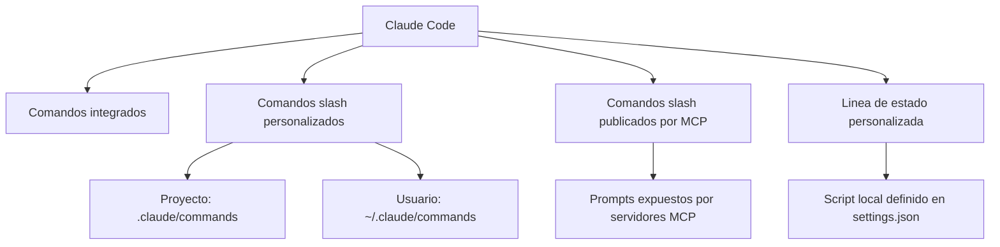
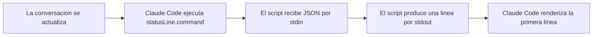
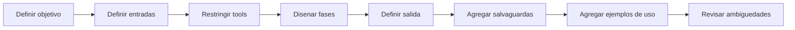

# Guia completa de comandos slash, comandos MCP y lineas de estado

Esta guia explica como extender Claude Code con comandos reutilizables, integraciones MCP y una linea de estado personalizada. El objetivo es que puedas disenar comandos claros, seguros y faciles de mantener.

## Vista general

Claude Code se puede personalizar por cuatro superficies principales:



| Superficie | Funcion | Ubicacion | Mejor uso |
|---|---|---|---|
| Comandos integrados | Controlar la sesion, el modelo y la herramienta | Claude Code | Configuracion, revision, memoria, estado |
| Comandos slash personalizados | Encapsular flujos de trabajo repetibles | `.claude/commands/` o `~/.claude/commands/` | Auditorias, planeacion, PRs, seguridad, operaciones |
| Comandos MCP | Ejecutar prompts publicados por integraciones externas | Servidores MCP conectados | GitHub, Jira, sistemas internos, servicios externos |
| Linea de estado | Mostrar contexto vivo en la interfaz | `.claude/settings.json` y un script local | Modelo, branch, costo, uso de contexto, directorio |

## 1. Comandos integrados

Los comandos integrados ya vienen con Claude Code. Conviene agruparlos por finalidad:

| Categoria | Comandos | Para que sirven |
|---|---|---|
| Sesion y contexto | `/help`, `/clear`, `/compact`, `/status`, `/cost`, `/bug` | Limpiar, compactar o inspeccionar la sesion |
| Trabajo de proyecto | `/init`, `/agents`, `/review`, `/pr_comments`, `/memory` | Inicializar proyecto, revisar codigo, manejar memoria |
| Configuracion | `/add-dir`, `/config`, `/permissions`, `/model`, `/mcp`, `/doctor` | Directorios, permisos, modelo, MCP y diagnostico |
| Cuenta | `/login`, `/logout` | Cambiar o cerrar sesion |
| Interfaz | `/terminal-setup`, `/vim` | Configuracion del terminal y modo de edicion |

En algunas instalaciones tambien puede existir un flujo guiado para la linea de estado.

## 2. Comandos slash personalizados

### Ubicaciones

| Alcance | Ruta | Caracteristica |
|---|---|---|
| Proyecto | `.claude/commands/` | Vive junto al repositorio y se puede compartir con el equipo |
| Usuario | `~/.claude/commands/` | Se reutiliza en varios proyectos |

### Sintaxis basica

```text
/<nombre-del-comando> [argumentos]
```

El nombre visible del comando se deriva del nombre del archivo Markdown sin la extension `.md`.

Ejemplos:

- `.claude/commands/security-audit.md` -> `/security-audit`
- `.claude/commands/release-notes.md` -> `/release-notes`
- `~/.claude/commands/catchup.md` -> `/catchup`

### Organizacion recomendada

Puedes usar subcarpetas para ordenar mejor los archivos, pero conviene que el nombre del archivo sea suficientemente claro por si solo. En la practica, lo mas robusto es:

- usar nombres explicitos y orientados al resultado
- reservar las subcarpetas para organizacion humana
- evitar nombres demasiado genericos

## 3. Anatomia de un archivo de comando

Un comando slash bien hecho suele tener dos capas:

1. Frontmatter: metadatos y restricciones
2. Cuerpo del prompt: contexto, proceso, formato de salida y salvaguardas

### Frontmatter soportado

| Campo | Para que sirve | Valor por defecto |
|---|---|---|
| `allowed-tools` | Limita las herramientas que puede usar el comando | Hereda la sesion actual |
| `argument-hint` | Sugiere al usuario el formato de los argumentos | Ninguno |
| `description` | Describe el comando en ayuda y autocompletado | Primera linea util del archivo |
| `model` | Fija un modelo concreto para ese comando | Hereda la sesion actual |

Ejemplo:

```markdown
---
allowed-tools: Read, Glob, Grep, Bash(git status:*), Bash(git diff:*)
argument-hint: [path] [--quick]
description: Inspecciona el estado del proyecto y devuelve riesgos concretos
model: claude-3-5-haiku-20241022
---
```

### Secciones recomendadas en el cuerpo

| Seccion | Funcion |
|---|---|
| Titulo u objetivo | Explica para que existe el comando |
| `## Contexto` | Reune la informacion necesaria antes de decidir |
| `## Proceso` o `## Instrucciones` | Ordena el razonamiento en fases |
| `## Formato de salida` | Fija una respuesta estable y reutilizable |
| `## Salvaguardas` | Limita acciones peligrosas o ambiguas |
| `## Uso` | Muestra invocaciones reales |

## 4. Capacidades dinamicas dentro del prompt

### 4.1 Argumentos con `$ARGUMENTS`

Sirven para inyectar texto dinamico desde la invocacion:

```markdown
Corrige el issue #$ARGUMENTS siguiendo las convenciones del proyecto.
```

Uso:

```text
/fix-issue 123
```

### 4.2 Referencias de archivos con `@`

Sirven para meter archivos o directorios en el contexto del comando:

```markdown
Revisa @src/auth/service.ts y compara con @src/auth/service.test.ts
```

Conviene usarlas cuando:

- quieres comparar implementacion y pruebas
- quieres contrastar codigo y documentacion
- necesitas fijar archivos clave en el contexto

### 4.3 Comandos inline con ``!`...` ``

Sirven para ejecutar un comando antes del prompt e incluir su salida:

```markdown
- Estado git: !`git status --short`
- Resumen del diff: !`git diff --stat HEAD`
```

Esto exige dos cuidados:

- declarar `allowed-tools` con el alcance minimo necesario
- priorizar comandos de lectura y recoleccion de contexto

### 4.4 Modo de razonamiento

Si el comando necesita un razonamiento mas deliberado, expresalo dentro del prompt:

- "piensa por fases"
- "evalua trade-offs"
- "no avances si hay ambiguedades criticas"
- "valida supuestos antes de concluir"

## 5. Buenas practicas para `allowed-tools`

La calidad de un comando depende mucho de sus permisos.

### Reglas practicas

| Situacion | Recomendacion |
|---|---|
| Comando de lectura | Usa `Read`, `Glob`, `Grep` y `Bash(...)` muy acotado |
| Comando de escritura | Agrega solo las herramientas estrictamente necesarias |
| Comando con commit, deploy o delete | Exige confirmacion explicita en el prompt |
| Comando de analisis | Mantenlo sin efectos laterales siempre que sea posible |

### Ejemplo correcto

```markdown
---
allowed-tools: Read, Glob, Grep, Bash(git status:*), Bash(git diff:*)
description: Resume cambios locales sin modificar archivos
---
```

### Ejemplo riesgoso

```markdown
---
allowed-tools: Bash(*), Write, Edit
description: Hace de todo
---
```

Ese segundo ejemplo es fragil, dificil de auditar y facil de usar mal.

## 6. Comandos slash publicados por MCP

Los servidores MCP pueden exponer prompts que aparecen como comandos dentro de Claude Code.

### Formato

```text
/mcp__<server-name>__<prompt-name> [argumentos]
```

Ejemplos:

```text
/mcp__github__list_prs
/mcp__github__pr_review 456
/mcp__jira__create_issue "Bug en auth" high
```

### Como funcionan

| Propiedad | Explicacion |
|---|---|
| Descubrimiento | El comando aparece cuando el servidor MCP esta conectado y publica prompts |
| Argumentos | Los define el propio servidor MCP |
| Normalizacion | Los nombres suelen pasar a minusculas y underscores |
| Gestion | `/mcp` sirve para ver estado, autenticacion, prompts y tools |

### Cuando usar MCP y cuando usar un comando personalizado

| Caso | Mejor opcion |
|---|---|
| Flujo del repo o del equipo | Comando slash personalizado |
| Flujo que vive en un sistema externo | Comando MCP |
| Necesitas versionar el prompt junto al codigo | Comando personalizado |
| El comportamiento depende de un proveedor externo | MCP |

## 7. Linea de estado personalizada

La linea de estado no es un comando slash, pero forma parte de la misma capa de personalizacion.

### Configuracion minima

```json
{
  "statusLine": {
    "type": "command",
    "command": "~/.claude/statusline.sh",
    "padding": 0
  }
}
```

### Flujo de ejecucion



### Reglas de funcionamiento

| Regla | Detalle |
|---|---|
| Frecuencia | Se actualiza como maximo cada 300 ms |
| Entrada | JSON por `stdin` |
| Salida | La primera linea de `stdout` se usa como linea de estado |
| Estilo | Acepta colores ANSI |
| Diseno | Debe ser corta y legible |

### Campos utiles del JSON

| Grupo | Campos importantes |
|---|---|
| Modelo | `model.id`, `model.display_name` |
| Workspace | `cwd`, `workspace.current_dir`, `workspace.project_dir` |
| Costos | `cost.total_cost_usd`, `cost.total_duration_ms`, `cost.total_lines_added`, `cost.total_lines_removed` |
| Contexto | `context_window.used_percentage`, `remaining_percentage`, `context_window_size`, `current_usage.*` |
| Sesion | `session_id`, `transcript_path`, `hook_event_name` |
| Entorno | `version`, `output_style.name` |

### Ejemplo de script Bash

```bash
#!/usr/bin/env bash
set -euo pipefail

input=$(cat)
model=$(printf '%s' "$input" | jq -r '.model.display_name')
dir=$(printf '%s' "$input" | jq -r '.workspace.current_dir' | xargs basename)
used=$(printf '%s' "$input" | jq -r '.context_window.used_percentage // 0')

branch=""
if git rev-parse --git-dir >/dev/null 2>&1; then
  current_branch=$(git branch --show-current 2>/dev/null || true)
  if [ -n "$current_branch" ]; then
    branch=" | git:$current_branch"
  fi
fi

printf '[%s] %s%s | ctx:%s%%\n' "$model" "$dir" "$branch" "$used"
```

### Buenas practicas para la linea de estado

- usar `jq` en Bash o un parser real en Python o Node
- evitar comandos caros en cada actualizacion
- no hacer llamadas de red en el hot path
- cachear operaciones lentas si hace falta
- probar el script con JSON de prueba antes de conectarlo a `settings.json`

## 8. Como disenar un buen comando slash

### Patron recomendado



### Checklist de diseno

| Pregunta | Debe quedar resuelta |
|---|---|
| Que produce el comando | Un reporte, una propuesta, una accion o una explicacion |
| Que necesita para correr | Path, PR, branch, flags o ningun argumento |
| Que puede tocar | Solo lectura o tambien escritura |
| Como decide | Por fases, checks, criterios o score |
| Como responde | Tabla, resumen, findings, plan de accion |
| Como evita errores | Confirmaciones, dry-run, validaciones previas |

### Estructura recomendada

```markdown
---
allowed-tools: ...
argument-hint: ...
description: ...
---

# Nombre del comando

Objetivo del comando en una o dos lineas.

## Contexto
- datos que se deben reunir

## Proceso
1. descubrir
2. analizar
3. validar
4. devolver

## Formato de salida
- resumen
- hallazgos
- accion sugerida

## Salvaguardas
- que no debe hacer
- cuando debe pedir confirmacion

## Uso
/comando
/comando --modo
```

## 9. Ejemplo completo: crear un comando de principio a fin

### Objetivo del ejemplo

Vamos a crear un comando llamado `/project-health-check` para inspeccionar el estado de un proyecto y devolver riesgos concretos sin modificar nada.

### Paso 1: elegir la ubicacion

Si el comando vive dentro del repo:

```text
.claude/commands/project-health-check.md
```

Si va a ser personal:

```text
~/.claude/commands/project-health-check.md
```

### Paso 2: escribir el archivo completo

```markdown
---
allowed-tools: Read, Glob, Grep, Bash(git status:*), Bash(git diff:*), Bash(rg:*)
argument-hint: [path] [--quick] [--security]
description: Inspecciona el estado del proyecto y devuelve un plan de accion breve
---

# Project Health Check

Inspecciona el proyecto actual o la ruta indicada en `$ARGUMENTS`, detecta los riesgos mas importantes y devuelve prioridades claras sin modificar archivos.

## Contexto

- Estado git: !`git status --short`
- Resumen del diff: !`git diff --stat HEAD`
- Marcadores de stack: !`rg --files -g "package.json" -g "pyproject.toml" -g "Cargo.toml" -g "go.mod"`
- Posibles secretos: !`rg -n "(API_KEY|SECRET|TOKEN|PASSWORD)" -g "!node_modules" -g "!dist" .`

Revisa estos archivos cuando existan:
- @README.md
- @CLAUDE.md
- @package.json

## Proceso

1. Determina el stack y el alcance segun los archivos detectados y `$ARGUMENTS`.
2. Identifica los riesgos principales en higiene del repositorio, pruebas y seguridad.
3. Separa blockers de warnings.
4. Si el usuario pidio `--quick`, responde en version reducida.
5. Si no hay hallazgos fuertes, dilo explicitamente.

## Formato de salida

Devuelve exactamente estas secciones:

### Resumen
- Alcance
- Tipo de proyecto
- Estado general: sano | advertencia | critico

### Bloqueantes
- Item
- Por que importa
- Archivo o comando exacto cuando exista

### Advertencias
- Item
- Seguimiento sugerido

### Siguientes acciones
1. Accion de mayor valor
2. Segundo seguimiento
3. Auditoria mas profunda sugerida

## Salvaguardas

- No modifiques archivos.
- Trata los matches heuristicas como hallazgos potenciales, no como vulnerabilidades confirmadas.
- Si falta argumento, usa el directorio actual.
- Si un comando inline falla, sigue con la mejor evidencia disponible.

## Uso

/project-health-check
/project-health-check src/api --security
/project-health-check --quick
```

### Paso 3: por que esta bien construido

| Parte | Motivo |
|---|---|
| `allowed-tools` restringido | El comando solo necesita leer y observar |
| `argument-hint` | Facilita descubrir el formato correcto de uso |
| Apertura corta | Define el objetivo sin ruido |
| `## Contexto` | Trae a la vista el estado real del proyecto |
| `## Proceso` | Obliga a pensar por fases |
| `## Formato de salida` | Hace que la respuesta sea estable y comparable |
| `## Salvaguardas` | Evita sobrerreaccionar y evita efectos laterales |
| `## Uso` | Ensena casos reales |

### Paso 4: como invocarlo

```text
/project-health-check
/project-health-check src/server
/project-health-check --quick
/project-health-check src/payments --security
```

### Paso 5: como evolucionarlo

Puedes convertir este comando en otras variantes:

- auditoria con score: agrega categorias y ponderaciones
- gate de release: agrega build, test y checks de deploy
- version educativa: cambia hallazgos por explicaciones
- version con escritura: agrega confirmaciones y tools de escritura muy acotados

## 10. Errores comunes al escribir comandos

| Error | Problema | Solucion |
|---|---|---|
| Permisos demasiado amplios | El comando hace mas de lo necesario | Restringir `allowed-tools` |
| Objetivo ambiguo | La respuesta sale dispersa | Definir un resultado concreto |
| Sin formato de salida | Cada corrida devuelve algo distinto | Fijar secciones y tablas |
| Sin salvaguardas | Puede ejecutar cosas riesgosas | Agregar confirmaciones y limites |
| Sin ejemplos de uso | El comando es dificil de descubrir | Agregar 2 o 3 invocaciones reales |
| Sin fases | El razonamiento se vuelve inconsistente | Usar `Contexto`, `Proceso`, `Formato de salida` |

## 11. Checklist final

Antes de dar por terminado un comando slash, verifica:

- el nombre del archivo coincide con el nombre del comando
- el objetivo se entiende en menos de 3 lineas
- los argumentos estan explicitados
- las tools estan restringidas
- la salida esta estructurada
- los casos peligrosos tienen salvaguardas
- hay al menos dos ejemplos de uso
- el comando puede correr con contexto parcial sin romperse
